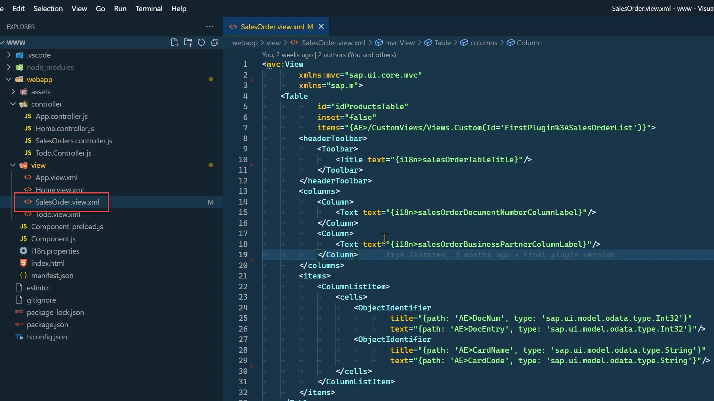
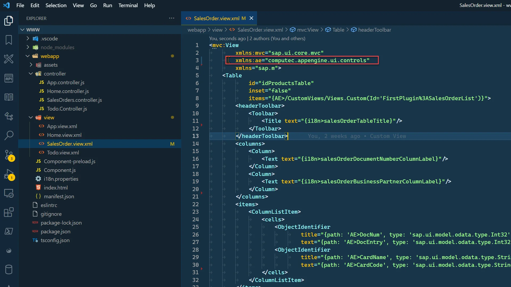
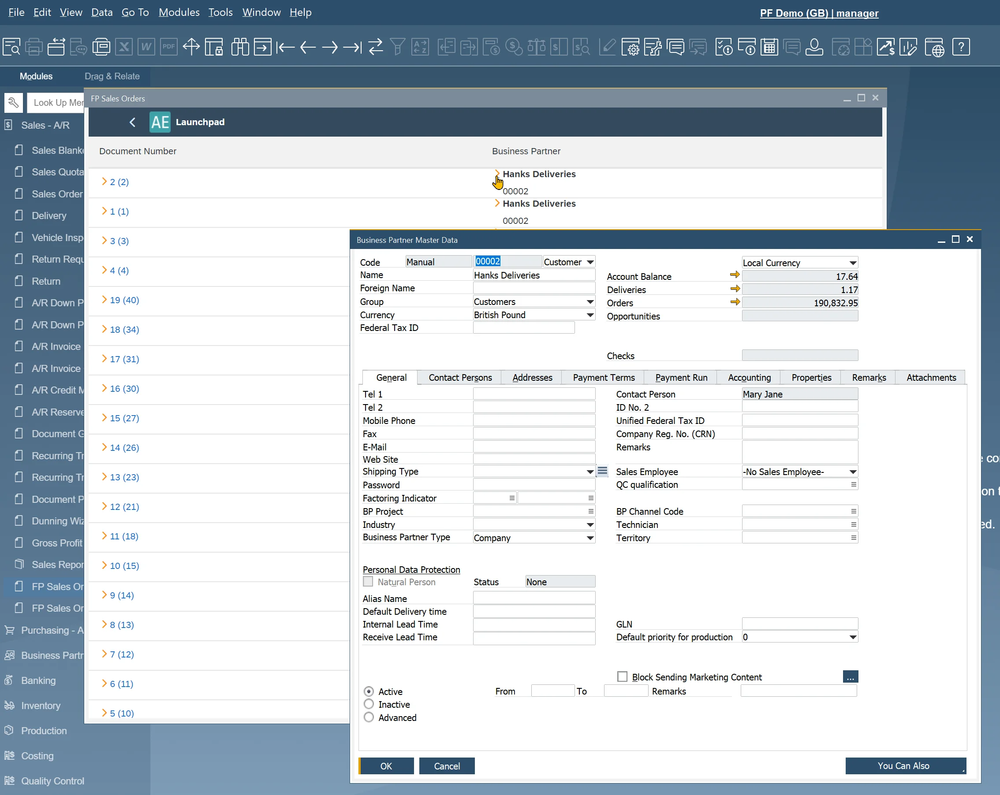

# Using ae:Link's

## Description

As part of AppEngine, there is custom control provided, named computec.appengine.ui.controls.link that works as "yellow arrows" in SAP Business One. Using this control you allow users to easily navigate to referenced Master Data/Document. Below you can find an example of the usage of this control.

:::warning
    AppEngine Link Control works only when plugin is started from SAP Business One.
:::

## Adding link to Sales Orders and Business Partners

1. Open SalesOrder.view.xml:

    
2. Add a namespace for AppEngine controls:

    `xmlns:ae="computec.appengine.ui.controls"`

    
3. Add a Link to the Document Number column. Change ObjectIdentifier to AppEngine Link.

    - text – text that will be displayed. Use DocNum and in curly brackets DocEntry
    - objectType – in case of SAP object, this needs to be BoFormObjectEnum (or ObjectType). BoFormObjectEnum can be found in SAP Business ne SDK. In this case this will be fo_Order:

        
    - objectSubType – only needed when opening ProcessForce objects. In this example, leave it empty
    - key – a key of an object we would like to open. In this case this will be Sales Order DocEntry.

        ```xml
        <ae:Link
        text="{path: 'AE>DocNum', type: 'sap.ui.model.odata.type.Int32'} ({path: 'AE>DocEntry', type: 'sap.ui.model.odata.type.Int32'})"
        objectType="fo_Order"
        objectSubType=""
        key="{path: 'AE>DocEntry', type: 'sap.ui.model.odata.type.Int32'}"/>
        ```

4. Do the same thing for a Business Partner. This time instead of replacing ObjectIdentifier, add link next to it using HBox control. Link text property is empty.

    ```xml
    <HBox>
        <ae:Link
            text=""
            objectType="fo_BusinessPartner"
            objectSubType=""
            key="{path: 'AE>CardCode', type: 'sap.ui.model.odata.type.String'}"/>
        <ObjectIdentifier
            title="{path: 'AE>CardName', type: 'sap.ui.model.odata.type.String'}"
            text="{path: 'AE>CardCode', type: 'sap.ui.model.odata.type.String'}"/>
    </HBox>
    ```

5. SalesOrder.view.xml should look like this.

    SalesOrder.view.xml

    ```xml
    <mvc:View
            xmlns:mvc="sap.ui.core.mvc"
            xmlns:ae="computec.appengine.ui.controls"
            xmlns="sap.m">
        <Table
                inset="false"
                items="{AE>/CustomViews/Views.Custom(Id='FirstPlugin%3ASalesOrderList')}">
            <headerToolbar>
                <Toolbar>
                    <Title text="{i18n>salesOrderTableTitle}"/>
                </Toolbar>
            </headerToolbar>
            <columns>
                <Column>
                    <Text text="{i18n>salesOrderDocumentNumberColumnLabel}"/>
                </Column>
                <Column>
                    <Text text="{i18n>salesOrderBusinessPartnerColumnLabel}"/>
                </Column>
            </columns>
            <items>
                <ColumnListItem>
                    <cells>
                        <ae:Link
                                text="{path: 'AE>DocNum', type: 'sap.ui.model.odata.type.Int32'} ({path: 'AE>DocEntry', type: 'sap.ui.model.odata.type.Int32'})"
                                objectType="fo_Order"
                                objectSubType=""
                                key="{path: 'AE>DocEntry', type: 'sap.ui.model.odata.type.Int32'}"/>
                        <HBox>
                            <ae:Link
                                    text=""
                                    objectType="fo_BusinessPartner"
                                    objectSubType=""
                                    key="{path: 'AE>CardCode', type: 'sap.ui.model.odata.type.String'}"/>
                            <ObjectIdentifier
                                    title="{path: 'AE>CardName', type: 'sap.ui.model.odata.type.String'}"
                                    text="{path: 'AE>CardCode', type: 'sap.ui.model.odata.type.String'}"/>
                        </HBox>
                    </cells>
                </ColumnListItem>
            </items>
        </Table>
    </mvc:View>
    ```

## Results

After restarting SAP Business One, you can see changes and you are able to use the Links as shown below.


