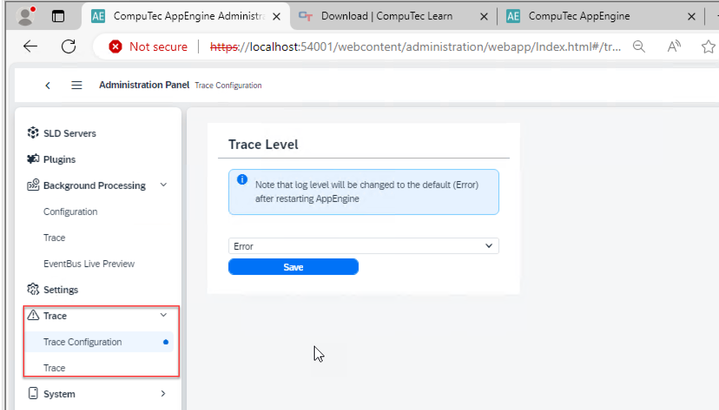

# Log Files

If the CompuTec AppEngine installation fails, the logs can be found in the Windows Event Viewer. Additionally, the AppEngine log is located at:

:::info Path
C:\ProgramData\CompuTec\AppEngine\logs
:::

The error logging level can be configured directly within the AppEngine settings.

