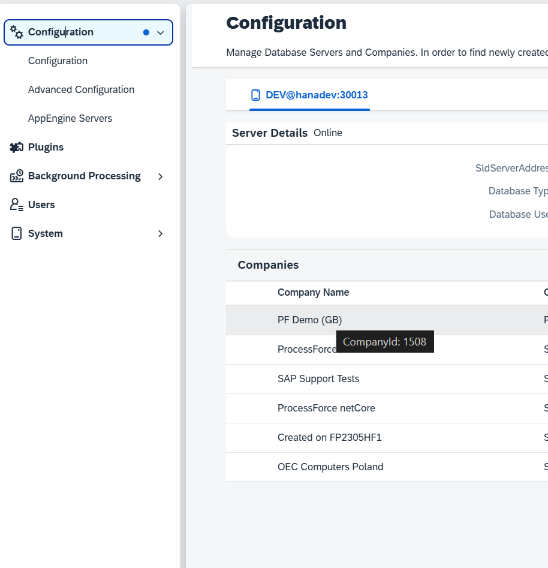
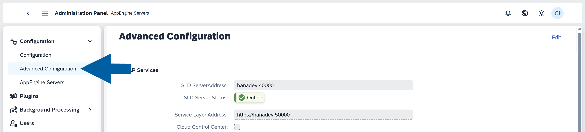
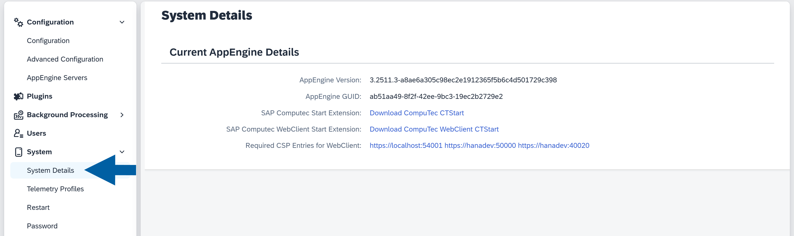
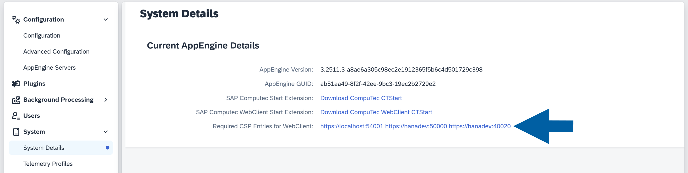
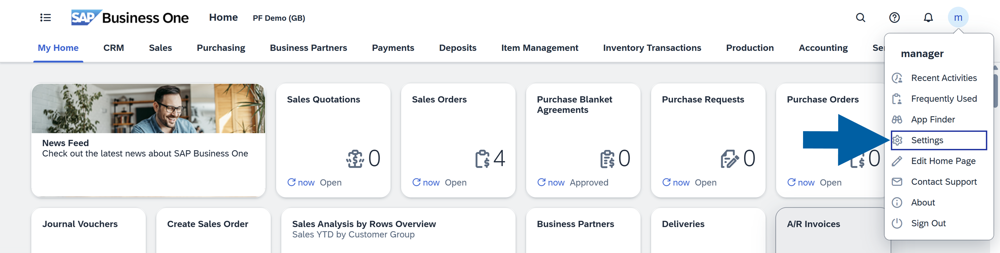
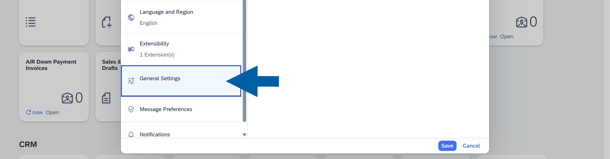
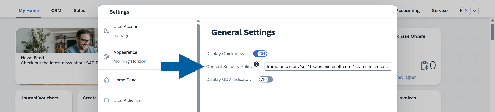

# FAQs

## How to get Company Id

To obtain the company ID, navigate to the Administration Panel and hover over the company name.

    

## How to configure CORS in the SAP Web Client manually

Sometimes, when activating your company in CompuTec AppEngine, you may want to set up CORS (Cross-Origin Resource Sharing) for the SAP Business One Web Client manually:

1. In the **CompuTec AppEngine Administration Panel**, go to **Configuration** > **Advanced Configuration**.  

      

2. In the **CORS Allowed Origins** field, enter your **SAP Web Client address**.  

    

3. Restart **CompuTec AppEngine** to apply changes.

## How to set up Content Security Policy in the SAP Web Client manually

Sometimes, you may want to set up the Content Security Policy (CSP) in the SAP Web Client manually. To make sure it's filled with the correct data (or add your own CSP entries), follow these steps:

1. In the **CompuTec AppEngine Administration Panel**, navigate to **System** > **System Details**.  

      

2. Click on the **Required CSP Entries for Web Client** link.  

      

3. Here, you can find all the required entries for SAP Web Client Content Security Policy.

      

4. Copy the entries and close the window.  

5. Open **SAP Business One Web Client** and click on your **profile** icon in the upper right corner of the interface.  

      

6. Navigate to **Settings** > **General Settings**.  

      

7. Paste the copied entries to the **Content Security Policy** field.  

    

8. Refresh the **SAP Business One Web Client** page to apply the changes.
