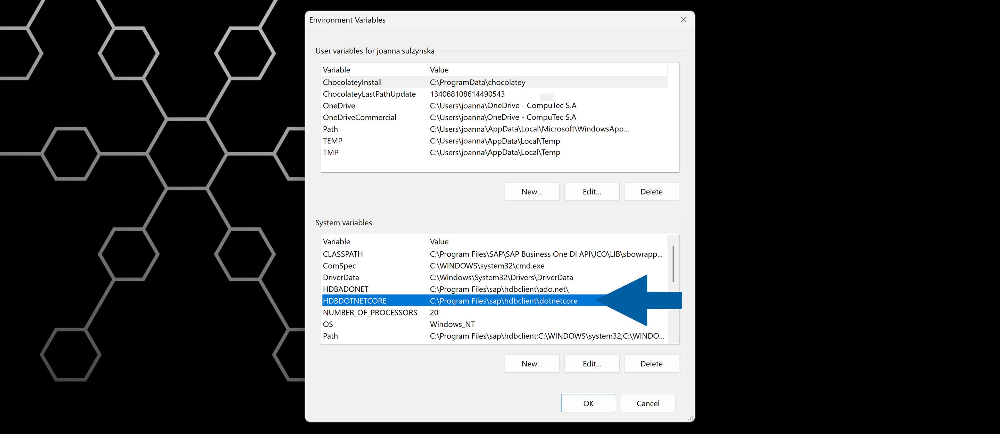
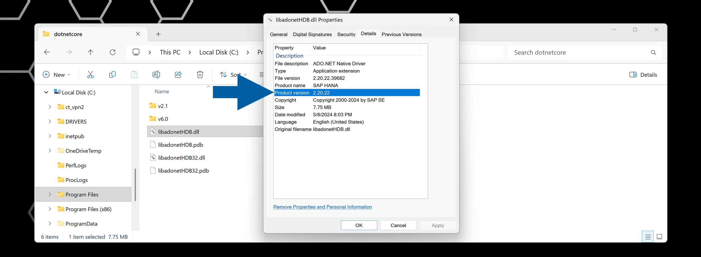
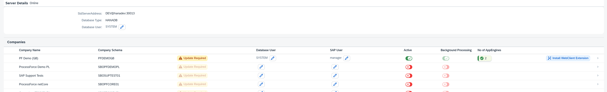

# Troubleshooting

## Problem: CompuTec AppEngine Fails to Start – Event ID 7000 or 7009

On some Windows systems, **CompuTec AppEngine** may fail to start and **Windows Event Viewer** logs ``Event ID 7000`` or ``Event ID 7009``. These errors usually indicate that the **Windows Service Control Manager** stopped waiting for the service to start because it exceeded the allowed startup time.

You may see one or more of the following:

- CompuTec AppEngine does not start automatically after a system reboot.
- The service fails shortly after startup.
- You can find the following logs in **Windows Event Viewer**:  
  - **Event ID 7000**: ``The service failed to start.``  
      
  - **Event ID 7009**: ``A timeout was reached while waiting for the service to connect.``  
    

## Solution

One of the workable solutions is to increase **Windows Service Startup Timeout**.  

:::warning[important]
This change affects how Windows handles **all services during startup**. You must discuss and approve it with your system administrator before proceeding. Apply this solution **at your own risk**.
:::

Windows uses a registry value called **ServicesPipeTimeout** to determine how long it waits for a service to start. Increasing this timeout can allow **CompuTec AppEngine** enough time to initialize successfully.  

Here’s a step-by-step guide on how to do it:

1. Run **Registry Editor** as an administrator.

    

2. Navigate to: ``HKEY_LOCAL_MACHINE\SYSTEM\CurrentControlSet\Control``

    

3. Look for a **DWORD** value named: **ServicesPipeTimeout**.

    :::info[NOTE]
    If it doesn't exist, create it:
    - **Right-click** > **New** > **DWORD (32-bit) Value**.
        
    - Name it ``ServicesPipeTimeout``.
    :::

4. Double-click **ServicesPipeTimeout**.
5. Enter the value: ``120000`` for 2 minutes, or ``180000`` for 3 minutes, and select **Decimal**.

    

6. Click **OK** and close **Registry Editor**.
7. Restart the system to apply the change.
8. Done! Now you can start **CompuTec AppEngine** again.

## Problem: Hyper-V Reserving AppEngine Default Port 54001

On some Windows systems, **Hyper-V** networking may reserve **TCP ports** that **CompuTec AppEngine** needs to start. When this happens, CompuTec AppEngine can't use its default **port 54001**, and the service doesn't start.

When Hyper-V is turned on, the **Windows NAT (WinNAT)** service may automatically reserve certain port ranges for virtual networking. If **port 54001** is included in one of these ranges, CompuTec AppEngine cannot bind to it, even though nothing else seems to be using it.

You may see one or more of the following symptoms:

- The **CompuTec AppEngine service** doesn't start or stops immediately after starting.
- **Log files** or **Windows Event Viewer** show messages such as: `Address already in use or Failed to bind to port 54001.`
- No other visible application appears to be using **port 54001**.

### Solution

:::info[note]

- You must run these steps as a local administrator.
- Stopping **WinNAT** may temporarily interrupt networking for virtual machines, for example, Docker.

:::

1. Close **CompuTec AppEngine** and any related admin tools. If **CompuTec AppEngine** runs as a **Windows service**, stop it from **Services**.
2. Find **Command Prompt** in your **Start menu**, right-click on it and select **Run as administrator**.
3. Run the following command: `net stop winnat` to stop the WinNAT service.
4. Wait until Windows confirms that the service has stopped.
5. Run the following command: `net start winnat` to start the WinNAT service again.
6. Once restarted, Windows recalculates the reserved port ranges. In many cases, this frees port 54001 so CompuTec AppEngine can start normally.
7. Done! Now you can start **CompuTec AppEngine** again.

#### If the problem persists

If AppEngine still cannot start **after restarting WinNAT**:

- Confirm that no other service is configured to use **port 54001**.
- Check with your system administrator whether other network tools (Docker, WSL2, additional Hyper-V setups) are reserving the same port range.
- Consider changing the CompuTec AppEngine port (if supported in your configuration) to a port outside the reserved range.

:::note[info]
If you need help, or have any questions, contact us via the [CompuTec Helpdesk Portal](https://support.computec.pl/servicedesk/customer/portals?q=webUp).
:::

## Problem: CompuTec AppEngine doesn't connect to the database

CompuTec AppEngine fails to connect to the SAP HANA database, and the following error is displayed:

>`Could not load file or assembly 'Sap.Data.Hana.Core.v2.1, Version=2.7.26.0, Culture=neutral, PublicKeyToken=0326b8ea63db4bc4'. Could not find or load a specific file. (0x80131621).`

### Solution

You have to ensure that the **SAP HANA Database (HDB) Client** installed on the system where CompuTec AppEngine runs matches the **SAP HANA server revision**. It's important that the environment variable path is correctly pointing to the installation directory.

To check the environment variable path, follow these steps:

1. Go to **Windows** > **System Properties** > **Environment Variables...**.

    

2. Locate the variable named **HDBDOTNETCORE** and note the path. In our example, it's `C:\Program Files\hdbclient\dotnetcore`.

    

3. Open the noted path on your computer.

4. Find the **libadonetHDB.dll** file, right-click on it, and click **Properties**.

5. Check its **Product version**. It must match the [**HANA Server Revision**](https://help.sap.com/docs/SAP_BUSINESS_ONE_ADMIN_GUIDE_HANA/1a2fc202f7f64336abf9fbc957d9b9ba/13c43452877d4feaad4dbd661d15d9bb.html).

    

6. Done! Now you know if the environment variable path is correctly pointing to the installation directory.

## Problem: Some features are disabled after CompuTec AppEngine upgrade

After upgrading CompuTec AppEngine, some or all CompuTec AppEngine features appear disabled or unavailable.

### Solution

To resolve this issue, follow these steps:

1. Log in to **CompuTec AppEngine Administration Panel**.

2. Navigate to **Configuration**.

3. Review the list of your companies.

4. Click the **Update required** label and complete the guided steps to finish the company update process.

    

5. Done! Now all features are active.
