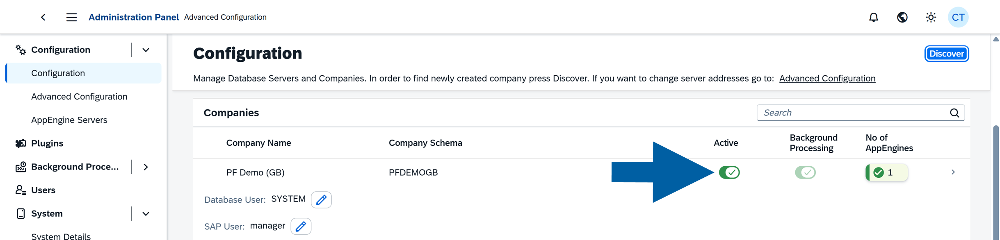
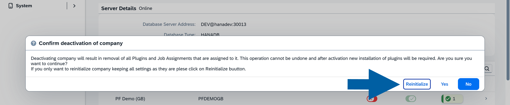
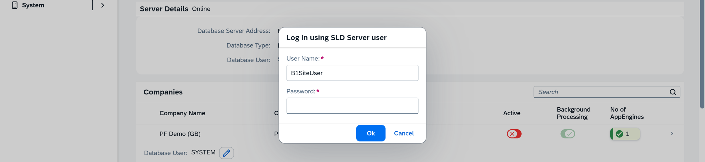
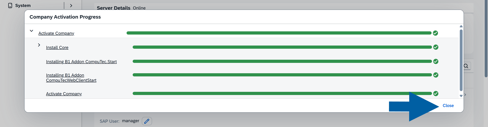
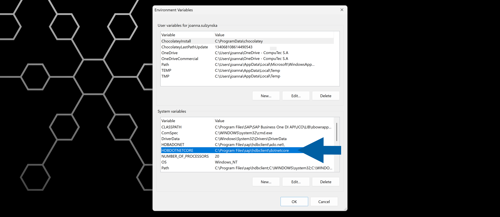
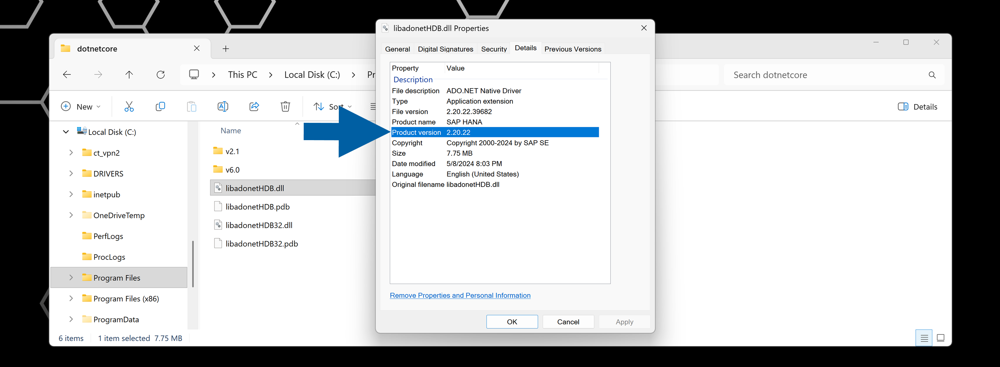
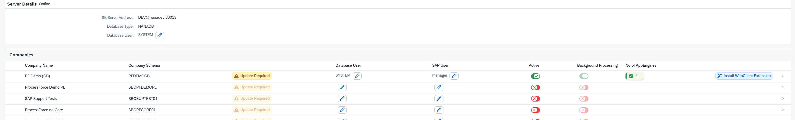

# Troubleshooting

## Troubleshooting

### Problem: CompuTec AppEngine restarts during long-running operations

In some environments, AppEngine may restart while processing long-running operations such as plugin installation, database setup, or other tasks that keep the SAP connection locked for an extended period.

This can happen when the operation takes longer than the configured `MaxConnectLockTime` value in the `AppEngineLockDetectAndRestartOptions` configuration section.

CompuTec AppEngine periodically checks how long the SAP connection has been locked. If the lock duration exceeds the configured `MaxConnectLockTime`, CompuTec AppEngine assumes the connection is stuck and automatically restarts the service.

As a result, legitimate long-running operations may be interrupted before they can finish.

:::note[info]
This procedure must be performed by a system administrator or consultant with access to the CompuTec AppEngine server, configuration files, and Windows services.
:::

### Solution

Increase the `MaxConnectLockTime` value in the `AppEngineLockDetectAndRestartOptions` section of the AppEngine configuration file.

Example:

```json
"AppEngineLockDetectAndRestartOptions": {
  "CheckInterval": "00:00:30",
  "MaxConnectLockTime": "00:20:00",
  "Disabled": false
}
```

After updating the configuration restart the CompuTec AppEngine service.

:::info[note]

By default, CompuTec AppEngine uses the following values:

```json
"AppEngineLockDetectAndRestartOptions": {
  "CheckInterval": "00:00:30",
  "MaxConnectLockTime": "00:10:00",
  "Disabled": false
}
```

Increase `MaxConnectLockTime` only when legitimate operations require more time to complete. The value should be greater than the expected duration of the longest operation performed in your environment.
:::

## Problem: CompuTec WebClient Start can't be opened when CompuTec AppEngine and SAP Business One Web Client use the same host name

In some environments, **CompuTec AppEngine** and the **SAP Business One Web Client** may be configured to use the same host name.

After logging in to CompuTec AppEngine, users may be unable to open **CompuTec WebClient Start** or other applications within the **SAP Business One Web Client**.

This happens because SAP Business One limits the size of HTTP request headers. When both applications use the same host name, authentication cookies created by CompuTec AppEngine are also included in requests sent to the SAP Business One Web Client. In some cases, this causes the request size to exceed SAP's limit and the request is rejected.

### Solution

Configure **CompuTec AppEngine** and the **SAP Business One Web Client** to use different host names.

Using separate host names prevents **CompuTec AppEngine** authentication cookies from being sent with **SAP Business One Web Client** requests and helps avoid HTTP header size limitations enforced by SAP.

For example:

- **CompuTec AppEngine**: `appengine.company.com`
- **SAP Business One Web Client**: `webclient.company.com`

After updating the configuration:

1. Clear the browser cache and cookies.
2. Log in to both applications again.
3. Verify that **CompuTec WebClient Start** opens correctly.

## Problem: CompuTec WebClient Start can't be opened after the CompuTec AppEngine update

In some environments, the **CompuTec WebClient Start** application may fail to open after updating or installing **CompuTec AppEngine**.

The following error message may appear in **SAP Business One Web Client**: ``App could not be opened because the SAP UI5 component of the application could not be loaded.``

This issue can occur when the company configuration was not fully refreshed after the update.

### Solution

One of the workable solutions is to reinitialize the company in the **CompuTec AppEngine Administration Panel**.

:::info[note]
Reinitializing a company refreshes the company configuration while keeping existing settings. During the process, the company may be temporarily unavailable for users.
:::

To reinitialize the company, follow these steps:

1. Log in to the **CompuTec AppEngine Administration Panel**.
2. Go to **Configuration**.
3. In the **Companies** section, locate the company you want to reinitialize.
4. Click the **Active** toggle next to the selected company.

    

5. In the confirmation window, click **Reinitialize**.

    

6. Enter the SLD Server user password, and click **OK**.

    

7. Wait until the **Company Activation Progress** window shows all steps completed successfully, and click **Close**.

    

After the process is completed, open **CompuTec WebClient Start** again and verify that the application loads correctly.

## Problem: Background processing can't be activated in CompuTec AppEngine

In some **CompuTec AppEngine** installations, administrators may encounter an issue where **Background Processing** cannot be activated for a company. When attempting to enable it, the activation fails and you can see an error.

    

You may also see that the **CompuTec AppEngine log file** contains an error similar to: ``Invalid number: not a valid number string '###_SEVTVALIDCK####'``

This issue is usually caused by incorrect custom code in ``SBO_SP_POSTTRANSACTIONNOTICE``, which blocks the CompuTec AppEngine configuration process.

### Solution

One of the workable solutions is to check and correct the **Post Transaction Notification** procedure in the **SAP Business One company database**.

:::warning[important]
Custom logic in **Post Transaction Notification** can affect multiple system processes.
Any changes should be reviewed and approved by your SAP Business One administrator or database administrator before proceeding.
:::

First, make sure the SAP environment configuration step was completed correctly: Follow the instructions in [our documentation](https://learn.computec.one/docs/appengine/administrators-guide/configuration-and-administration/installation/#step-6-configure-background-processing-within-the-sap-environment) to configure background processing within the SAP environment.

If the issue still occurs:

- Check the ``SBO_SP_POSTTRANSACTIONNOTICE`` procedure in the company database.
- Review any custom queries or validations added to the procedure.
- Temporarily disable or correct the problematic customization.
- Activate the CompuTec AppEngine company again.

After resolving the issue, you will be able to activate **Background Processing** without problems.

## Problem: CompuTec AppEngine fails to start – Event ID 7000 or 7009

On some Windows systems, **CompuTec AppEngine** may fail to start and **Windows Event Viewer** logs ``Event ID 7000`` or ``Event ID 7009``. These errors usually indicate that the **Windows Service Control Manager** stopped waiting for the service to start because it exceeded the allowed startup time.

You may see one or more of the following symptoms:

- CompuTec AppEngine does not start automatically after a system reboot.
- The service fails shortly after startup.
- You can find the following logs in **Windows Event Viewer**:
  - **Event ID 7000**: ``The service failed to start.``

    

  - **Event ID 7009**: ``A timeout was reached while waiting for the service to connect.``

    

### Solution

One of the workable solutions is to increase **Windows Service Startup Timeout**.  

:::warning[important]
This change affects how Windows handles **all services during startup**. You must discuss and approve it with your system administrator before proceeding. Apply this solution **at your own risk**.
:::

Windows uses a registry value called **ServicesPipeTimeout** to determine how long it waits for a service to start. Increasing this timeout can allow **CompuTec AppEngine** enough time to initialize successfully.  

Here’s a step-by-step guide on how to do it:

1. Run **Registry Editor** as an administrator.

    

2. Navigate to: ``HKEY_LOCAL_MACHINE\SYSTEM\CurrentControlSet\Control``

    

3. Look for a **DWORD** value named: **ServicesPipeTimeout**.

4. (optional) If **ServicesPipeTimeout** doesn't exist, create it:

    - **Right-click** > **New** > **DWORD (32-bit) Value**.
        
    - Name it ``ServicesPipeTimeout``.

5. Double-click **ServicesPipeTimeout**.
6. Enter the value: ``120000`` for 2 minutes, or ``180000`` for 3 minutes, and select **Decimal**.

    

7. Click **OK** and close **Registry Editor**.
8. Restart the system to apply the change.
9. Done! Now you can start **CompuTec AppEngine** again.

## Problem: Hyper-V reserving CompuTec AppEngine default port 54001

On some Windows systems, **Hyper-V** networking may reserve **TCP ports** that **CompuTec AppEngine** needs to start. When this happens, CompuTec AppEngine can't use its default **port 54001**, and the service doesn't start.

When Hyper-V is turned on, the **Windows NAT (WinNAT)** service may automatically reserve certain port ranges for virtual networking. If **port 54001** is included in one of these ranges, CompuTec AppEngine cannot bind to it, even though nothing else seems to be using it.

You may see one or more of the following symptoms:

- The **CompuTec AppEngine service** doesn't start or stops immediately after starting.
- **Log files** or **Windows Event Viewer** show messages such as: `Address already in use or Failed to bind to port 54001.`
- No other visible application appears to be using **port 54001**.

### Solution

:::info[note]

- You must run these steps as a local administrator.
- Stopping **WinNAT** may temporarily interrupt networking for virtual machines, for example, Docker.

:::

1. Close **CompuTec AppEngine** and any related admin tools. If **CompuTec AppEngine** runs as a **Windows service**, stop it from **Services**.
2. Find **Command Prompt** in your **Start menu**, right-click on it and select **Run as administrator**.
3. Run the following command: `net stop winnat` to stop the WinNAT service.
4. Wait until Windows confirms that the service has stopped.
5. Run the following command: `net start winnat` to start the WinNAT service again.
6. Once restarted, Windows recalculates the reserved port ranges. In many cases, this frees port 54001 so CompuTec AppEngine can start normally.
7. Done! Now you can start **CompuTec AppEngine** again.

#### If the problem persists

If AppEngine still cannot start **after restarting WinNAT**:

- Confirm that no other service is configured to use **port 54001**.
- Check with your system administrator whether other network tools (Docker, WSL2, additional Hyper-V setups) are reserving the same port range.
- Consider changing the CompuTec AppEngine port (if supported in your configuration) to a port outside the reserved range.

:::note[info]
If you need help, or have any questions, contact us via the [CompuTec Support Portal](https://support.computec.pl/servicedesk/customer/portals?q=webUp).
:::

## Problem: CompuTec AppEngine couldn't connect to the database

CompuTec AppEngine fails to connect to the SAP HANA database, and the following error is displayed:

>`Could not load file or assembly 'Sap.Data.Hana.Core.v2.1, Version=2.7.26.0, Culture=neutral, PublicKeyToken=0326b8ea63db4bc4'. Could not find or load a specific file. (0x80131621).`

### Solution

You have to ensure that the **SAP HANA Database (HDB) Client** installed on the system where CompuTec AppEngine runs matches the **SAP HANA server revision**. It's important that the environment variable path is correctly pointing to the installation directory.

To check the environment variable path, follow these steps:

1. Go to **Windows** > **System Properties** > **Environment Variables...**.

    

2. Locate the variable named **HDBDOTNETCORE** and note the path. In our example, it's `C:\Program Files\hdbclient\dotnetcore`.

    

3. Open the noted path on your computer.

4. Find the **libadonetHDB.dll** file, right-click on it, and click **Properties**.

5. Check its **Product version**. It must match the [**HANA Server Revision**](https://help.sap.com/docs/SAP_BUSINESS_ONE_ADMIN_GUIDE_HANA/1a2fc202f7f64336abf9fbc957d9b9ba/13c43452877d4feaad4dbd661d15d9bb.html).

    

6. Done! Now you know if the environment variable path is correctly pointing to the installation directory.

## Problem: Some features are disabled after CompuTec AppEngine upgrade

After upgrading CompuTec AppEngine, some or all CompuTec AppEngine features appear disabled or unavailable.

### Solution

To resolve this issue, follow these steps:

1. Log in to **CompuTec AppEngine Administration Panel**.

2. Navigate to **Configuration**.

3. Review the list of your companies.

4. Click the **Update required** label and complete the guided steps to finish the company update process.

    

5. Done! Now all features are active.
