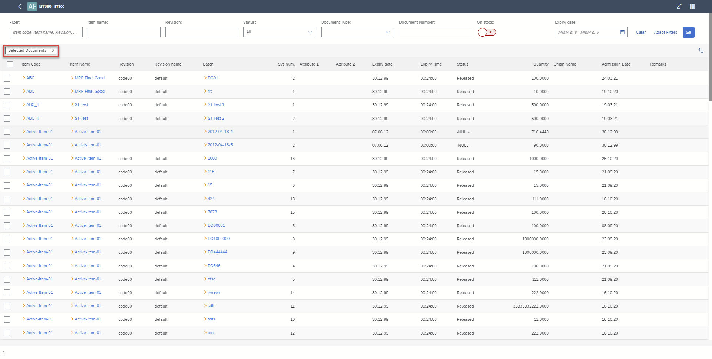
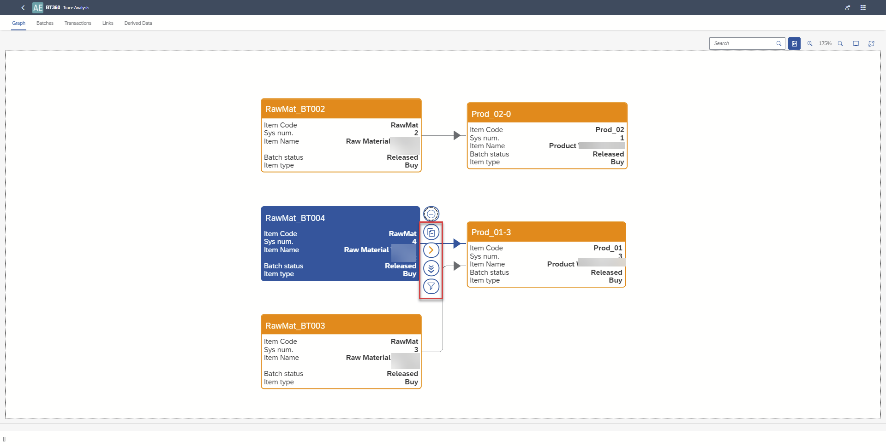
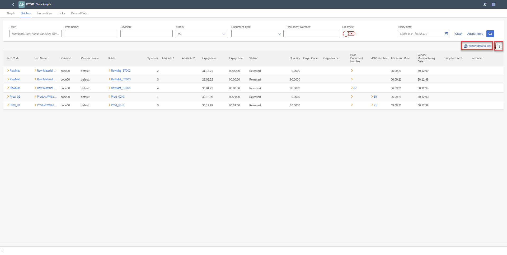

# Multi-Batch Analysis

The Multi-Batch Analysis functionality in SAP Business One (BT360) provides users with powerful tools to analyze and understand the relationships between batches at the transaction (document) level.The user can save data used in the graph as an  xlsx file.
There are three core data sets directly derived from the graph:

    - Batches with attributes
    - Transactions (documents) for each Batch
    - Links between Batches

Additionally, there is one set of derived data:

    - (Direct → Indirect Batch) - Transactions. This data specifies all indirect batches that affect a direct batch, along with all transactions associated with the direct batch.

Using this data, users can create pivot tables to gain insights such as:

- Are there any Batches affected by a raw material Batch with Country of Origin of Pakistan for selected delivery notes?
- Which delivery notes are impacted by batches from a selected Goods Receipt Purchase Order (GRPO)?

In Batch Traceability 360, it is possible to:

1. **Filter Batches by Document** - Users can filter batches associated with a specific document type (such as Document Type → Doc entry) and then switch to Trace Analysis on the list of batches.
2. **Transaction Analysis for Selected Batches** - Once batches are selected, users can access transaction analysis for those batches. This includes:
    - Multi batches graph
    - A grid of batches with attributes
    - A grid of transactions
    - A grid of links
    - A grid of derived data

3. **Export Data** - All data from the four grids (Batches, Transactions, Links, Derived Data) can be exported into a single XLSX file, with each data type organized into a separate tab for ease of use.
4. **Selection of Multiple Batches on the Graph** - By selecting multiple batches within the graph, users can redirect to a single batch analysis for further in-depth exploration.

---

## Batches Selection for Trace Analysis

You have the option to select multiple batches directly from the batch list, or you can first choose specific documents to filter and narrow down the batches to those associated with the selected documents.

- To narrow down batches, click the "Select Documents" button

    

For more information on filtering batches, click [here](https://www.youtube.com/watch?v=rr60g-PGttY).

- Batch selection and run of Trace Analysis

    

To know more about Batch Selection, click [here](https://www.youtube.com/watch?v=8Q4GkChEFqw).

## Trace Analysis

### Graph

Once batches are selected, users can run the trace analysis, which will provide a visual graph of related documents and batch details. From this graph, users can:

- View related documents
- Open related batch details in SAP Business One via a yellow arrow (BT360 have to be opened from the SAP Business One level).
- Navigate to a single batch analysis (opened in a new tab).
- Filter to display only the related nodes.
    

Click [here](https://www.youtube.com/watch?v=-A73RG9ynzw) to know more about Trace Analysis.

### Export Data

In each grid (Batches, Transactions, Links, Derived Data), users can sort data as needed. Once sorted, the data from all four grids can be exported to a single XLSX file, with each type of data on a separate tab for easy analysis.

Click [here](https://www.youtube.com/watch?v=GXQlY4yV2rA) to know more about exporting data.

---
The Multi-Batch Analysis functionality in SAP Business One (BT360) offers businesses a robust solution for understanding the complex relationships between batches at the transaction level. By providing comprehensive insights through grids and graphical representations, users can easily identify how batches influence each other and impact business operations.
