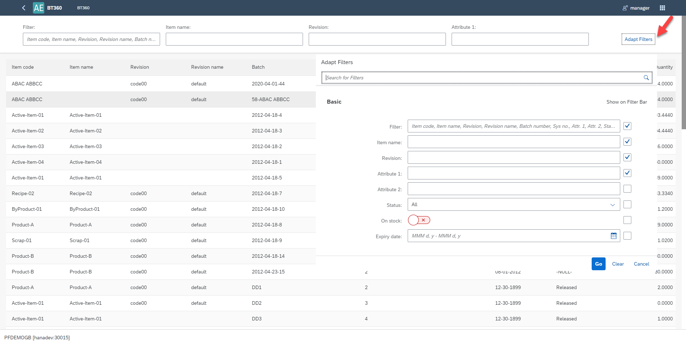
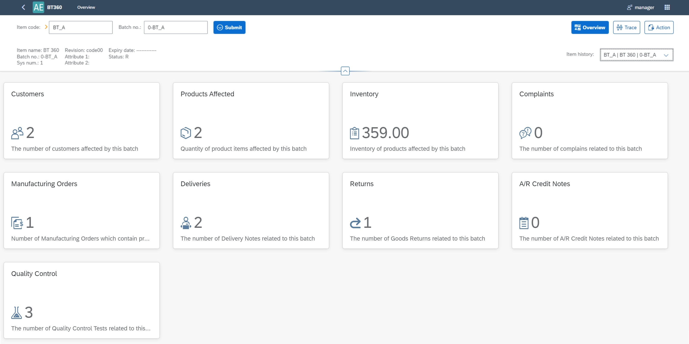
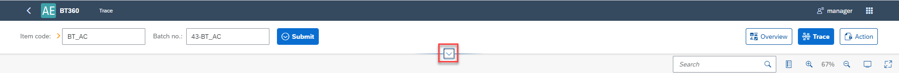

# Overview

Batch Traceability 360 plug-in allows to trace Item Batches through all its life in a company: from production (or purchase), being a part of a production process of other Item, to delivery to a client. Instant access to batches records is very useful, e.g. in complaint management or recall process.

[Batch Traceability Scenario - A Guided Tour](https://youtu.be/ZHUswSIKTu0)

## Installation and Configuration

### Prerequisites

Before using the Batch Traceability 360 plug-in, ensure that the prerequisites are met:

CompuTec ProcessForce and CompuTec Licence Server is installed and configured. For more details, refer to the installation documentation [here](/docs/processforce/administrators-guide/licensing/computec-license-server/overview/)

### CompuTec AppEngine and Plug-in Installation and Configuration

For CompuTec AppEngine installation, follow the instructions outlined in the [Installation](../../administrators-guide/configuration-and-administration/installation.md) Guide.

For configuring the plug-in, refer to the [Configuration and Administration](../../administrators-guide/configuration-and-administration/configuration.md) Guide.

### CompuTec ProcessForce

Optionally, you can invoke the Serialization plug-in within the CompuTec ProcessForce application. To enable this:

## Start points for function opening

You can access CompuTec ProcessForce Batch Traceability 360 by:

- AppEngin launchpad
- Modules Menu (check the path below)
        :::info Path
                Inventory > Item Management > Batches > Batch Traceability 360
        :::

- Transaction tab on Complaint form:

        

Click [here](/docs/processforce/user-guide/complaint-management/complaint/) to find out more about Complaint function.

- Batch Master Data form context menu

        

Click [here](/docs/processforce/user-guide/inventory/batch-control/batch-master-data/overview/) to find out more about Batch Master Data.

## Batch List

You can compose filter using Adapt Filters:

Select a Batch line and you will be redirected to its Overview.

## Overview

On this screen, you will find tiles that provide analytical information. The selected batch serves as the starting point for the analysis. Prepared information is related to the Batch and products (Batches) affected by the Batch. That means, information is prepared for all nodes on the right, from selected node in the trace graph.

>**Note**: When you access Batch Traceability from SAP Business One, you can use the yellow arrow functionality, just like in SAP Business One.

To see extended view of header please select 

Select button  and you will be redirected to Batch Trace graph.

## Batch Trace Graph

- Specific batches are represented by boxes (nodes) containing their details.
- You can zoom in or out using the mouse wheel or the zoom buttons  and .
- You can show or hide legend by using .
- You can expand the view by using the .

### Going Forward and Backward

The Batch Trace visualization form displays the composition of a specific item by tracing backward through each batch involved in its production process, all the way to the selected batch.

You can also select a batch and trace forward to see where the items from that specific batch were used. To do this, hold Shift and left-click on the desired batch.

You can also track your trace history from the list at any point, allowing you to switch between different batches and views, including Overview, Trace, and Action.

### Transactions

To view activities and transactions associated with a specific batch, left-click on the corresponding box and then select  button. This will display all activities linked to the selected batch.

Click the yellow arrow in a specific document row to access more detailed information about that transaction.

## Action

To navigate to the Action view, please select  "Action" button. In this view, you can update the status of batches. To change the status of a batch, select the line from the list, select the checkboxbox in the first column, and then finally click the "Change Status" Button.

---
The Batch Traceability 360 plug-in provides a powerful and flexible tool for tracking the complete lifecycle of batches within SAP Business One. From production to delivery, it offers unparalleled transparency, which is crucial for managing quality, handling complaints, and responding to recalls. The intuitive interface and comprehensive analytics enhance operational efficiency and ensure compliance with industry standards, making it an essential tool for businesses dealing with complex inventory and production processes.
