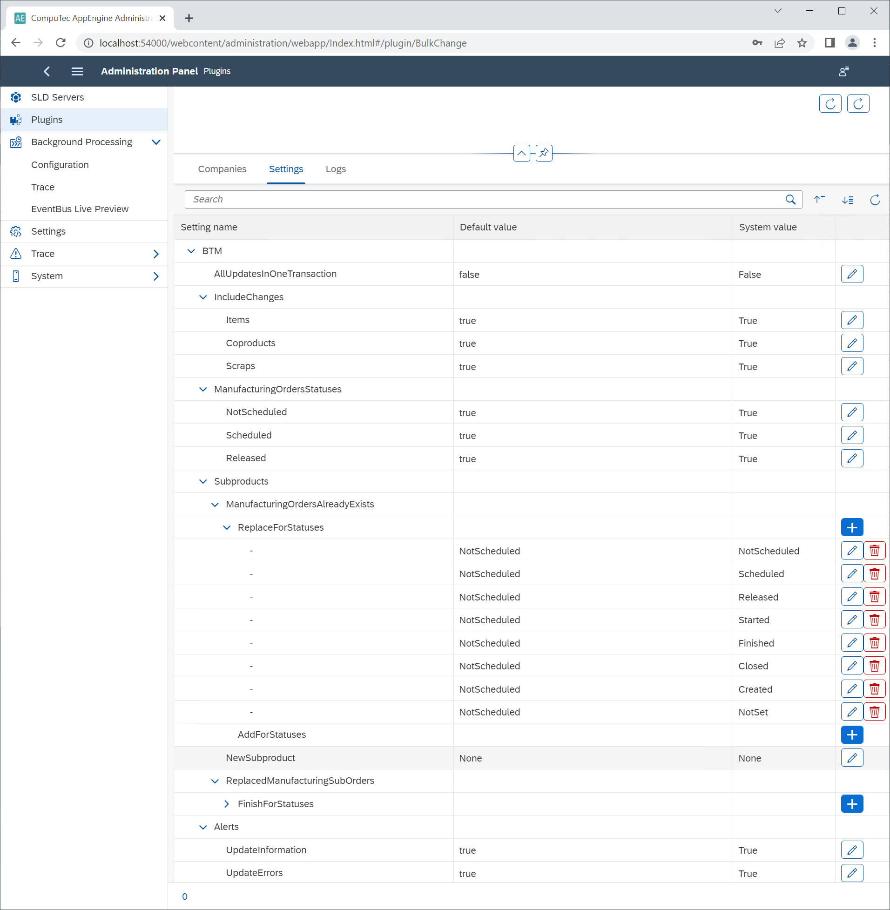

# BOM to MOR Update

This function allows propagating changes made on a particular Bill of Materials to existing Manufacturing Orders based on criteria given in the configuration. This guide outlines the installation, configuration, and usage process, detailing all available options and their effects. Additionally, it highlights the system’s capability to handle updates with flexibility and error management, ensuring uninterrupted production operations.

---

## Installation

This feature is built on CompuTec AppEngine job, which is automatically installed during the [BulkChange plugin installation](../bulk-changes-on-bills-of-materials/installation-and-configuration.md). o enable the BOM to MOR update, ensure:
    - Send Events Job is active for a specific company. Click [here](../../administrators-guide/configuration-and-administration/configuration.md) to find out more.
    - Background processing is configured for the specific company.

## Configuration

To configure the BOM to MOR Update functionality, follow the path:

:::info Path
CompuTec AppEngine → Administration Panel → Plugins → CompuTec BulkChange Plugin → Settings
:::

There are additional settings that allow to filter which related Manufacturing Order are to be updated. Set a true or false value to activate or deactivate any option. The default values are used when no System values are set by a user.

| Option | Description |
|--- | --- |
| <u>AllUpdatesInOneTransaction</u> |When it is set to true, all of the related updates have to be successful (otherwise no update is performed).  If it is set to false, in case of failure on one of the Manufacturing Orders, the rest of them will be still updated.|
| <u>IncludeChanges</u>: <li>Items</li> <li>Coproducts</li> <li>Scraps</li> | These elements are taken under consideration during an update (each of the element can be switched off) |
| <u>ManufacturingOrdersStatuses</u>: <li>NotScheduled</li> <li>Scheduled</li> <li>Released</li> | Define Manufacturing Orders in which status are taken under consideration during an update (each of the element can be switched off).  Other Manufacturing Order statuses are not available because of being not editable, e.g. the Closed status. |
| <u>Subproducts</u> | In this section, you can configure the plugin to work for cases when the Manufacturing Order for the subproduct already exists (meaning, there are Items that are BOMs and there can have related Manufacturing Orders).   <u>**ManufacturingOrdersAlreadyExists**</u>  If there are related Manufacturing Orders, then there are two options:  <u>Replace for Statuses</u> – a BOM Item line with related Manufacturing Orders in specific status is replaced in the Final Good Manufacturing Order  <u>AddForStatuses</u> – a new BOM Item line with related Manufacturing Orders in specific status is added in the Final Good Manufacturing Order   <u>ReplacedManufacturingSubOrders</u> – related to the Replace for Statuses option; defines what happens upon the replace.  FinishforStatuses – set status to Finish for the replaced Manufacturing Orders in specific statuses |
| <u>Alerts</u> | You can define whether user will get alerts upon successful or failed updates. |

## Usage

The BOM to MOR Update functionality allows users to propagate changes made to a Bill of Materials to associated Manufacturing Orders effortlessly. Follow the steps below to initiate and monitor updates, ensuring seamless data synchronization:

1. Make some changes to the Bill of Materials:

    :::info Path
    Production → Bill of Materials → Bill of Materials
    :::

2. Set the MOR Update Status User-Defined Field to the U - Start Update option:

    :::info Path
    the upper menu → View → User-Defined Fields
    :::

    

3. Click the Update button in the Bill of Materials form. Now the status of the related MOR Update is available in the MOR Update Status UDF:

    - **Processing** – Update is in progress (the time of processing depends on the data structure and volume).

    - **Success** or **Failure** – Final result of the update.

---
The BOM to MOR Update functionality simplifies production management by ensuring that changes to BOMs are reflected in MORs accurately and efficiently. With proper setup and usage, this tool becomes a vital asset for maintaining production data integrity and supporting operational excellence.

For any further assistance or advanced configurations, consult the CompuTec support team or related documentation.
