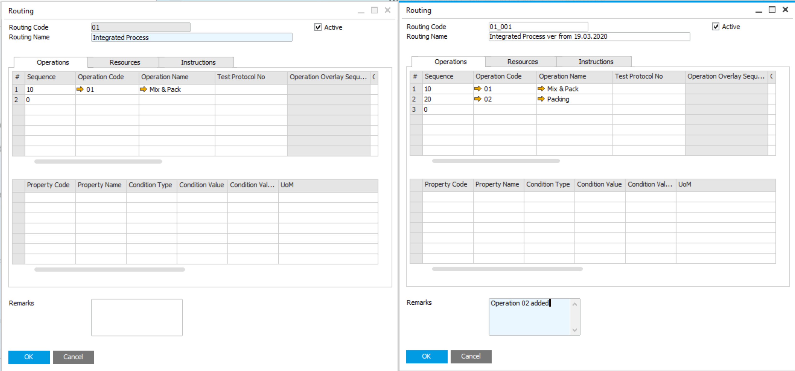

# Case 1 – Routing Changing for Selected Processes

Requirement:  When a routing is changed, it must be possible to replace it in the production process. We can change the following things:

- Operations
- Resources for operations
- Times
After changing the Routing there should be a possibility to choose whether we change it in every process or only in selected ones.

| Step | Action | Obilgatory |  |
| --- | --- | --- | --- |
| 1 | In B1/PF prepare modified Routing's template (define new Code by adding e.g. Revision ID) with changes in: Operations, Resources, times, etc. It is recommended to put some additional information in Remarks (the scope of changes). | Yes |  |
| 2 | Open Bulk Changes from AppEngine or directly from B1/PF, create new scenario and Select Change Scope = Routings | Yes | 

Click here to expand

 |
| 3 | In Selected BOMs tab select BOMs (processes) for which the routing have to be changed | Yes | 
 
Click here to expand
 
 |
| 4 | In Routings tab filter and select routing which has to be replaced. Choose mode Replace and select routing (prepared in step 1) as a Replacement. At the end you can unselect some processes. The change will not affect them. | Yes | 
 
Click here to expand
 
 |
| 5 | Add Scenario | Yes | - |
| 6 | Start process of bulk changes preparation | Yes | 
 
Click here to expand
 
 |
| 7 | Check if the changes are correct in Proposed Changes tab | Yes | 
 
Click here to expand
 
 |
| 8 | Execute the scenario | Yes | 
 
Click here to expand
 
 |
| 9 | Check results of bulk changes in Proposed Changes tab and in B1/PF | Recommended |
 
Click here to expand
 
 |
