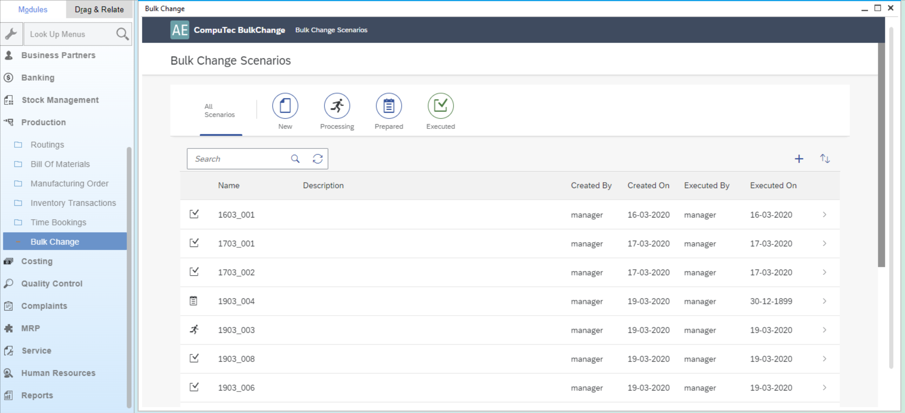

# Installation and Configuration

## Prerequisites

Process Force and CompuTec Licence Server is installed and configured

For more information click [here](/docs/processforce/administrator-guide/licensing/license-server/overview/).

## AppEngine and Plugin Installation and Configuration

For AppEngine installation please follow this link: [Installation](../../administrators-guide/installation.md).

For plug-in installation please follow this link: [Configuration and Administration](../../administrators-guide/configuration-and-administration/overview.md).

### ProcessForce

As an option you can call Bulk Change plug-in from inside the Process Force:

To do this, check the following checkbox:

Enter AppEngine url, e.g. `http://{host}:54000`, click Update and restart SAP Business One.
