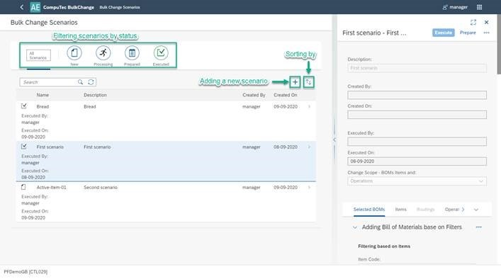
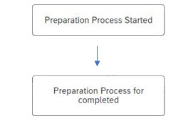
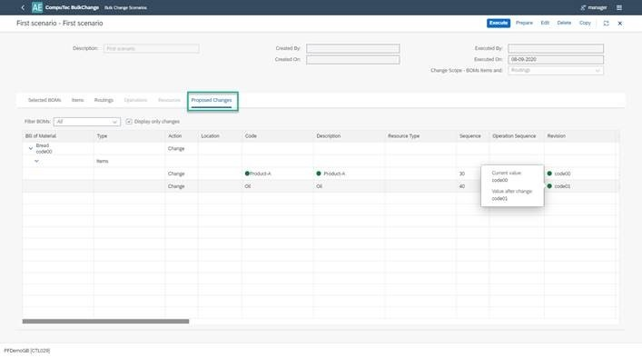
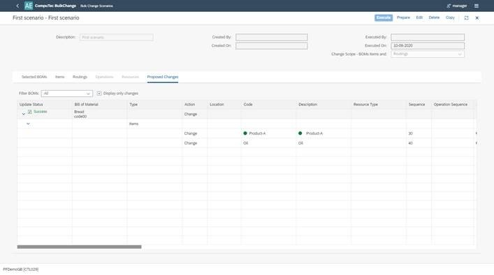

# Scenario Management View

From this view it is possible to create a new scenario as well as work on previously created ones. You can also filter them by their status.

Scenario statuses:

- **New** – a scenario that is in the edition mode. After editing a previously created scenario, it always gets the New status
- **Processing** – a temporary status. A scenario gets it when it is being processed. After changing status, e.g. from New to Prepared. Starting and finishing of the processing is communicated to a user by a related system message:

    

- **Prepared** – a scenario ready to be used. It is possible to check this scenario's proposed bulk changes In the scenario details, in Proposed Changes tab.

    

- **Executed** – a scenario that was realized. You can get more information about success of failure of the execution in the scenario's details, Proposed changes tab.

    
