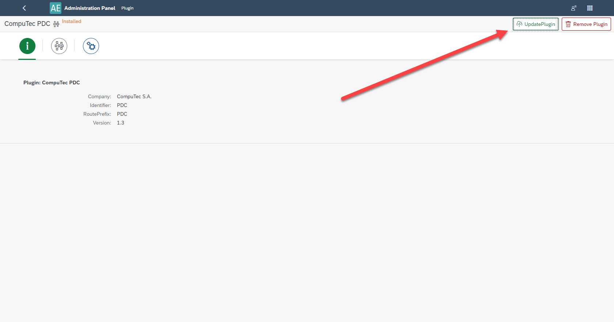
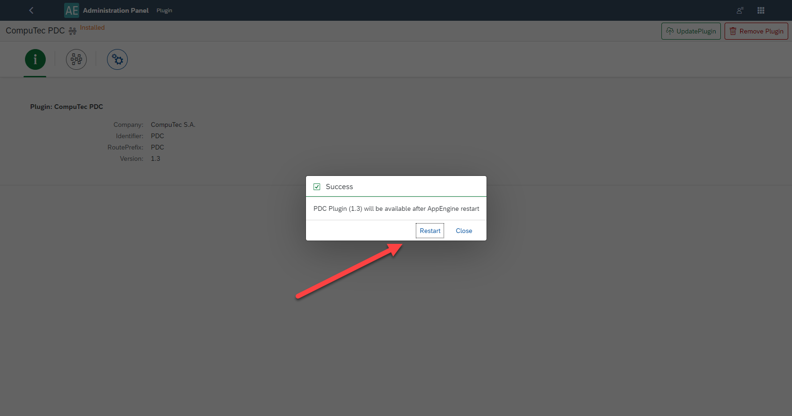
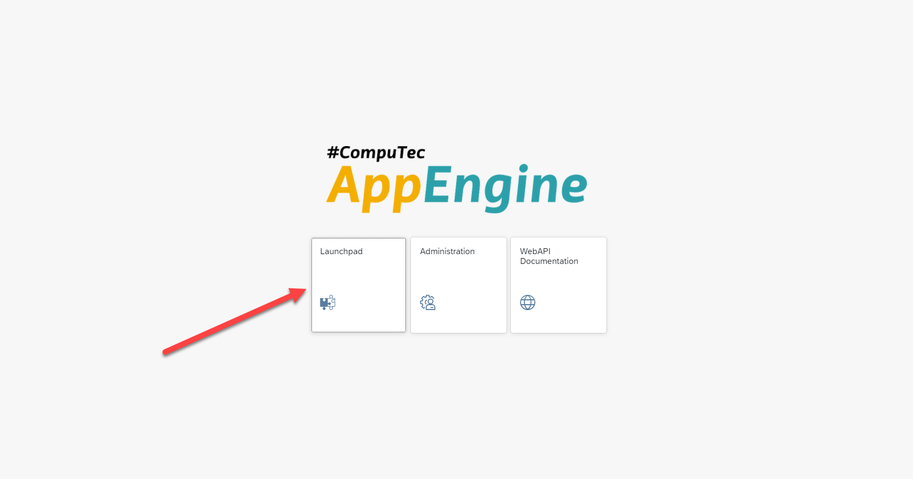

# CompuTec PDC Plugin

PDC stands for Plant Data Capture. The CompuTec PDC Plugin integrates seamlessly with CompuTec ProcessForce Time Bookings, offering an efficient way to capture production task data directly from the production floor using mobile touchscreen devices. It records time spent on specific tasks or operations, allows you to oversee the precise details about any given operation such as machine data, features, operational history and item details and using the management panel you can supervise your entire machine park and its operations as well as check resource status.CompuTec PDC on CompuTec AppEngine gives you more speed and makes work-time record more effective.

This guide provides comprehensive instructions on working with the CompuTec PDC Plugin and CompuTec AppEngine. It complements the main CompuTec PDC application manual, (which is available [here](/docs/pdc/)).

---

## Prerequisites

Before using the CompuTec PDC Plugin, ensure the following are installed and configured:

1. CompuTec ProcessForce and CompuTec Licence Server is installed and configured. Refer to the relevant installation guide [here](/docs/processforce/administrator-guide/licensing/license-server/overview/).

2. CompuTec PDC requirements have been fulfilled. Verify the system meets all requirements [here](/docs/pdc/administrator-guide/installation/requirements/).

:::caution
The CompuTec PDC Plugin is compatible only with the 64-bit version of CompuTec PDC.
:::

## CompuTec AppEngine and Plugin Installation and Configuration

Follow the individual installation guides for each required component:

- [CompuTec AppEngine installation](../administrators-guide/configuration-and-administration/installation.md)
- [CompuTec PDC plugin](../administrators-guide/configuration-and-administration/configuration.md)
- [CompuTec ProcessForce plugin](../plugins-user-guide/processforce.md)
- [CompuTec ProcessForce API (on the same server as CompuTec AppEngine)](/docs/processforce/releases/download#computec-processforce-api)
- [CompuTec PDC application](/docs/pdc/administrator-guide/installation/first-installation/)

:::caution
CompuTec ProcessForce API needs to be installed on the same server as CompuTec AppEngine.
:::

## Setting up the Application

After a successful installation choose the CompuTec AppEngine console which database would you like to bind in :

Then open the CompuTec PDC application and fill in Settings with data (default CompuTec AppEngine server is `https://localhost:54000`. It is required to fill in the fields in the order marked on the following screenshot to refresh the application and download the data.

Filling in the fields marked with the red arrows automatically fills in the fields marked with the purple arrows (then, choose one option from the drop-down list).

## Upgrade of the Application

To successfully upgrade the application, follow the steps outlined below:

    1. Update plugin in the CompuTec AppEngine console (you can do it by choosing the plugin package) and restart the plugin.

        
        
        

    2. Install the corresponding CompuTec PDC application (before that, uninstall the existing CompuTec PDC application.)

        :::caution
        Check if you need to upgrade CompuTec ProcessForce API too (if yes, remove the existing one and install the new, corresponding one once again).
        :::

    3. Start CompuTec PDC application.

## Additional Information

1. CompuTec PDC details information can be found here.
2. CompuTec AppEngine for CompuTec PDC is only available from web address, no reference in SAP Business One or CompuTec ProcessForce functional objects.
3.Relevant CompuTec PDC installer to installed CompuTec PDC Plugin can be reached from CompuTec AppEngine Console level. Instruction below:
    a. Open Launchpad in Appengine Console:

        

    b. Fill the login data (remember that here the user ID and password are the same as your SAP Business One login).

        

    c. Open CompuTec PDC, download the file and go through the installation.

        
        
