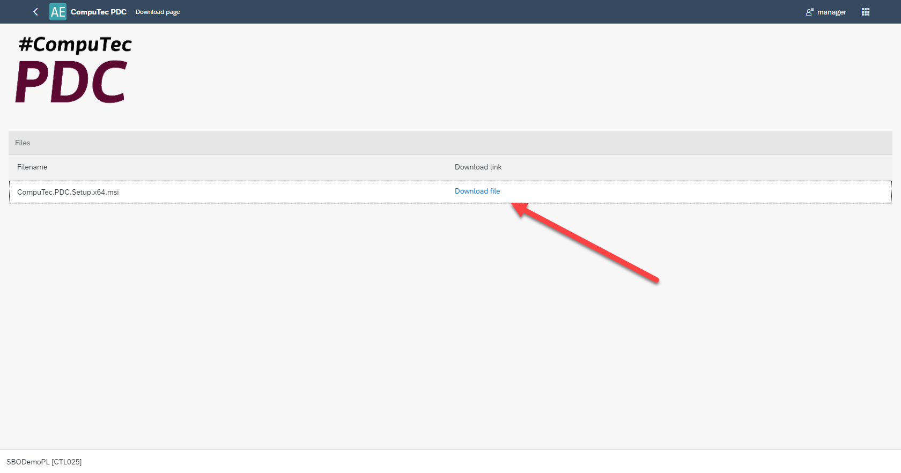

# CompuTec PDC Plugin

:::info
This manual presents how to work with CompuTec PDC and AppEngine. It is not a manual for CompuTec PDC application (which is available [here](/docs/pdc/)).
:::

PDC stands for Plant Data Capture: the application allows to record production task by using ProcessForce Time Bookings documents directly from production floor via mobile touchscreen devices. It records time spent on specific tasks or operations, allows you to oversee the precise details about any given operation such as machine data, features, operational history and item details and using the management panel you can supervise your entire machine park and its operations as well as check resource status.

PDC on AppEngine gives you more speed and makes work-time record more effective.

---

## Prerequisites

ProcessForce and CompuTec Licence Server is installed and configured. For more information click [here](/docs/processforce/administrator-guide/licensing/license-server/overview/).

CompuTec PDC requirements have been fulfilled, for more information click [here](/docs/pdc/administrator-guide/installation/requirements/).

:::caution
CompuTec PDC plugin works only with CompuTec PDC, 64bit version.
:::

## AppEngine and Plugin Installation and Configuration

Click each link for the specific component installation manual:

- [AppEngine installation](../administrators-guide/installation.md)
- [CompuTec PDC plugin](../administrators-guide/configuration-and-administration/overview.md)
- [ProcessForce plugin](/docs/appengine/administrators-guide/configuration-and-administration/overview)
- [ProcessForce API (on the same server as appengine)](/docs/processforce/releases/download/)
- [CompuTec PDC application](/docs/pdc/administrator-guide/installation/first-installation/)

:::caution
ProcessForce API needs to be installed on the same server as AppEngine.
:::

## Setting up the application

After a successful installation choose the AppEngine console which database would you like to bind in :

Then open the CompuTec PDC application and fill in Settings with data (default AppEngine server is `https://localhost:54000`. It is required to fill in the fields in the order marked on the following screenshot to refresh the application and download the data.

Filling in the fields marked with the red arrows automatically fills in the fields marked with the purple arrows (then, choose one option from the drop-down list).

## Upgrade of the application

To successfully upgrade the application please follow the steps:

    1. Update plugin in the AppEngine console (you can do it by choosing the plugin package) and restart the plugin.
    
    
    

    2. Install the corresponding CompuTec PDC application (before that you have to remove the already installed CompuTec PDC application)

:::caution
Check if you need to upgrade CompuTec ProcessForce API too (if yes, remove the existing one and install the new, corresponding one once again).
:::

    3. Start CompuTec PDC application.

## Additional info

1. CompuTec PDC details information can be found here.
2. AppEngine for CompuTec PDC is only available from web address, no reference in SAP Business One or ProcessForce functional objects.
3.Relevant CompuTec PDC installer to installed CompuTec PDC Plugin can be reached from AppEngine Console level. Instruction below:
    a. Open Launchpad in Appengine Console:
    
    b. Fill the login data (remember that here the user ID and password are the same as your SAP Business One login).
    
    c. Open CompuTec PDC, download the file and go through the installation.
    
    
