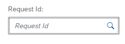

# CompuTec Labels

The CompuTec Labels (CTLabel) plugin is a powerful tool designed to enhance the functionality of CompuTec Labels, allowing users to manage and reprint labels efficiently. By following this guide, users can optimize their experience with the CTLabel plugin, streamlining label management processes and resolving printing errors with ease.

CTLabel plugin is related to [CompuTec Labels](/docs/labels/) and provides a range of functionalities to manage label printing requests effectively:
        - list all requests
        - list all requests based on multiple filters
        - reprint a label
        - reprint a label on a different printer
        - show printing details of a request
        - save filters in the URL
        - load filters from the URL

        

---

## CompuTec AppEngine and Plug-in Installation and Configuration

For detailed installatin steps,  refer to the the [CompuTec AppEngine installation manual](../administrators-guide/configuration-and-administration/installation.md) and [Plugin installation manual](../administrators-guide/configuration-and-administration/configuration.md).

Once installed, the plugin integrates seamlessly into your environment, providing an intuitive user interface for managing labels.

## Filters and Sorters

The plugin offers a comprehensive filter bar at the top of the page. Users can combine multiple filters to refine their search for specific requests. Here are the available filters:

1. **Request Id Filter**
        - This filter enables users to search for requests by a specific Request ID.
        - It functions as a SearchField filter, allowing you to input any text.
        - To locate requests with a particular Request ID, simply type the "Request Id" and press "Enter" key.

        

2. **Company Database Filter**
        - This filter enables searching for requests associated with specific Company Databases.
        - It is a MultiComboBox filter, allowing you to select one or more companies.
        - The available companies are derived from all requests, based on the distinct `CompanyDatabase` values in the Requests view.

        

3. **Requester Filter**
        - This filter allows you to search for requests based on specific requesters.
        - It is a MultiComboBox filter, enabling the selection of one or more requesters.
        - The list of requesters is constant, with the available values: **SAP, WMS, PDC, PF**.

        

4. **Status Filter**
        - This filter enables you to search for requests based on their specific status.
        - It is a MultiComboBox filter, allowing you to select one or more statuses.
        - The list of statuses is fixed and includes the possible values: **Started, Modified, Stopped, Finished, Done, Finished with errors**.

        

5. **Printer Filter**
        - This filter enables you to search for requests associated with specific printers.
        - It is a MultiComboBox filter, allowing the selection of one or more printers.
        - The available printers are derived from the list managed in the **CompuTec Label Printing Manager**.

        

6. **Transaction Type Filter**
        - This filter enables searching for requests with specific transaction types.
        - It is a MultiComboBox filter, allowing you to select one or more transaction types.
        - The list of transaction types is generated from all requests (based on distinct TransactionTypes values in the Requests view).

        

7. **Date Range Filter**
        - This filter enables searching for requests within a specific time period.
        - It is a DateRange filter, requiring you to select two dates.
        - They can be the same dates e.g. if you want requests from a specific day you need to select the same day twice.

        

8. **Adapt Filters**

        At the end of the filter bar, you'll find an Adapt Filters button. Clicking it opens a new dialog window containing all the filters.

                

        Any changes made in the "Adapt Filters Dialog" will take effect only when you close the dialog using the "Go" button. If you close the dialog with the "Cancel" button, the filters will revert to their previous state. The "Clear" button will reset all the filters. You can also use the checkboxes on the right side to toggle the visibility of different filters on the filter bar.

- **Sorting**

        

At the end of the filter bar, there is a "Sorting" button. Clicking it opens a dialog with all available sorting options.

        

In this dialog, you can choose the column to sort by and specify the sort order.

## Reprinting

The following steps outline the process for reprinting:

- To use the reprint function, click on the "Reprint" button on the selected request.

        

- This will open the "Reprint" form.

        

- At the top of the form, the request ID is displayed. The printer is pre-set to the one associated with the request being reprinted. You can choose a different printer from the list if needed.

        

>**Note**: The list of printers is based on the list of printers from **CompuTec Label Printing Manager**.

- Clicking the "Reprint" button will result in sending the request to reprint the label of the selected printer. If the operation is successful we will get a pop-up telling us that a new request has been added and the requests list will refresh automatically.

        

- If an error occurs, a pop-up will appear notifying us that there was an issue attempting to reprint the label.

        

## Request Details

The following steps outline the process for request details:

- To check the details of a given request, click on the "Details" button on the selected row.

        

- This will open the "Details" form.

        

- An the top of the dialog, you will find the request ID. Below you can view all the details for the given request. If the status of the request is "Finished with errors", a "Retry" button will appear within the details form.

        

- Clicking the "Retry" button will will initiate a reprint of the request. If successful, a pop-up will confirm that the retry operation has been completed, and the request list will automatically refresh The status will be updated to "Started" upon retrying.

        

- If there was an error we will get a pop-up telling us that there was an error trying to retry printing the label.

        

## Request Run Parameters

To check the run parameters of a given request, you need to click on the "selected" button on the selected row.

## Request Errors

To view the errors associated with a specific request, click on the "selected" button in the selected row.

## URL Parameters

The CTLabel plugin offers the ability to save filters within the URL and reload them. Each time a filter is adjusted, the URL is dynamically updated, and the corresponding data is refreshed automatically.

To manually add parameters,  add **?** sign at the end of the URL and then list all parameters like **parameterName=parameterValue1,parameterValue2**.

E.g. `http://localhost:54000/webcontent/launchpad/webapp/Index.html#/plugin/computec.appengine.ctlabel.plugin&labels`**?companyDatabase=SBODemoPL,SBODemoPL2**

We separate parameters using the **&** sign e.g. `http://localhost:54000/webcontent/launchpad/webapp/Index.html#/plugin/computec.appengine.ctlabel.plugin&labels`**?**
companyDatabase=SBODemoPL**&**status=E,F,C**&**transactionType=15,4

### List of URL Parameters

        - **requestId=sampleRequestId**  Full request Id or part of it.  E.g. requestId=12

        - **companyDatabase=companyName1,companyName2,...**  Company names are the names of the databases.  E.g. companyDatabase=SBODemoPL,SBODemoPL2

        - **requester=requester1,requester2,...**  Requester values are constant.  Possible requester values: **SAP, WMS, PDC, PF**.E.g. requester=SAP,PF

        - **status=status1,status2,status3,...**  Status values are constant. Possible status values: **C** (Started), **M** (Modified), **S** (Stopped), **F** (Finished), **D** (Done), **E** (Finished with errors).  E.g. status=E,F,C
        
        - **printer=printer1,printer2,..**
        Printer values (printer codes) are based on the list of printers from **Computec Label Printing Manager**.  E.g. printer=DefaultCrystal,DefaultZebra

        - **transactionType=transactionType1,transactionType2,...**  Transaction type values are based on the values from the **"@CT_PF_TSTS"** table.  The key for each transaction type is **"@CT_PF_TSTS"**.U_Name.  SAP types are numbers, other ones are strings.  E.g. transactionType=4,15,CT_PF_ADDITONALBATCH

        - **dateRange=date1-date2**  Date1 and date2 are saved in a yyyyMMdd format.  Date1 is the starting date, date2 is the ending date.  E.g. dateRange=20200701-20200731

        - **dateRange=date1-date2**  Date1 and date2 are saved in a yyyyMMdd format.  Date1 is the starting date, date2 is the ending date.  E.g. dateRange=20200701-20200731
        
        - **sorter=sorterKey** 
         Sorter key is a key for a given sorter option with possible values:
                - **R** - Request Id - Ascending
                - **RD** - Request Id - Descending
                - **C** - Company Database - Ascending
                - **CD** - Company Database - Descending
                - **T** - Requester - Ascending
                - **TD** - Requester - Descending
                - **P** - Printer - Ascending
                - **PD** - Printer - Descending
                - **N** - Transaction Type - Ascending
                - **ND** - Transaction Type - Descending

Sample link with all filters:

`http://localhost:54000/webcontent/launchpad/webapp/Index.html#/plugin/computec.appengine.ctlabel.plugin&labels**?**`
**requestId**=12**&companyDatabase**=SBODemoPL**&requester**=SAP**&status**=E,F,C**&printer**=DefaultCrystal**&transactionType**=15,4,CT_PF_ADDITONALBATCH**&dateRange**=20200701-20200731**&sorter**=PD

---
The CompuTec Labels (CTLabel) plugin is a versatile solution for managing label requests, offering extensive filtering, sorting, and error-handling features.
