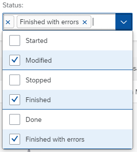
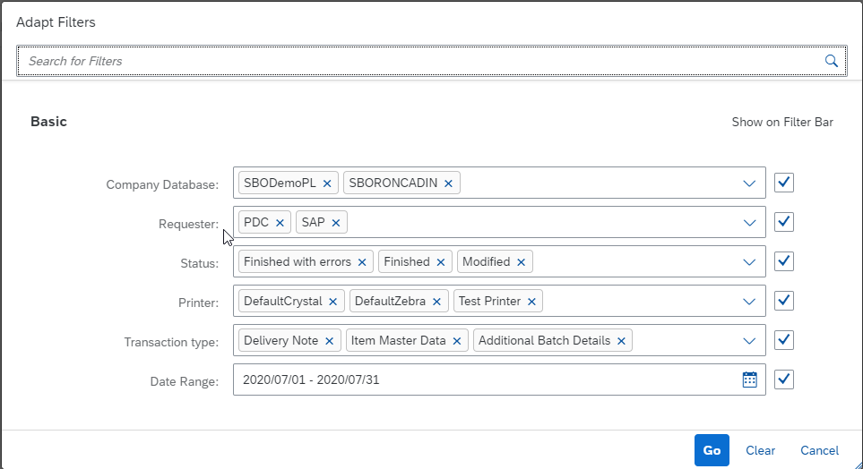
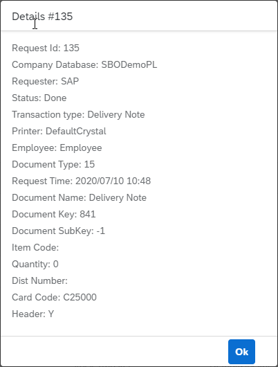

# CTLabel

CTLabel plugin is related to [CompuTec Labels](/docs/labels/) and allows to use some of its options:

- list all requests,
- list all requests based on multiple filters,
- reprint a label,
- reprint a label on a different printer,
- show printing details of a request,
- save filters in the URL,
- load filters from the URL.

---

---

## AppEngine and plug-in installation and configuration

For the AppEngine installation manual, click [here](../administrators-guide/installation.md).

For the plugin installation manual, click [here](../administrators-guide/configuration-and-administration/overview.md).

## Filters and Sorters

At the top of the page, there is a filter bar with all possible filters and sorters. You can combine them to get your wanted requests.

        - **Request Id Filter**

        This filter allows looking for requests with a given Request Id.
        It is a SearchField filter. You can write anything on it.
        To search for requests with a given request Id **write request Id and press Enter key**.

        
    
        - **Company Database Filter**
        
        This filter allows looking for requests with a given Company Database assigned to it.
        It is a MultiComboBox filter. You can select one or more companies.
        The list of companies is based on all the requests (distinct CompanyDatabase values from Requests view).

        

        - **Requester Filter**

        This filter allows looking for requests from given Requesters.
        It is a MultiComboBox filter. You can select one or more requesters.
        The list of requesters is constant. Available values: **SAP, WMS, PDC, PF**.
        
        

        - **Status Filter**

        This filter allows looking for requests with a specific status.
        It is a MutliComboBox filter. You can select one or more statuses.
        The list of statuses is constant. Possible values: **Started, Modified, Stopped, Finished, Done, Finished with errors**.    
        
        

        - **Printer Filter**

        This filter allows looking for requests assigned to specific printers.
        It is a MultiComboBox filter. You can select one or more printers.
        The list of printers is based on the list of printers from **Computec Label Printing Manager**.

        

        -- **Transaction Type Filter**

        This filter allows looking for requests with specific transaction types.
        It is a MultiComboBox filter. You can select one or more transaction types.
        The list of transaction types is based on all the requests (distinct TransactionTypes values from the Requests view).

        

        - **Date Range Filter**

        This filter allows looking for requests from a specific period.
        It's a DateRange filter. You have to select two dates. They can be the same dates e.g. if you want requests from a specific day you need to select the same day twice.

        

        - **Adapt Filters**

        At the end of the filter bar, there is an Adapt Filters button.
        Clicking it will open a new dialogue window with all the filters.

        

        Changing filters in **Adapt Filters Dialog** will only take effect if you close the dialog with the **Go** button.
        Closing the dialog with the **Cancel** button will return all the filters to the previous state.
        The **Clear** button clears all the filters.
        You can use checkboxes on the right side to hide/show different filters on the filter bar.

        - **Sorting**

        

        At the end of the filter bar, there is a **Sorting** button.
        Clicking it will open a new dialog with all sorting options.

        

        In this form, you can select the column you want to sort by and the sort order.

## Reprinting

To use the reprint function, you need to click on the **Reprint** button on the selected request.

It will open the **Reprint** form.

On the top of the form, you can see the request ID.
The printer value is set by default to the printer value of the request we want to reprint.
From the list, we can select the printer we want to reprint on.

The list of printers is based on the list of printers from **Computec Label Printing Manager**.

Clicking the **Reprint** button will result in sending the request to reprint the label of the selected printer.
If the operation is successful we will get a pop-up telling us that a new request has been added and the requests list will refresh automatically.

If there was an error we will get a pop-up telling us that there was an error trying to reprint the label.

## Request Details

To check the details of a given request, you need to click on the **Details** button on the selected row.

It will open the **Details** form.

On the top of the dialog, you can see the request ID.
Below you can check all the details for the given request.

If the status of the request is **Finished with errors**, there will be the **Retry** button inside the details form.

Clicking the **Retry** button will result in sending the request to retry printing the request.
If the operation is successful we will get a pop-up telling us that a retry operation has been done and the requests list will refresh automatically.
Retrying sets the status to **Started**.

If there was an error we will get a pop-up telling us that there was an error trying to retry printing the label.

## Request Run Parameters

To check the run parameters of a given request, you need to click on the selected button on the **selected** row.

## Request Errors

To check the errors of a given request, you need to click on the **selected** button on the selected row.

## URL Parameters

CTLabel plugin provides functionality to save filters in the URL and load them.
Whenever we change the filter the URL is dynamically updated and the new data is loaded.

To add parameters manually, we need to add **?** sign at the end of the URL and then list all parameters like **parameterName=parameterValue1,parameterValue2**.

E.g. `http://localhost:54000/webcontent/launchpad/webapp/Index.html#/plugin/computec.appengine.ctlabel.plugin&labels`**?companyDatabase=SBODemoPL,SBODemoPL2**

We separate parameters using the **&** sign e.g. `http://localhost:54000/webcontent/launchpad/webapp/Index.html#/plugin/computec.appengine.ctlabel.plugin&labels`**?**
companyDatabase=SBODemoPL**&**status=E,F,C**&**transactionType=15,4

### List of URL Parameters

        - **requestId=sampleRequestId**  Full request Id or part of it.  E.g. requestId=12

        - **companyDatabase=companyName1,companyName2,...**  Company names are the names of the databases.  E.g. companyDatabase=SBODemoPL,SBODemoPL2

        - **requester=requester1,requester2,...**  Requester values are constant.  Possible requester values: **SAP, WMS, PDC, PF**.E.g. requester=SAP,PF

        - **status=status1,status2,status3,...**  Status values are constant. Possible status values: **C** (Started), **M** (Modified), **S** (Stopped), **F** (Finished), **D** (Done), **E** (Finished with errors).  E.g. status=E,F,C
        
        - **printer=printer1,printer2,..**
        Printer values (printer codes) are based on the list of printers from **Computec Label Printing Manager**.  E.g. printer=DefaultCrystal,DefaultZebra

        - **transactionType=transactionType1,transactionType2,...**  Transaction type values are based on the values from the **"@CT_PF_TSTS"** table.  The key for each transaction type is **"@CT_PF_TSTS"**.U_Name.  SAP types are numbers, other ones are strings.  E.g. transactionType=4,15,CT_PF_ADDITONALBATCH

        - **dateRange=date1-date2**  Date1 and date2 are saved in a yyyyMMdd format.  Date1 is the starting date, date2 is the ending date.  E.g. dateRange=20200701-20200731

        - **dateRange=date1-date2**  Date1 and date2 are saved in a yyyyMMdd format.  Date1 is the starting date, date2 is the ending date.  E.g. dateRange=20200701-20200731
        
        - **sorter=sorterKey**  Sorter key is a key for a given sorter option.  Possible values:  **R - Request Id - Ascending,**  **RD - Request Id - Descending,**  **C - Company Database - Ascending,**  **CD - Company Database - Descending,**  **T - Requester - Ascending,**  **TD - Requester - Descending,**  **P - Printer - Ascending,**  **PD - Printer - Descending,**  **N - Transaction Type - Ascending,**  **ND - Transaction Type - Descending**

Sample link with all filters:

`http://localhost:54000/webcontent/launchpad/webapp/Index.html#/plugin/computec.appengine.ctlabel.plugin&labels**?**`
**requestId**=12**&companyDatabase**=SBODemoPL**&requester**=SAP**&status**=E,F,C**&printer**=DefaultCrystal**&transactionType**=15,4,CT_PF_ADDITONALBATCH**&dateRange**=20200701-20200731**&sorter**=PD
