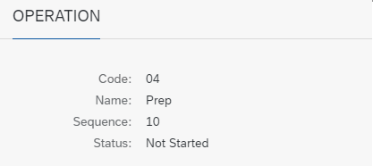
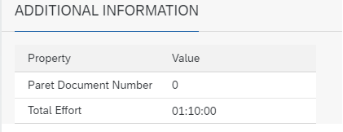

# Current task flow vs. Gantt chart

Here you can find information on scenario definition.

---

## Add new view

The 'Add new view' function is used to define scenarios. It It allows to filter elements displayed on the Gantt chart, to display just specific ones. It is possible to divide Resources into Departments, types of machines.

## Change Scope Tabs

It is possible to change the graph display view. Features are as follows:

    - **Refresh interval in minutes** – possibility to change the frequency of refreshing the progress of manufacturing orders:

    

    - **Display details** – click on a Task to view its details. Possibility to check details broken down into:

    

    - **Show quick view** – the ability to view the details of the operation of a given Manufacturing Order. The information is shown in the form of a window that appears when you hover over the Task:
    

    - **Zoom** – increase or decrease the detail of the display results:
    

    - **List Legend** – describes the displayed colours and characters:
    

    - **Settings** - 
        -  **Indicate Current Time** – show current time on view
        

        - **Show Cursor Line** – shows the time of a place on the graph pointed by a cursor:
        

        - **Show Divider Lines** – shows a time division grid:
        

        - **Show Ad Hoc Lines** – shows the relationship between a planned and an actual Task:
        

        - **Synchronize Time Scroll** – the graph returns to the current date after a specified interval in minutes.

        - **Display** 

    - **Table and chart**:
    

    - **Chart**:
    
    
    - **Table**:
    

## Display Details

### Work-in-progress

The side panel shows details of a Task flow on a Resource. The data is presented in real time, showing the current Set up Time or Run time.

### Manufacturing Order

    - Manufacturing Order details (Number, Item Code, Revision, Planned and Actual Quantity, Required Date)

    

### Operation

    - Operation details (Code, Name, Sequence, Status)

    

### Resource

    - Resource details (Code, Name, Type)
    - Time details (start and end time of all time types)
    

### Additional information

    - Additional information from a Resource

    
    

### Production process

    - Graphical representation of the manufacturing process for a Manufacturing Order
    
