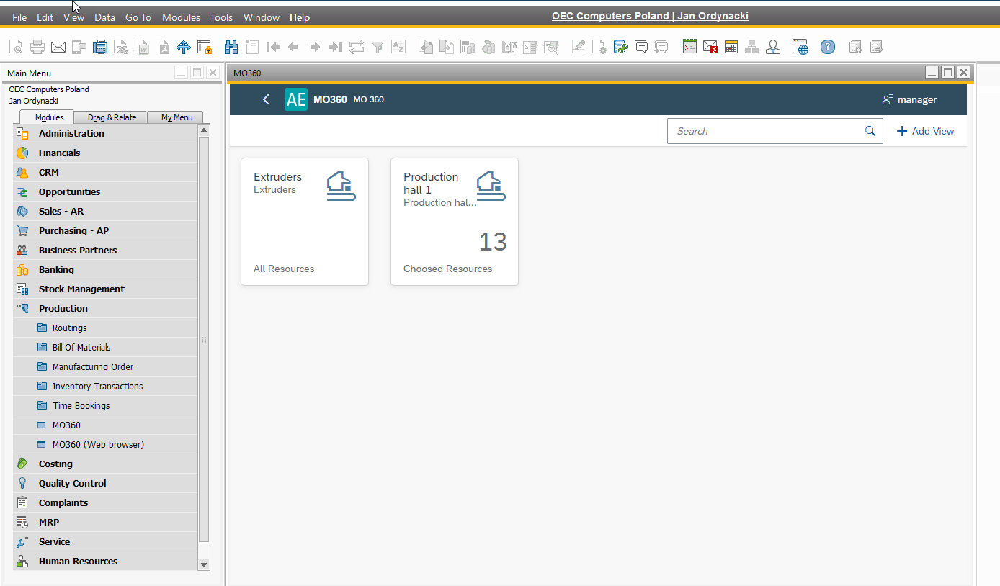

# Plugin Installation and Configuration

## Prerequisites

ProcessForce and CompuTec Licence Server is installed and configured. For more information, click [here](/docs/processforce/administrator-guide/licensing/license-server/overview/).

## AppEngine and plugin installation and configuration

For the AppEngine installation manual, please follow this link: [Installation](/docs/appengine/administrators-guide/installation/).

For the plugin installation manual, please follow this link: [Configuration and Administration](/docs/appengine/administrators-guide/configuration-and-administration/overview).

Two plugins need to be installed: **MO360** and **PPF**.

## ProcessForce

Optionally, you can reach MO 360 plugin the Process Force level:

To do this, check the following checkbox:

Enter the AppEngine URL, e.g. `http://{host}:54000`, click Update and restart SAP Business One.
