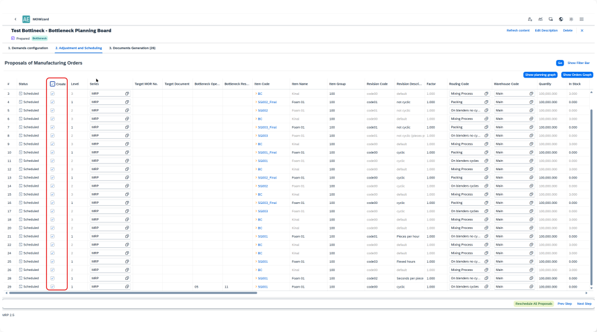

# Scheduling with Bottlenecks

Scheduling in MOWizard begins with creating a scenario, which defines the structure for planning operations. This scenario incorporates demand, available production capacities, and planning constraints. Based on selected demand documents, the system generates Manufacturing Order Recommendations (MORs) that can be scheduled and refined.

A key element of this scheduling approach is the identification and handling of bottlenecks—critical points in the production process where limited capacity significantly affects throughput. These are typically operations with the lowest efficiency or the highest workload, and if not properly managed, they can delay the entire production process.

Responsibility for identifying these bottleneck resources lies with the user, who leverages their expertise and understanding of the production process. Users manually designate specific machines or workstations as bottlenecks within the context of the current scenario. This flexibility allows the scheduling logic to be tailored to the specific characteristics of the production environment.

To maintain simplicity and scheduling focus, MOWizard enforces a strict rule known as the "Single Bottleneck per Production Tree" constraint. This rule ensures that only one operation across the entire production tree of a product can be scheduled on a bottleneck resource.

By isolating a single, critical operation for optimization, the system enables more accurate resource planning, reduces scheduling conflicts, and improves overall production efficiency.

---

## Steps to Create a Scheduling Scenario

1. **Configure Plugin Settings (Administration)**:

    - HasBottleneckPlanning - when is true, MOWizard has feature Bottleneck Declaration in Scheduling
    - DefaultIsBottleneckPlanning - Default value for MOWizard scenario (when is creating)

        

2. **Create a New Scenario in MOWizard**:

    - Launch MOWizard and click the plus (+) button to create a new scenario.
    - Enter a scenario name and configure the necessary parameters.
    - Ensure the Bottleneck Planning checkbox is selected if you want the scenario to consider bottleneck constraints.

        

3. **Add Demand Documents**:

    - In the Demands Configuration tab, click Add Position to select the required items from the demand documents (e.g., Sales Orders).

        
        

4. **Generate Manufacturing Order Recommendations (MORs)**:

    - Confirm selection to trigger the scheduling generation process by selecting the Generate MO Proposals From Documents button in the Demands Configuration tab.
    - The system then processes demand data, considers available resources, and creates an optimized proposal for manufacturing orders (MORs).

         

### Bottleneck Declaration

1. **Initiate Bottleneck Declaration**:

    Proceed to Bottleneck Declaration, where users identify key constraints in the production flow by selecting bottleneck resources. This selection is a one-time action for the given scenario and upon completion, the system automatically advances to the Bottleneck Planning Board. The process is initiated by selecting the "Bottleneck Declaration" button in the Adjustment and Scheduling tab.

        

2. **Select Bottleneck Resources**:

    At this stage, the user based on their knowledge of the production process defines which resources should be treated as bottlenecks. This decision is crucial, as it directly shapes how the system will generate and prioritize operations. The declaration of bottlenecks activates the Single Bottleneck per Production Tree constraint, which limits the scheduling logic to only one operation per production tree being executed on a bottleneck resource. By selecting the most impactful constraint point in the process, the user sets the foundation for efficient, bottleneck-focused scheduling and ensures that the system filters only those operations that truly require prioritization. The process is initiated by clicking the "Manage Bottlenecks" button.

        

## Bottleneck Planning Board

The Bottleneck Planning Board is a key component in scheduling, allowing users to efficiently manage operations by focusing on bottleneck resources. It provides a structured view of manufacturing orders (MORs) and their constraints in the production flow.

### Features of the Bottleneck Planning Board

1. **Top Panel**: Top panel consists of two tabs, List and Gantt. Both the tabs displays unscheduled operations related to bottleneck resources. The Gantt list shows unplanned tasks on the time axis. The List gives more information including scheduled and unscheduled quantities.

        

    **Bottom Panel**: Shows the Gantt chart with assigned MORs and their respective bottleneck resources.

        

2. **Helper Window**: Provides detailed insights and modification options for selected operations.

    

    - Opens when an operation is right-clicked or double-clicked on operation in Top or Bottom Panel. Allows for:
        - batch sizing – Divide;
        - manual scheduling adjustments – Start/End Date;
        - remove from schedule – Remove;
        - merge all batches back into a single operation and remove it from the schedule - Merge All
        - Snap Left/Right – please see Snap Mode
3. **Drag & Drop Scheduling**: Users can move operations to the resource from top to bottom panel, within the same resource or reassign them to other available resources.

    

4. **Auto-Split by Step Size** (header option): Determines the drag and drop behavior. When the task is moved to the resource, it is split according to Step Size (Maximum Order Quantity or Cycle Capacity), Yes or No, default = Yes

    

5. **Snap Mode** (header option): Determine drag and drop behavior on how operations are automatically positioned within available time slots during scheduling in the resource Gantt (bottom panel). When enabled, the selected snap mode is applied immediately after an operation is placed.

    

    - **None**: No snapping is applied. The operation will be placed in its default position within the available time slot.
    - **Snap to Left**: The operation will snap to the start of the available time slot, scheduling it as early as possible.
    - **Snap to Right**: The operation will snap to the end of the available time slot, scheduling it as late as possible.
6. **Expand/Restrict Slotting strategy**:  When task is moved to resource Expand Slots strategy is used by default. User can change these settings in Slotting Settings (see Slotting Modes in Slotting Panel Settings).

    

7. **Projected Start and End Dates**: Selecting an operation in the bottom panel displays its estimated start and completion dates across the production cycle.

    

    **Scheduling Window Area (blue area)**: This area appears when an operation is selected in the bottom panel. The left boundary indicates the earliest possible start of the operation, while the right boundary marks the latest possible completion. These limits are determined by the Required Date for the entire order. The area is visible only if completing the order within the planned timeframe is feasible.
8. **Filtering & Scrolling**: Users can filter displayed items and adjust the time frame (zoom in/out, scroll timeline).

    

9. **Calling Slotting Panel**: The Slotting Panel can be accessed through the Helper Window by selecting an operation and choosing the Slotting option . It can also be opened via the Slotting button, which is located on the right side of the row in the Top Panel of the Bottleneck Planning Board, allowing users to define and refine slot allocations efficiently.

    

## Slotting Panel

1. The Slotting Panel allows for operation planning with the ability to define the planning horizon and maintain full control over all planning parameters. The planning horizon can be narrowed to the range of the scheduling window.

    

2. Available production capacities are calculated within the scheduling window. For all resources, the available capacity is displayed in the "For Use" fields in the Slotting Panel header, expressed both in quantity and time. This is the sum of For Use values for individual bottleneck resources which is the sum of Slots.

    

### Slotting Panel Features

1. **To Slot Field**: The suggested value in this field is constrained by Step Size, which by default corresponds to the Maximum Batch Size from Item Master Data (Item Details) > Planning Data. If a resource's Run Time is expressed in Cycles, the value represents the cycle capacity. Using the plus and minus buttons, the user can modify the To Slot field value with increments corresponding to Step Size.

    

2. **Jobs Field**: In the Jobs field, the user specifies the number of jobs to be slotted (allocated) to resources, based on the To Slot value. The number of jobs can be adjusted using the plus and minus buttons located under this field.

    

3. **Slotting Actions**:
    - The user initiates the slotting process (resource allocation) by selecting Slot Job button. This button is active only if Available is greater than zero.
    - The user can transfer the entire remaining Available quantity to the To Slot field by selecting Get All. - Slot Job in the header triggers the process for all listed resources, while the same action can be performed for individual resources or slots.
    - Once slotting is complete, selecting Assign Jobs finalizes the process and returns the user to the Bottleneck Planning Board.
    - Slotted jobs will receive status "Assigned".

        

4. **Slotting Panel Settings**: Initially, the user can set these parameters on the Bottleneck Planning Board, and he can modify them in the Slotting Panel.

    **4.1.** **Quantity strategy:**
        - **Quantity Division**: In this option, the user inputs a quantity (To Slot / Output Qty) and then a number (To Slot / Jobs in Output) by which this quantity is to be divided. This is the option where the given quantity is divided by the specified number, resulting in smaller units or parts of that quantity per job.

            

        - **Quantity Replication**: In this option, the user inputs a quantity (To Slot / Output Qty) and then a number (To Slot / Jobs in Output) that indicates how many times this quantity is to be replicated. This is the option where the provided quantity is duplicated the specified number of times.

            

    **4.2.** **Slotting strategy**:
        - **Expand**: If a job does not fit within the available slot before a non-working period (e.g., weekends or planned downtime), it is automatically scheduled in the next available slot after the non-working period. This mode effectively "ignores" non-working time by linking the slot before the break with the slot after it.

            

        - **Restrict**: If a job does not fit within the available slot before a non-working period, it will not be scheduled in that slot. The job remains unallocated until an appropriate slot is found within working hours, preventing automatic spillover into post-non-working time slots.

            

    **4.3. Anchor and Unanchor Job**: New jobs can be either Anchored or Unanchored upon creation. In the Slotting Panel, users can manually change the anchoring status of jobs in Slotted, Assigned, and Dispatched statuses. An Anchored job is fixed to a specific resource and time, while an Unanchored job adjusts dynamically to changes in the scheduling window.

        

    **4.4. Align Left vs. Align Right in Slotting**: When slotting the first job within an available slot, users can choose between two alignment options:
        - **Align Left**: The job is placed at the earliest possible time within the slot. This method minimizes gaps at the start of the slot, allowing for better utilization of available working time. Ideal when maximizing resource usage or aligning with dependencies that require an early start.
        - **Align Right**: The job is positioned at the latest possible time within the slot. This method preserves flexibility at the start of the slot, allowing room for additional scheduling adjustments. Useful when jobs need to be scheduled closer to their deadlines or when dependencies require a later start.

            

    **4.5. Display Options in Slotting Panel**

        

        - **Show All Jobs**: Toggles the visibility of jobs for all resources within the Slotting Panel.
        - **Show Advanced**: Enables or disables the display of advanced Slotting Panel features.
        - **Show Zero Quantities Slots**: Controls whether slots with insufficient capacity to accommodate a job are shown or hidden.
        - **Compressed Slot**: Allows slots to be displayed either in full or in a compressed format, optimizing space usage in the panel.

            
            

### Task Planning Progress Chart

The Task Planning Progress Chart is located in the slotting panel header and provides a quantitative representation of task scheduling progress, helping users assess the allocation status of resources. It illustrates the progress of task planning using the following allocation statuses:

- **Production**: Quantity in production documents.
- **Dispatched**: Quantity transferred for conversion into production documents.
- **Assigned**: Quantity allocated to resources (visible on the Gantt Chart in the Bottleneck Planning Board).
- **Slotted**: Quantity assigned to resources in the current Slotting Panel session.
- **Available**:  Remaining quantity to be scheduled.

#### Process Flow Based on Task Planning Progress Chart Statuses

The Task Planning Progress Chart provides a structured approach to monitoring and managing the progress of task scheduling. Below is the process flow based on each status:

1. **Available**: The process begins with identifying tasks that have not yet been scheduled. These tasks remain in the Available status (orange bar in Bottleneck Board) until they are planned within the scheduling system.  The user selects an operation and defines the necessary scheduling parameters in the Slotting Panel.
2. **Slotted**: Once a task is allocated to resources within the Slotting Panel, it transitions into the Slotted status. The task is now associated with specific resources but has not yet been confirmed as part of an active schedule. The user can modify allocations, batch sizing, and cycle settings before finalizing the schedule.
3. **Assigned**: When a Slotted task is confirmed and integrated into the resource plan, it moves to the Assigned status. The task now appears within the Bottleneck Planning Board and is visible on the Gantt Chart (green bar). At this stage, the task has been allocated but not yet converted into a production order.

    Drag-and-drop functionality can be used on Gantt Chart in Bottleneck Planning Board to set status to Assigned or button Assign Jobs on Slotting Panel.

        

4. **Dispatched**: Once a task is finalized for production, it is dispatched for conversion into manufacturing documents. The task transitions to the Dispatched status visible on the Gantt Chart (green bar with red border), signaling that it has been approved for execution . The system prepares to generate production orders based on available capacities and dependencies.

    This status is managed from Bottleneck Planning Board - button Dispatch.

        

5. **Production**: The final step occurs when the task is fully processed into production orders, at which point it enters the Production status (grey bar). The job is now an active part of the manufacturing process, and real-time execution begins.

        

    This status is managed from Document Generation tab - button Create Manufacturing Orders. Prior proposals have to be selected for creation in tab Adjustment and Scheduling.

    Progress tracking is maintained via the Gantt Chart and other monitoring tools.

    This structured workflow ensures that tasks progress sequentially from Available → Slotted → Assigned → Dispatched → Production, improving scheduling transparency and resource utilization.

        

#### Anchored vs. Non-Anchored Jobs in Slotted, Assigned, and Dispatched Statuses

Jobs in the Slotted, Assigned, and Dispatched statuses can either be Anchored or Non-Anchored:

- **Anchored Jobs**: These jobs are fixed to a specific resource and time slot. Their position remains constant, regardless of any modifications to the scheduling window.
- **Non-Anchored Jobs**: These jobs are dynamically adjusted based on changes to the scheduling window. If the planning window is modified, these jobs shift accordingly to maintain alignment with available capacity and resource constraints.
- **Managing Anchored Status in Slotting Panel**: Newly slotted jobs can be either Anchored or Non-Anchored upon creation, based on user selection. Users can modify this status within the Slotting Panel, allowing for greater flexibility in scheduling operations.

---

## Glossary of Terms

- **Bottleneck**: A point in production where capacity is most constrained.
- **Manufacturing Order Recommendation** (MOR): System-generated production recommendation.
- **Slotting**: The process of assigning jobs to available production slots.
- **Scheduling Window**: The time range within which operations can be scheduled.
- **Planning Horizon**: The broader timeframe for long-term scheduling considerations.
- **Drag & Drop Scheduling**: The ability to manually adjust operations within the Gantt Chart.
- **Dependency Management**: Ensuring that operations follow the correct sequence based on dependencies.
- **For Use**: Displays available production capacity for scheduling.
- **To Slot**: Defines the quantity to be scheduled within available capacity.
- **Slot Job**: The action of allocating jobs to production slots.
- **Get All**: Transfers the remaining available quantity to the To Slot field for scheduling.
- **Expand Slots Mode**: Mode that allows jobs to overflow into slots after non-working periods, effectively ignoring non-working time when planning.
- **Restrict Slots Mode**: Mode that ensures jobs do not overflow into slots after non-working periods, keeping scheduling strictly within available working slots.
- **Align Left**: A method of slotting where jobs are scheduled at the earliest available time in a slot.
- **Align Right**: A method of slotting where jobs are scheduled at the latest possible time in a slot.
- Anchored Job – A job that remains fixed to a specific time and resource, unaffected by changes in the scheduling window.
- **Non-Anchored Job**: A job that automatically adjusts its position when the scheduling window is modified.
- Slotting Panel Display Options – Settings that control job visualization, including Show All Jobs, Show Advanced, Show Zero Quantities Slots, and Compressed Slot.
- **Job Quantity Processing Modes**: Methods for determining how job quantities are allocated within slots.
- **Batch Sizing according to Step Size** (Cycle Capacity) – When a task is moved to a resource, it is divided according to Step Size. If enabled, job quantities are automatically adjusted based on the cycle capacity of the selected resource.

---
