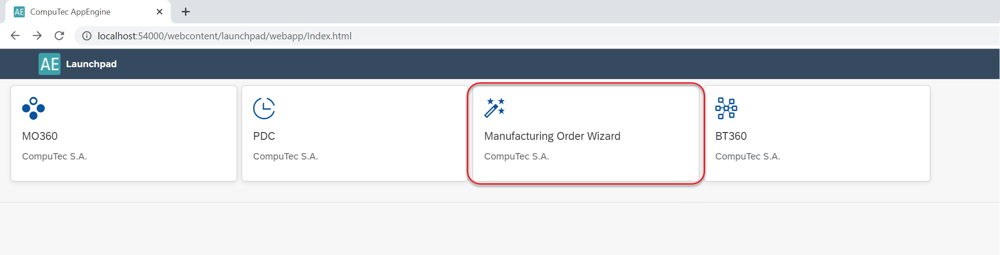

# MOWizard

The MOWizard plugin is designed to streamline the creation of Manufacturing Orders (MOs) based on selected Sales Order lines, helping manage complex, multi-level product trees efficiently. This plugin is ideal for businesses dealing with large numbers of Manufacturing Orders associated with individual Sales Order lines, enabling swift processing and organization.

---

## Installation

Below are the steps to install the MOWizard Plugin for SAP Business One:

1. Get the installation file from provided source [link](/docs/appengine/releases/plugins/mowizard/download).

2. Follow the detailed instructions to install the plugin on your SAP Business One system [here](/docs/appengine/administrators-guide/configuration-and-administration/overview#plugins).

3. After completing the installation, go to Launchpad and choose the MOWizard plugin to begin using it.

    

If the right option is chosen, the plugin is available from the SAP Business One main menu: Production → MOWizard.

## Usage

Click the plus icon to add a new Job. You can create many of these.

    1. Job Description: choose any name (mandatory) and description (optional) and click the Step 2 icon:
    

    2. Sales Orders lines selection. Filter the list by desired values (you can skip this step) and choose the required lines from the list:
    

        The Available Sales Orders Positions table holds Sales Orders lines that can be filtered by many conditions (the Filter Available Sales Orders Positions section).

        Checking the required checkboxes and clicking Add Selected Positions moves them to the Selected Sales Orders Positions table (click the checkbox in the first row to mark all of the lines in the list). These Sales Orders' lines will be further processed.
        Here you can still change quantity:
        
        After this, Click Step 3. 

    3. Manufacturing Orders.  Here, click Generate Manufacturing Orders. Click Yes in the system message form:
    

        Click the Yes button to continue. The creation is not immediate and some time is needed to complete it, depends on number of Manufacturing Orders and their structure. Started Jobs are displayed in the Running tab (please check the second screenshot on this page).

        You can see the prepared manufacturing tree in a map and table form.  At this moment manufacturing trees are generated but no Manufacturing Order is yet created.

    4. Once the manufacturing tree is created, the related job is moved from the Running tab to the Prepared tab. Once the job is generated, it is not possible to change any data in it. Click the required job line in the Prepared tab to see the related data.  Here, you can see the chosen data in form of a manufacturing tree (the Map tab, showing relations between linked Manufacturing Orders) or a table (the Table tab).  The map view shows the manufacturing tree divided by material groups.  This section is for data preview only.

    5. Click the Step 5 button to go to the Planning section.  Here, you can see information on the planned Manufacturing Orders.  If you want to choose specific Manufacturing Orders, click the Edit button at the top of the form.  You can change numbering series and Manufacturing dates. If you change the dates, click the Reschedule button after that.  Once the editing is finished, click the Summary button.

    6. Here, you can see the Manufacturing Orders that are about to be created.  Link child MOR's option is checked by default.

    7. Click "Save and Run". The job will move to the Running tab. Once all the planned Manufacturing Orders are successfully created, the job will be moved to the Completed tab. If some Manufacturing Orders fail to be created (for example, if a child order was selected but not a higher-level one), the job will return to the Prepared tab. Here, you can click the job and check which Manufacturing Orders were created, which were not and why (click the Manufacturing Order with the Failure status to get this information).

**Example usage**

Click [here](https://www.youtube.com/watch?v=HdCU7PtdwPA) to know more about Example Usage.

---
