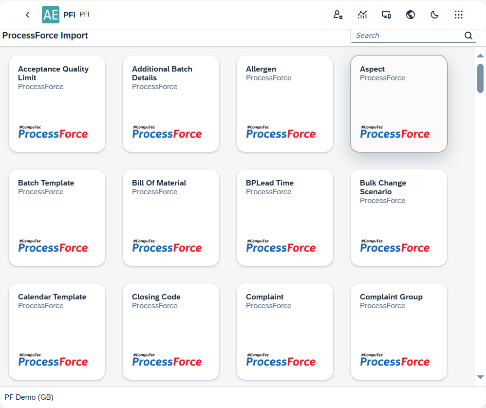
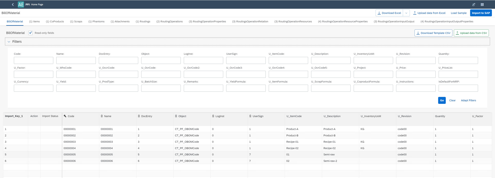
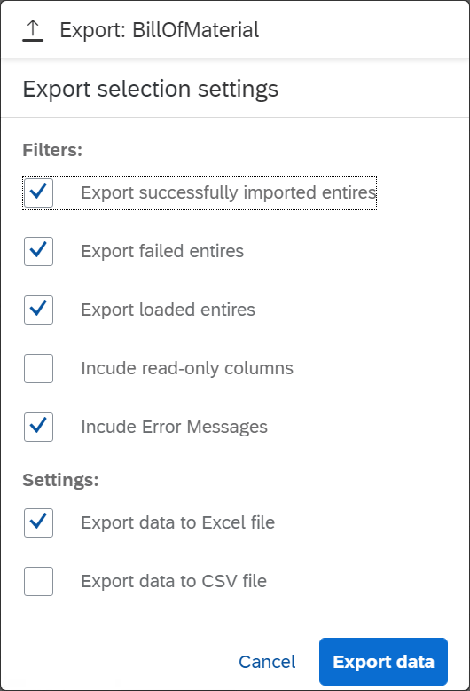
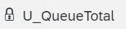

# PFI

CompuTec PFI (CompuTec ProcessForce Import) is a powerful plugin designed to simplify and accelerate the process of importing and updating data within CompuTec ProcessForce objects. As a flexible alternative to [PowerShell updates](/docs/processforce/developer-guide/data-import/overview/), PFI offers an intuitive interface and advanced features that cater to the unique needs of users managing CompuTec ProcessForce data.

To know more about CompuTec PFI, Click [here](https://www.youtube.com/watch?v=MSreLSZC8DU).
>**Note**: The video was recorded on a pre-release version and the interface differs slightly in the released version.

---

## Prerequisites

Before using PFI, ensure the following:

1. The CompuTec ProcessForce plugin is installed and enabled for the relevant company.
2. If a new UDF (User-Defined Field) is added to CompuTec ProcessForce object, restart the CompuTec AppEngine service to reflect the changes in PFI templates.

### Installation

For detailed instructions on installing the CompuTec AppEngine plugin, click [here](../administrators-guide/configuration-and-administration/plugins/overview.md).

## Usage

Once the plugin is installed, its tile becomes available in the [Launchpad](/docs/appengine/appengine-users-guide/launchpad/). Opening the plugin reveals tiles representing various CompuTec ProcessForce objects. Scroll to find and select the object you wish to work with.

    

The example view (Bill of Materials in this case):

### Header

The Header section provides key details and functionalities related to the selected object. The object's name is displayed in the upper-left corner. On the right, you can find tiles representing all objects related to the main object. Clicking on these names displays the corresponding columns (database table properties) in the table below. The numbers in brackets indicate the object's hierarchy level, e.g., Bill of Materials 0 > Routing 1 > Routing Operations 2 > Routing Operations Properties 3.

1. **Download Excel** – Export the table's content, including column names, to a Microsoft Excel file. If no sample data is loaded (see the Load Sample option below), this will download an empty file with only column headers. You can edit this file in Excel, save it, and upload it back into the plugin using the Upload Data from Excel option.

2. **Download with Advanced Settings** – This option is available from the arrow down next to Download Excel option:

    

    - **Include Error Messages**: Generates a downloadable file showing the import results along with error descriptions, if any.

3. **Upload Data from Excel** – Import data from an edited Excel file. Blank cells do not overwrite existing values. To explicitly set a property to blank, use a forward slash (/). Blank cells are otherwise skipped during the import process, retaining current values or allowing the system to populate them for new entries.

4. **Load Sample** – Load data from the database into the table for mass updates. Steps:
    - Optionally filter data using specific field values.
    - Choose the number of records to load.
    - Click Load to populate the table with the selected object and its lower-level components (e.g., Bill of Materials with Items, CoProducts, Scraps, etc.).
    - After editing, you can re-upload the data for updates.

5. **Import to SAP** – Transfer the data from the matrix to the SAP database.

6. **Download Template CSV** – Download a CSV template for the currently displayed object (e.g., Bill of Materials' Items). Unlike the advanced download option, this exports templates for only the displayed object without including its lower-level components.

7. **Upload Data from CSV** – Similar to the Excel upload option, this allows importing data from a CSV file.

### Filters

The result table can be refined by entering values in specific fields. Additionally, the filter section can be customized to display only the fields you wish to use.

**Read-only fields** – When this option is unchecked, only editable fields are shown. Checking the box will display all fields. Read-only objects are marked with a padlock icon for easy identification. Example: 

### Table

The table displays data associated with the object selected in the header, including all columns and User-Defined Fields (UDFs) located at the far-right end of the table. This data can be imported into SAP using the relevant header options. Before importing, the table must first be populated using the appropriate actions in the header.

**Key Features of the Table**:

- **Import Key** – The first column in the PFI matrix, acting as a link for the template. For example, it connects the Bill of Materials to its subordinate components.
- **The key icon** – Indicates the primary field for the object. Leaving this field empty during editing will add a new record. If a value is present, the existing record will be updated.
- **Action** – Specifies the type of operation (Add/Update) for each row after uploading an Excel file.
- **Import Status** – Displays the success or failure of each line's import into SAP Business One.

---
CompuTec PFI bridges the gap between user convenience and complex data management by providing a reliable, customizable, and efficient tool for  data handling. Whether you're new to CompuTec ProcessForce or an experienced user, PFI empowers you to optimize your operations with ease.
