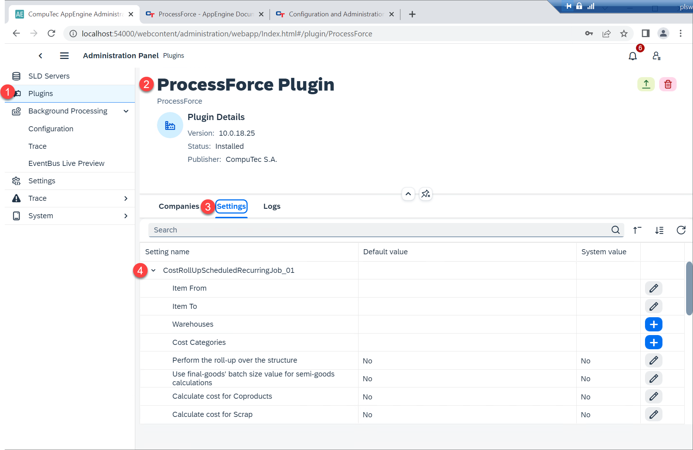
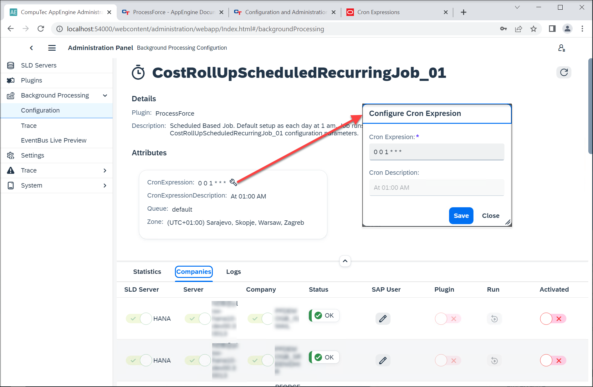

# CompuTec ProcessForce Plugin Related Jobs

CompuTec ProcessForce plugins provide a suite of automated jobs designed to enhance the efficiency and accuracy of manufacturing, quality control, and data synchronization processes in SAP Business One. Below, we outline the key jobs available and their functionalities, along with their configurable parameters.

---

:::info
To use these jobs, you need to enable Background Processing for the specific company.
:::

## Cost Roll-Up Scheduled Recurring Jobs

Jobs: CostRollUpScheduledRecurringJob_01, 02, 03
Default Cron Expression: `0 0 1 * * *` (Daily at 1 AM)

These jobs automatically perform Cost Roll-Up operations for selected items based on predefined parameters in specific time (defined in Cron Expressions). Key steps to configure:

1. Navigate to Plugins → ProcessForce Plugin → Settings to define parameters (that reflects options available in the [Cost Roll-Up form](https://learn.computec.one/docs/processforce/user-guide/costing-material-and-resources/cost-categories#cost-roll-up)).
2. Use the Perform the roll-up over structure checkbox to enable advanced options like batch-based calculations and BOM data saving.

:::caution
The four checkboxes on the Cost Roll-Up form (ranging from “Use final-goods’ batch[…]” to “Calculate and Save Costed BOM data”) become usable only after the Perform the roll-up over structure checkbox is selected. Although these options are visible in CompuTec AppEngine even without selecting this checkbox in the CompuTec AppEngine settings, they should still be utilized in alignment with the Perform the roll-up over structure configuration due to CompuTec AppEngine limitations.
:::

You can set up the occurance of the automatic Roll-Up by using [Cron Expressions](https://docs.oracle.com/cd/E12058_01/doc/doc.1014/e12030/cron_expressions.htm) in the job's details: Background Processing → Configuration → [name of a job]:

You can configure three different automation of this kind by using these job variatins (CostRollUpScheduledRecurringJob_01, CostRollUpScheduledRecurringJob_02, and CostRollUpScheduledRecurringJob_03 job).

## Quality Control-Related Jobs

1. **QCRefillBatchesAndSerialNumbersJob**

    This job automatically populates Batches and Serial Numbers into the appropriate Quality Control Tests. It ensures that when a Goods Receipt is added, the newly created Batches and Serial Numbers are incorporated into any existing Quality Control Tests that were initially created before these data entries were available in the database.

    Following are the Details:

    - ContentType = "59"
    - ActionType = "A"

    This job enhances CompuTec ProcessForce performance by maintaining accurate and up-to-date Quality Control Test data.

2. **QCTestDocumentsGeneratorJob**

    Based on specific settings, this job automatically generates Quality Control Test when adding documents.
    Following are the Details:

    - ContentType = "*",
    - ActionType = "A",
    - Publisher = "AppEngine",
    - PublisherApp = "SAPB1",
    - EventType = "SAPB1Object"

    This job optimizes CompuTec ProcessForce performance by streamlining test generation processes.

## Restore Jobs

1. **RestoreAditionalBatchDetails**

    This job runs every two hours to invoke a method that creates Batch Master Data for any missing batches in the system, ensuring data completeness.

        Default Cron Expression Description = "0 */2 * * *"

2. **RestoreItemDetailsJob**

    This job synchronizes the ItemDetails object whenever there are updates in the OITM table, ensuring that item-related data remains consistent. Following are the details:
        - Editable = true
        - ContentType = "4", // OITM
        - ActionType = "U"

    This job enhances CompuTec ProcessForce performance by keeping item data synchronized and up-to-date

## Synchronization Jobs

1. SynchronizeBillOfMaterialsJob

    This job synchronizes updates made to CompuTec ProcessForce Bill of Materials with the corresponding data in SAP Business One.
    - Editable = true
    - ContentType = "CT_PF_OBOMCode"
    - ActionType = "*".

    This job enhances CompuTec ProcessForce performance by maintaining accurate and up-to-date Bill of Materials information.

2. **SynchronizeManufacturingOrderJob**

    This job ensures that updates made to Manufacturing Orders are synchronized with the corresponding Production Orders. Following are the details:
        - Editable = true
        - ContentType = "CT_PF_ManufacOrd"
        - ActionType = "*"

    This job improves CompuTec ProcessForce performance by maintaining accurate and consistent order data.

3. **SynchronizeManufacturingOrdersRecursiveJob**

    This job performs a scheduled synchronization between Manufacturing Orders and Production Orders every twelve hours, ensuring data consistency. Followingare the details:
        - Default Cron Expression = `"0 */12 * * *"` (Every 12 hours)

## Additional Batch Details Job

1. **AdditionalBatchDetailsSynchronizerEB**

    This job synchronizes updates to Batch Master Data with the Additional Batch details in SAP Business One.
    Following are the details:
        - ContentType = "CT_PF_AdditonalBatch",
        - ActionType = "U",
        - Publisher = "AppEngine", PublisherApp = "SAPB1", EventType = "SAPB1Object".
    This job enhances CompuTec ProcessForce performance by maintaining accurate and consistent batch-related data across systems.

2. **AdditionalBatchDetailsCreatorEB**

    This job automatically creates related Batch Master Data when a new Batch is created in SAP Business One.
    Following are the details:
        - ContentType = "10000044",
        - ActionType = "*", Publisher = "AppEngine",
        - PublisherApp = "SAPB1",
        - EventType = "SAPB1Object"

    If this job is enabled, Batch Synchronization is handled by CompuTec AppEngine. Otherwise, synchronization is managed by the CompuTec WMS service when using CompuTec WMS.

    This job improves the performance and efficiency of both CompuTec ProcessForce and CompuTec WMS by ensuring seamless and accurate batch data synchronization.

## Manufacturing Order Management

**ManufacturingOrderWizardRecoverJob**

On CompuTec AppEngine startup, this job checks and processes unfinished Manufacturing Order Wizard tasks.

---
