# Serialization: Fields Description

Here you can find a description of all of the configuration fields that affect the serialization process.

---

## SAP Business One/ProcessForce – Item Declaration

### Item Master Data

Only for Items (managed by Batches) with Serialization enabled = Yes are available to be assigned SPT.

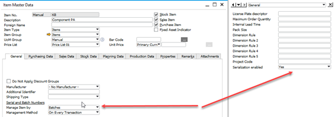

**Serialization enabled = Yes**, Item with all revisions enabled for serialization, is selectable for Rule definition.

## WMS - Custom Configuration

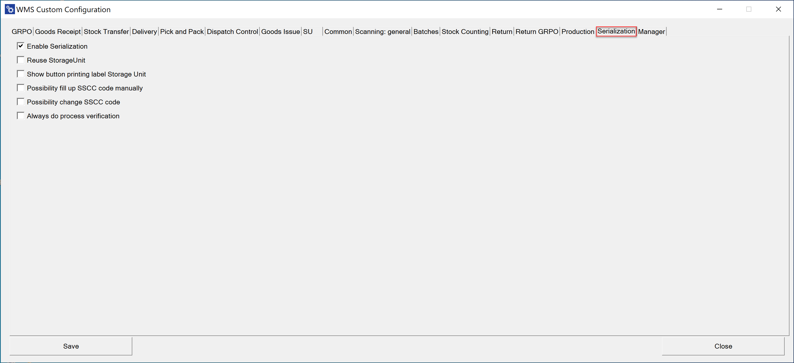

**Enable Serialization** – allows the use of serialization in WMS

**Reuse Storage Unit** – allows reusing the same packages (SSCC) in the reception process

**Show button printing label Storage Unit** – allows you to print manually labels for the package (the button will be visible in WMS)

**Possibility fill up SSCC code manually** – user can enter an SSCC code manually without using a scanner

**Possibility change SSCC code** – user can change the SSCC code generated by the system in the process of accepting packages

**Always do process verification** – by default, the verification process is only made for those series that require it, this option always forces the process to pass

## WEB application – Serialization Configuration

Steps for configuring serialization are as follows:

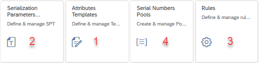

First, define Attributes Template. Then from these templates, you are able to define Serialization Parameters Templates. The next obligatory step is to set up Rules. Step 4 is not required for clustering. It useful if you produce serialized products and you received SN pools from a customer or you have to generate SN pools according to determined schemes.

You can find an example of a clustering case here: [Example usage: clustering](../serialization/example-usage-clustering.md).

### Attribute Templates

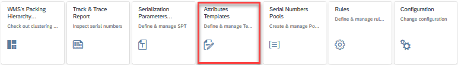

#### Attributes list window

List with all defined attributes. Here you can start adding a new one or modify the existing.

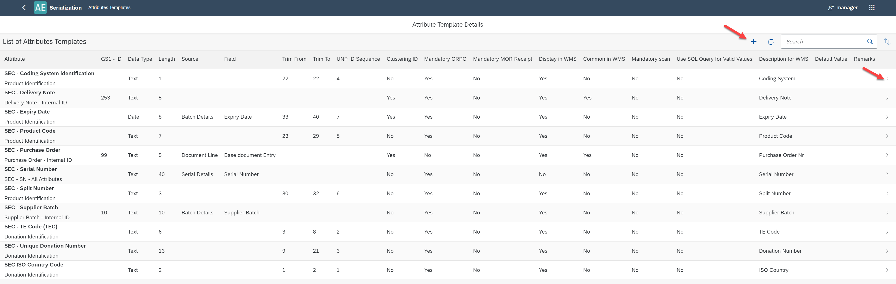

#### Single Attribute window add/view/edit

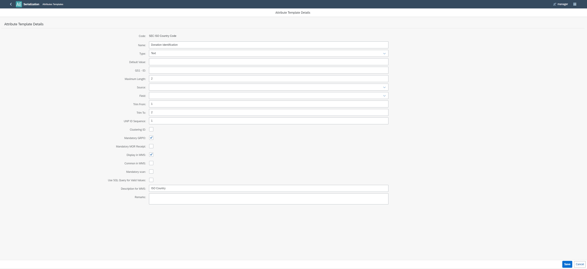

    1. **Code** – attribute's code
    2. **Name** – attribute’s name
    3. **Type** – a type of data (Text, Date, Time, Integer, Decimal)
    4. **Default Value** – enabled when Type = Text
    5. **GS1 ID** – ID in accordance with GS1 standard
    6. **Maximum Length** – a length of the SPT's component
    7. **Source** – Batch Details, Document Line, Serial Details
    8. **Field** – for Batch Details: Batch Number, Supplier Batch, Expiry Date, Batch Attribute 1, Batch Attribute 2;  for Document Line: Base document Entry; for Serial Details: Serial Number, Remarks  **Note**: Source and Field defined only for non-UNP Segments
    9. **Trim From, Trim To** – start and end position of an attribute in UNP, determine which part of the attribute is added to the UNP ID.
    10. **UNP ID Sequence** - if value is different than null, given attribute is included in UNP ID.  Value of this field determines position of the Attribute in UNP ID.  **UNP ID Sequence = "null"** - given attribute isn't included in UNP ID
    11. **Clustering ID** – if the selected attribute is a clustering parameter
    12. **Mandatory GRPO** – attribute is obligatory for Good Receipt Purchase Order
    13. **Mandatory MOR receipt** – attribute is obligatory for Receipt from production
    14. **Display in WMS** – field will be visible on the WMS device's screen
    15. **Common in WMS** – field will be displayed in the upper part on WMS device's screen (will not disappear when other fields are saved)
    16. **Description for WMS** – you can define the field's label for WMS
    17. **Remarks** – you can describe any additional information related to the attribute

### Serialization Parameters Templates (SPT)

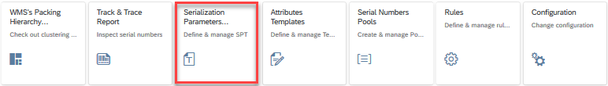

Here you can pin Attribute Templates in one SPT it accordance with used serialization standard. Each component of SPT you have to assign to a Field from the Track & Trace Table according to attribute type.

#### SPT list window

List with all defined SPT. From this place, you can start to add the new one or to modify the existing one.

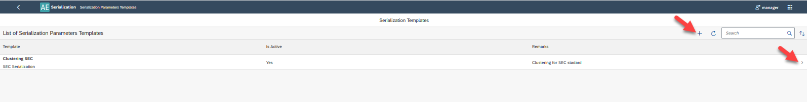

#### Singe SPT window add/view/edit

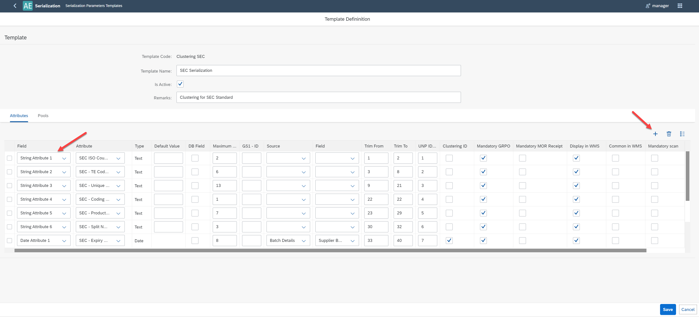

#### Header

1. **Template Code** – SPT 's template code
2. **Template Name** – SPT's template name
3. **Is Active** – checked by default. If checked can be used in Rules
4. **Remarks** – some additional remarks

#### Attributes Tab

To add Attribute to the list you have to select [+]. In the column Attribute, you have to select Attribute Template and assign it to Attribute in column Field with a type compatible with Attribute's Template type. You are able to modify the Attribute’s parameters. Descriptions of fields are available at: Attribute's list window.

#### Pool Tab

You can assign a previously defined pool to the SPT (please see chapter Serial Numbers Pulls). One of them you should select as default.

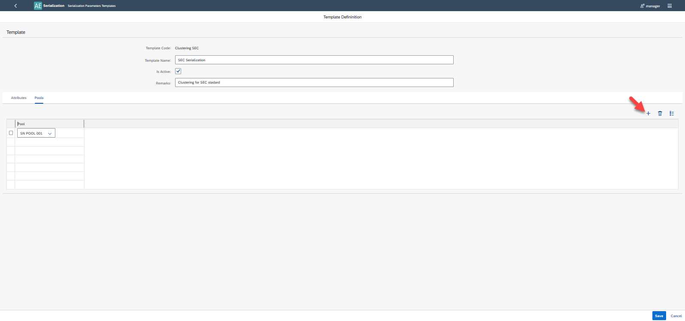

### Rules

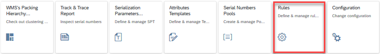

Define rules which will be used to decide which SPT should be used for serialized Item/Revision.

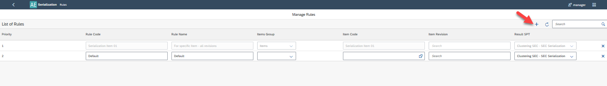

1. **Priority** – information managed by the system. Inform you about the rules hierarchy.
2. **Rule Code** – Rule's code
3. **Rule Name** – Rule's name
4. **Item Group** – you can select Item Group from the combo-box. The rule for Items Group overwrite the rule in which the Item Group is not specified (Default rule in a picture above ).
5. **Item Code** – you can select Item from the list of items. This rule defined for Item overwrites the rule for Item Group and the Default rule.  **Note**: In the list of items are only visible Items with Serialization enabled = Yes in Item Master Data
6. **Item Revision** – you can select Item's revision from the list (before that you have to specified Item). The rule for revision overwrites the rule for Item, Item Group, and Default
7. **Result SPT** – you have to select SPT from the list.

**The logic of SPT assignment priority when you select Item/Revision for Serialization in WMS**:

    1. Find Rule for Item/Revision combination. If it does not exist:
    2. Find Rule for Item. If it does not exist:
    3. Find Rule for Item Group. If it does not exist:
    4. Find Default Rule. If it does not exist, the system displays a warning in CompuTec WMS.

When you define a rule for a particular Item/Revision, it will be as a first choice. If you want to assign SPT to all Item’s revisions (besides these for which you have to define a rule in 1st priority) you have to only define Item Code, this is the 2nd priority. If you want to assign SPT to all items from a particular group (besides these for which you have to define a rule in 1st and 2nd priority) you have to only define Items Group. For all Item/revisions for which you have not defined rules in priority 1 or 2 or 3, the default rule will be used. To define the Default rule please leave empty fields: Items Group, Item Code, Item Revision. You are able to define only one rule of this kind.

### Serialization Number Pool Definition

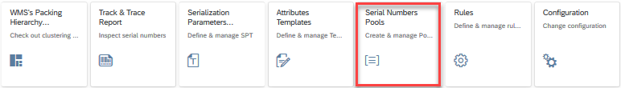

### Serialization Numbers Pools window

This is a list of all defined Pools. From here you can start to add a new one or modify the existing.

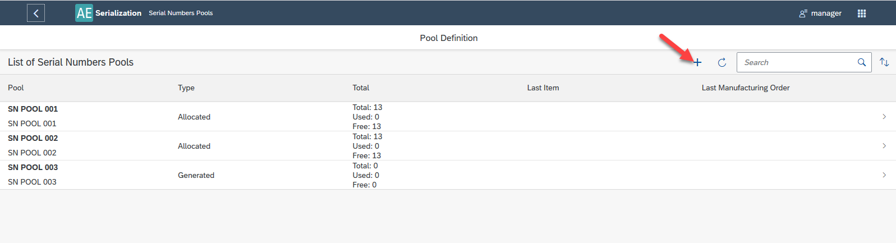

#### Serialization Numbers Pool definition

Type Allocated – Serial Numbers from CSV file

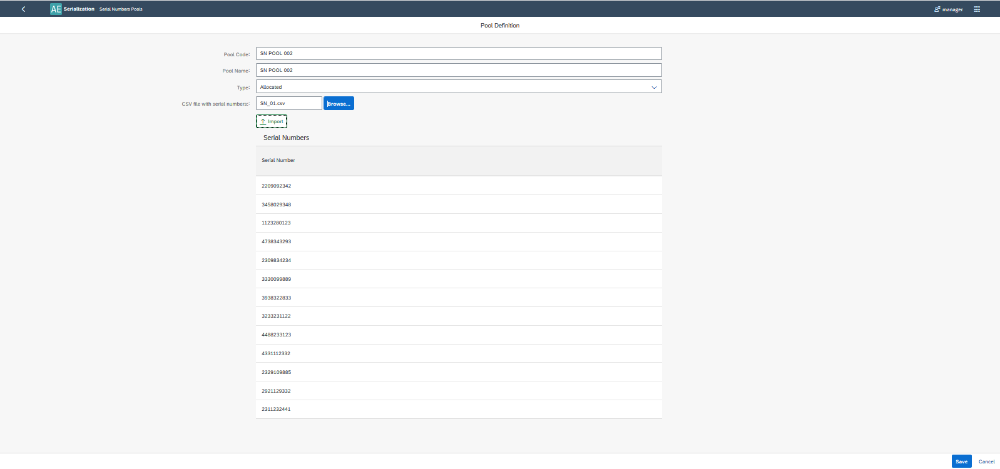

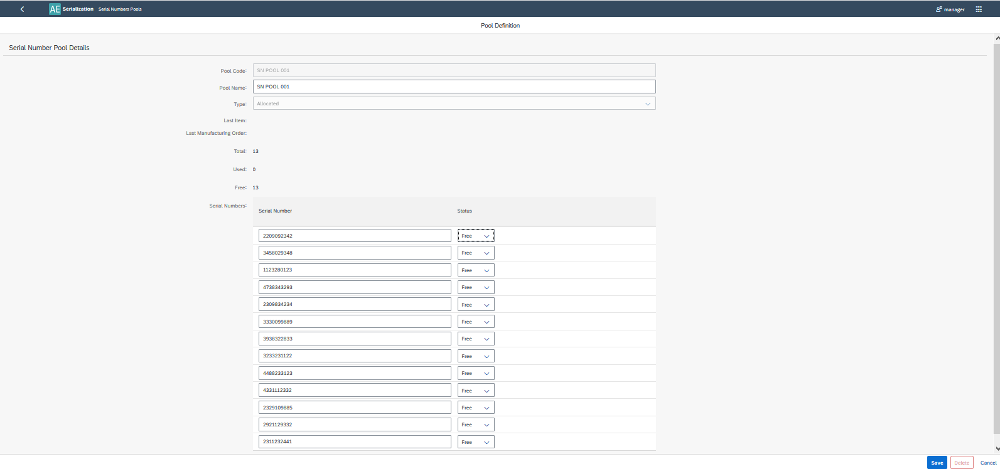

    1. **Pool Code** – Pool's Code
    2. **Pool Name** – Pool's Name
    3. **Type** – Serial Numbers in a Pull can be allocated or generated
    4. **CSV file with serial numbers** – for allocated - externally file - select button **Browse -> Import**
    5. **Query** – you can create an SQL formula which defines the generation algorithm
    6. **Last Item/Revision** – last Item/Revision to which the pool was assigned
    7. **Last Manufacturing Order** – last MOR to which the pool was assigned
    8. **Total** – the size of the set
    9. **Used** – a number of used SN
    10. **Free** – a number of free SN
    11. **Serial numbers** – List of serial numbers with statuses

#### SN Pool Type Generated

You can create an SQL formula that defines the generation algorithm which will be used to generate SN Pool during the production process:

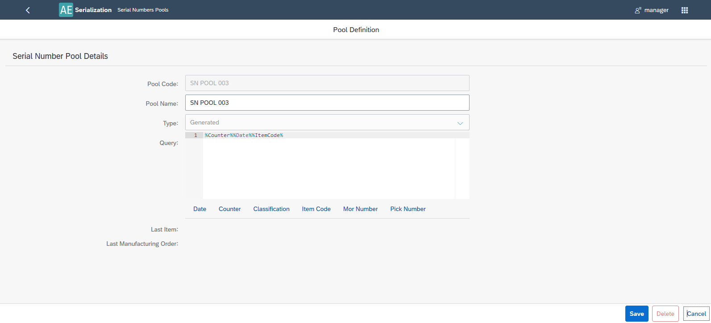

## Serialization results

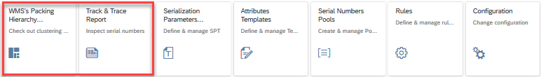

### Track and Trace Reports

By definition of Serial Number Parameters, you are able to filter Serial Numbers.

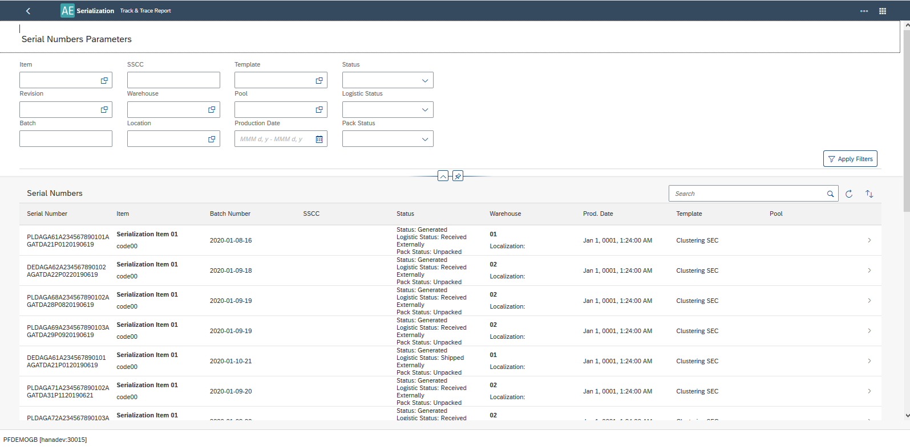

It is possible to analyze Track & Trace Report for each Serial Number:

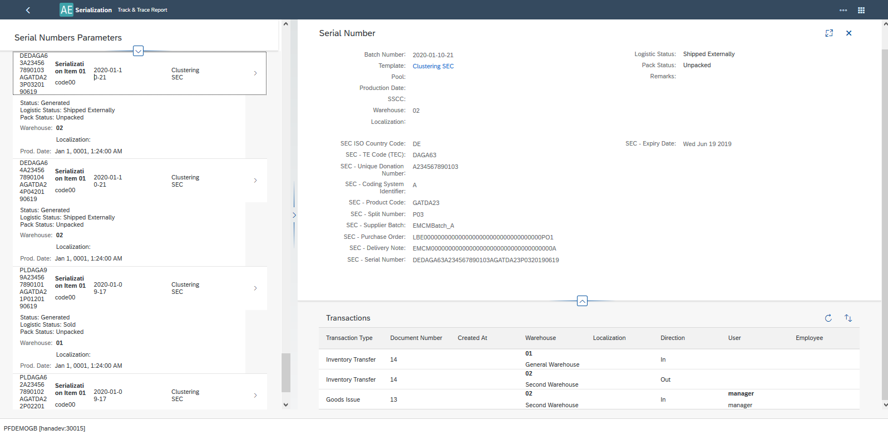

### WMS’s Packing Hierarchy

From this place, you can check, modify, and finally accept clustering and aggregation documents generated in CompuTec WMS. Editing and acceptance of document is possible for documents with Status = Ready for accepting.

#### List of documents window

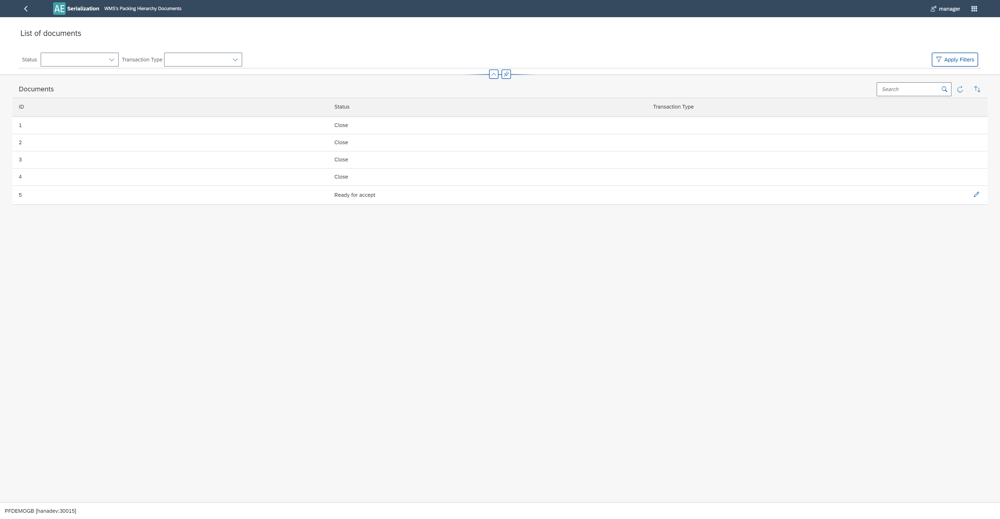

#### Single document add/view/edit window

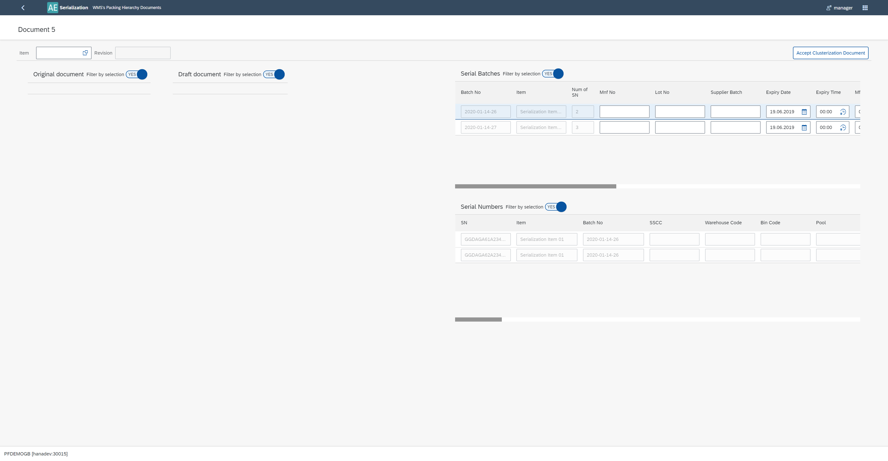

In this window, you can filter information according to CompuTec WMS’s document structure.
