# Plugin Update

You can update plugins using the **Releases** tab in the **CompuTec AppEngine Administration Panel**.

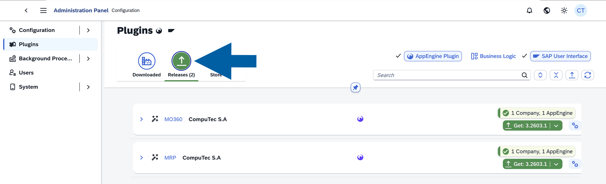

## Update a plugin

To update an installed plugin, follow these steps:

1. Log in to **CompuTec AppEngine Administration Panel**.

    

2. Go to **Plugins**.

    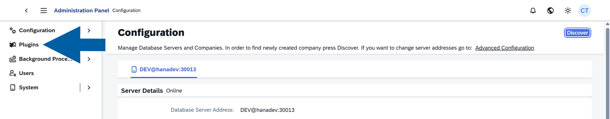

3. Navigate to **Releases**.

    

4. Click the **Get...** to install the latest plugin version.

    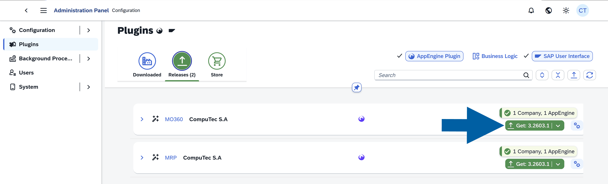

5. (optional) If you want to install a different version, foolow these steps:

    - Click the **plugin name**.

        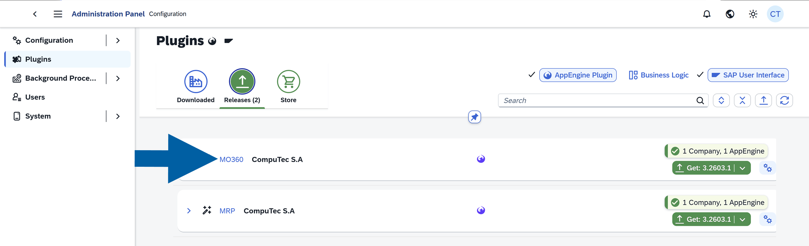

    - Navigate to **Other Versions**.

        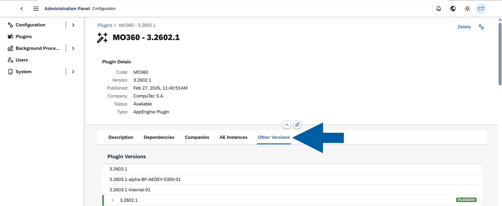

    - Choose the **version** you want to install.

        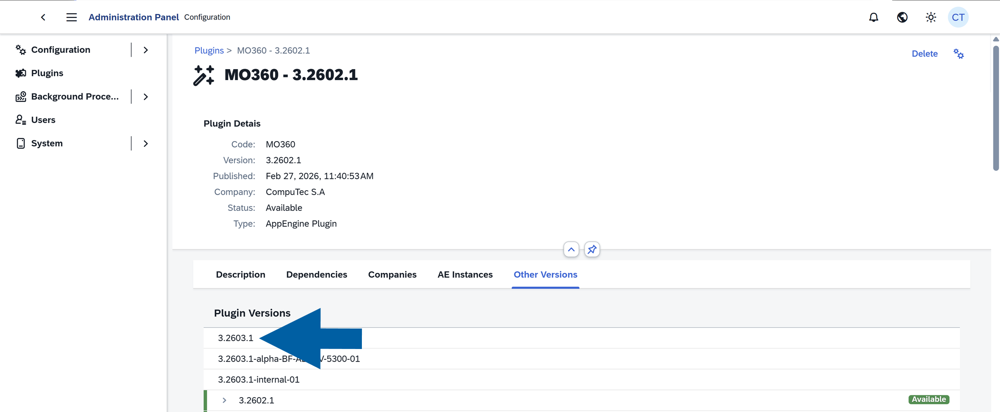

6. Click **Get**.

    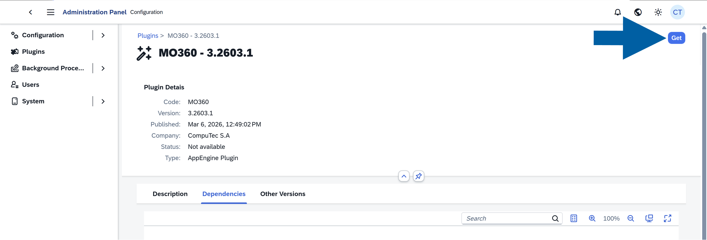

7. Click **Get & Install**.

    

8. Select the company for installation and click **Accept**.

    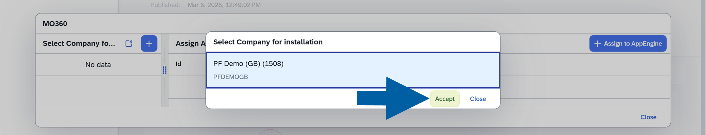

9. Select **CompuTec AppEngine Instance** for installation and click **Accept**.
 
    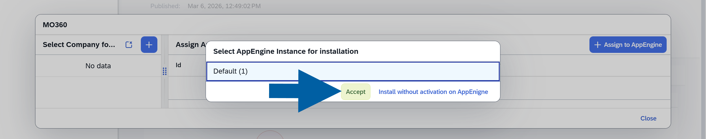

10. Review the installation details and click **Perform Installation**.

    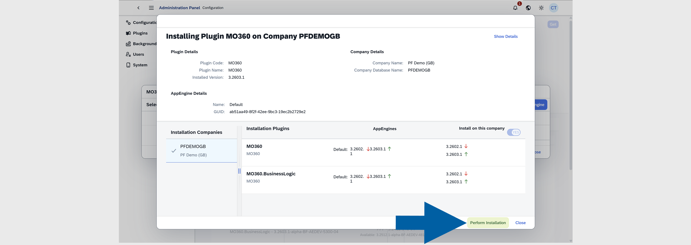

11. Click **OK**.

    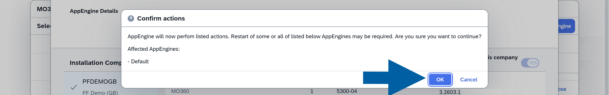

12. After the installation is completed, click **Close**.

    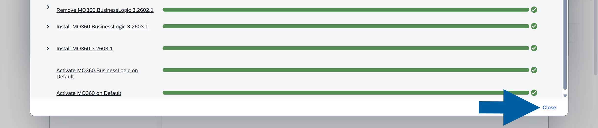

13. Click **Yes** to restart **CompuTec AppEngine**.

    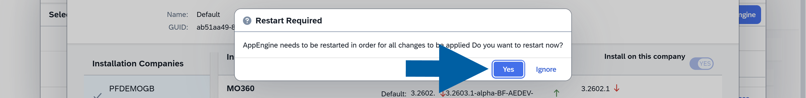

14. After the restart is completed, click **Close**.

    

15. Done! You’ve successfully updated the plugin.

## After update

After the successful update:

- The plugin runs in the selected version
- The previous version is replaced on the Computec AppEngine instance

:::info[Note]

To learn about new features or changes, refer to the plugin’s [documentation](http://learn.computec.one/docs/appengine/plugins-user-guide/overview#available-plugins).

:::
