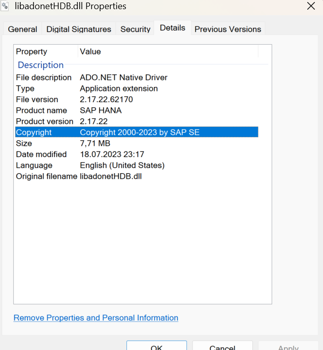

# FAQs

## How to get Company Id

To obtain the company ID, navigate to the Administration Panel and hover over the company name.

    

## Features are Disabled after CompuTec AppEngine Upgrade

Ensure all your companies are fully updated by clicking "Update Company" in the Administration Panel for each one. Features may remain unavailable until the update is completed.

    

## CompuTec AppEngine not Connecting to the Database

CompuTec AppEngine fails to connect to the SAP HANA database, and the following error is displayed:

>**Error Message**: Could not load file or assembly 'Sap.Data.Hana.Core.v2.1, Version=2.7.26.0, Culture=neutral, PublicKeyToken=0326b8ea63db4bc4'. Could not find or load a specific file. (0x80131621).

**Solution**:

To resolve the issue, follow these steps:

1. Ensure that the SAP HANA Database (HDB) client installed on the system where CompuTec AppEngine runs matches the SAP HANA server revision.
2. Make sure that the environment variable path are correctly pointing to the installation directory.

**How to check it**:

1. Open Environment Variables through: Windows->System->Environment Variables

    

2. Locate the variable named HDBDOTNETCORE and open the path.
3. Right click the libadonetHDB.dll file and check the Details for the Product version.

    

It must match the [HANA Server Revision](https://help.sap.com/docs/SAP_BUSINESS_ONE_ADMIN_GUIDE_HANA/1a2fc202f7f64336abf9fbc957d9b9ba/13c43452877d4feaad4dbd661d15d9bb.html)
