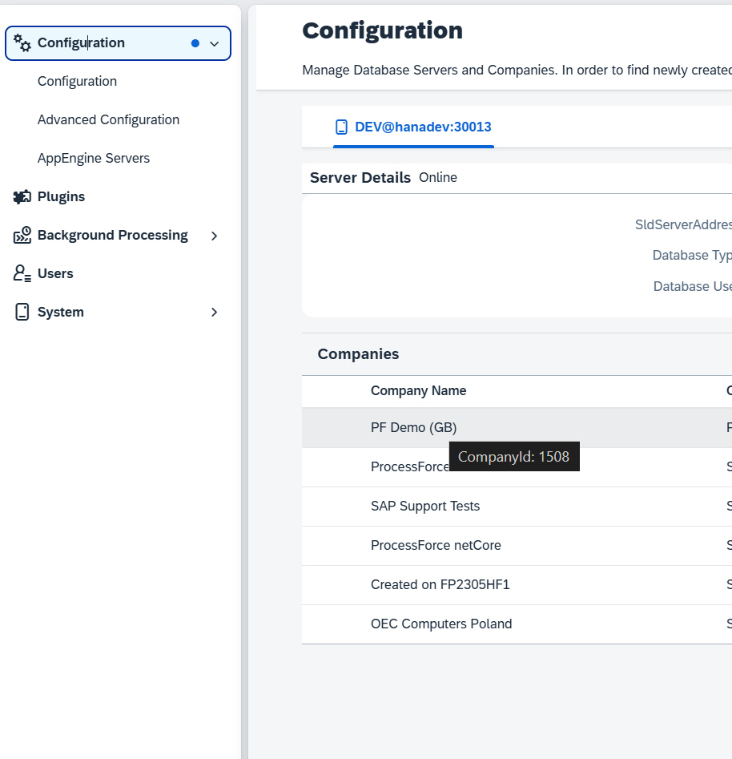

# FAQs

## How to get Company Id

To obtain the company ID, navigate to the Administration Panel and hover over the company name.

    

## Features are Disabled after an AppEngine Upgrade

Ensure all your companies are fully updated by clicking "Update Company" in the Administration Panel for each one. Features may remain unavailable until the update is completed.

    
