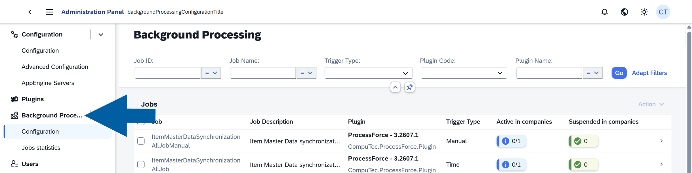
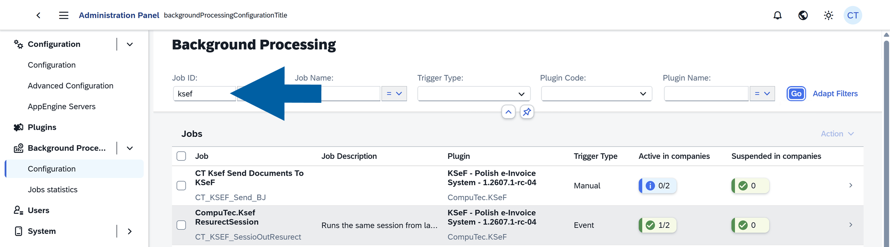
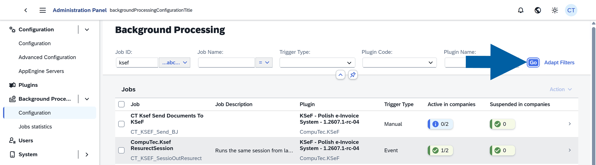
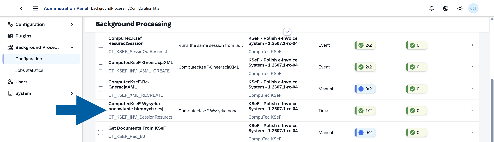
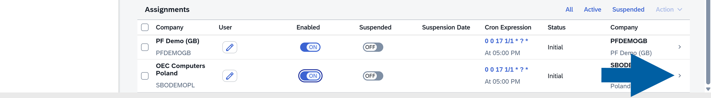
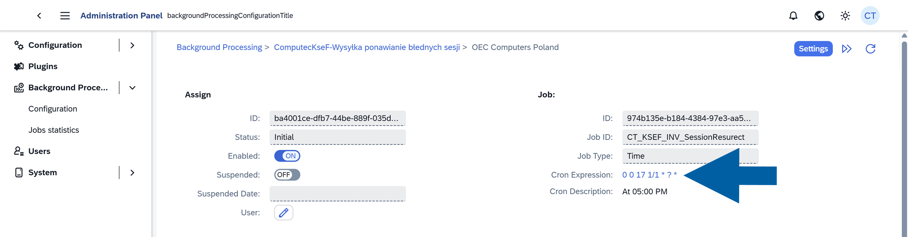
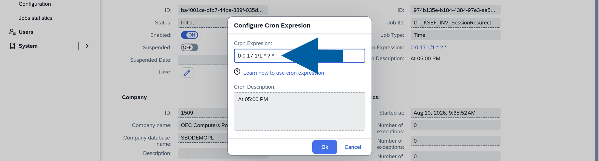

# Configure CompuTec KSeF Background Processing

Use CompuTec AppEngine background processing jobs to automate CompuTec KSeF operations.

Depending on the jobs you enable, CompuTec AppEngine can generate XML files, send documents to KSeF, retry interrupted sessions, retrieve incoming documents, and monitor incoming document processing.

## Before you start

Before you configure background processing:

- Configure the CompuTec KSeF Core plugin.
- Make sure the required company is active in CompuTec AppEngine.
- Make sure you have access to the **CompuTec AppEngine Administration Panel**.

## Find KSeF background processing jobs

1. In the **CompuTec AppEngine Administration Panel**, go to **Background Processing** > **Configuration**.

    

2. In **Job ID**, enter `ksef`.

    

3. Select **Contains**.
4. Click **Go**.

    

The list displays KSeF-related background processing jobs.

## Use background processing trigger types

The **Trigger Type** defines how a job starts:

- **Event** – Runs in response to a related system event.
- **Time** – Runs automatically according to its configured schedule.
- **Manual** – Runs when an administrator starts it manually.

## Configure outgoing document jobs

Use the following jobs to generate and send outgoing KSeF documents.

### ComputecKseF-GeneracjaXML

**Trigger Type:** Event

Generates the XML file required by KSeF when an applicable document is created in SAP Business One.

CompuTec KSeF generates the XML according to the views and XML generation procedures configured in the CompuTec KSeF Core plugin.

:::note[info]
We recommend enabling this job.
:::

### Send Documents To KSeF (Cron)

**Trigger Type:** Time

Automatically sends documents with successfully generated XML files to KSeF according to the configured schedule.

Enable this job if you want to send documents automatically.

### CT Ksef Send Documents To KSeF

**Trigger Type:** Manual

Sends documents to KSeF manually.

Use this job when an administrator needs to start the sending process manually.

You normally do not need this job for regular processing when **Send Documents To KSeF (Cron)** is configured.

### ComputecKseF-Re-GeneracjaXML

**Trigger Type:** Manual

Regenerates XML files manually.

Use this job when an XML file was not generated as expected and you need to generate it again.

## Configure recovery jobs

### CompuTec.Ksef ResurectSession

**Trigger Type:** Event

Resumes an interrupted KSeF session from its last processing stage.

Use this job to help recover processing after an interruption such as:

- An Internet connection failure.
- KSeF unavailability.
- A CompuTec AppEngine interruption.

:::note[info]
We recommend enabling this job.
::::

### ComputecKseF-retrieving failed sending sessions

**Trigger Type:** Time

Periodically retries interrupted or failed KSeF sending sessions.

This job uses a Quartz cron expression. For example: `0 0 17 1/1 * ? *` runs the job every day at 5:00 PM.

:::note[info]
We recommend enabling this job.
:::

## Configure incoming document jobs

Complete this section if you use CompuTec KSeF to retrieve incoming documents.

### Get Documents From KSeF

**Trigger Type:** Manual

Retrieves incoming documents from KSeF manually.

Use this job when an administrator needs to retrieve documents without waiting for the scheduled process.

### Get Documents from Ksef (recurrency)

**Trigger Type:** Time

Automatically retrieves incoming documents from KSeF according to a configured schedule.

Enable this job if you want CompuTec KSeF to retrieve incoming documents automatically.

### KSeF Draft Document Detector

**Trigger Type:** Event

Monitors changes to SAP Business One draft documents created from incoming KSeF documents.

When a draft changes, the job updates the related incoming document when required.

We recommend enabling this job when you process incoming KSeF documents.

### KSeF Target Document Detector

**Trigger Type:** Event

Detects when a final SAP Business One document is created from a KSeF draft.

The job updates the related incoming document, including its status and link to the final SAP Business One document.

We recommend enabling this job when you process incoming KSeF documents.

### KSeF Target Document Scanner

**Trigger Type:** Time

Periodically checks for final SAP Business One documents created from KSeF drafts.

This job provides an additional check if **KSeF Target Document Detector** does not detect a document.

We recommend enabling this job. In the example configuration, it runs every 30 minutes.

## Enable a background processing job

Enable each required **Event** and **Time** job for the company:

1. Click the job name.

    

2. In **Assignments**, find the company.

3. Turn on **Enabled** for the company.

    

4. Click **Yes** to confirm.

    

:::info[Note]  
You do not need to restart CompuTec AppEngine after changing background processing settings. Changes to enabled jobs and schedules take effect without restarting the service.
:::

## Change the schedule of a time-based job

Time-based jobs use **Quartz cron expressions**.

The **Cron Description** field displays the schedule in a readable format.

To change a schedule:

1. In **Assignments**, click the arrow next to the company.

    

2. Click **Cron Expression**.

    

3. Enter the required Quartz cron expression.

    

4. Optionally, enter a **Cron Description**.
5. Click **OK**.

## Result

The required CompuTec KSeF background processing jobs are enabled for the company.

Depending on the jobs you configured, CompuTec AppEngine can automatically generate XML files, send documents, recover interrupted sessions, retrieve incoming documents, and monitor incoming document processing.

## Additional Information

If you use CompuTec KSeF only for outgoing invoices, you do not need to enable the jobs used exclusively for incoming document retrieval and processing.

## Next steps

After configuring the required background processing jobs:

- If you use CompuTec KSeF to retrieve and process incoming documents, configure the incoming document categories. See **Configure CompuTec KSeF Incoming Document Categories**.
- Configure the required SAP Business One authorizations for CompuTec KSeF users. See **Configure SAP Business One Authorizations for CompuTec KSeF**.

:::info[note]
If you use CompuTec KSeF only to send outgoing invoices, you can skip the incoming document categories and continue with SAP Business One authorizations.
:::
