# Configure KSeF Certificates

**CompuTec KSeF** can use certificates to authenticate with KSeF and support offline invoice processing.

Import the required certificates into the **Windows Certificate Store**, grant the account used by **CompuTec AppEngine** access to their private keys, and copy the certificate thumbprints.

You will use the thumbprints later when you configure the **CompuTec KSeF Core** plugin.

## Before you start

Before you configure the certificates:

- Obtain the required KSeF certificates.
- Obtain the private key password for each certificate.
- Make sure you have administrator permissions on the Windows machine where you will install the certificates.
- Identify the account under which CompuTec AppEngine runs.

:::info[Note]

This guide uses the **Windows Certificate Store** in its configuration examples.
:::

## Import a KSeF certificate

To import a certificate, follow these steps:

1. Open **Manage computer certificates** as an administrator.

    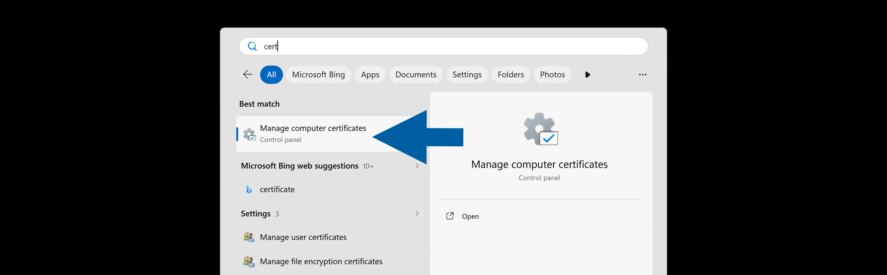

2. Select the certificate store where you want to install the certificate. In our example, we select **Personal**.

    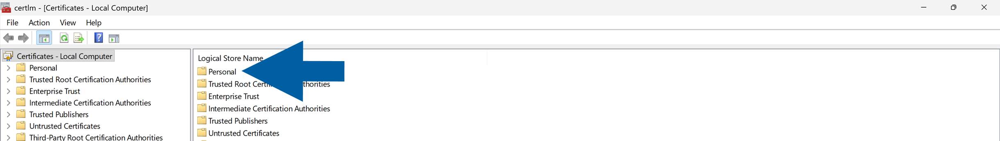

3. Right-click inside the chosen store and click **All Tasks** > **Import...**.

    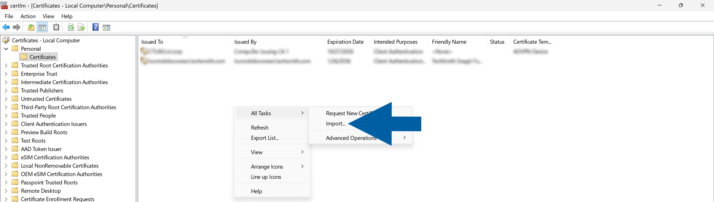

4. In the **Certificate Import Wizard**, click **Next**.

    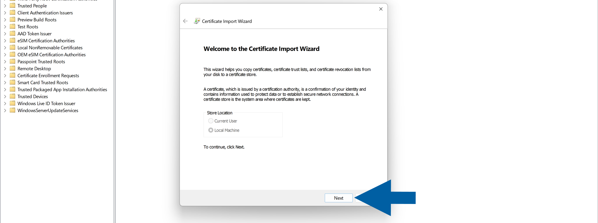

5. Click **Browse...** and select the certificate file you want to import.

    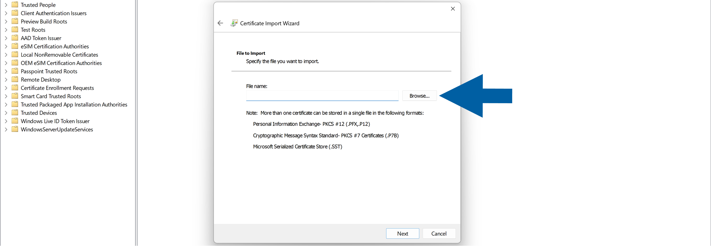

   :::info[note]
   If your certificate is not displayed, change the file type filter to **All Files**.

   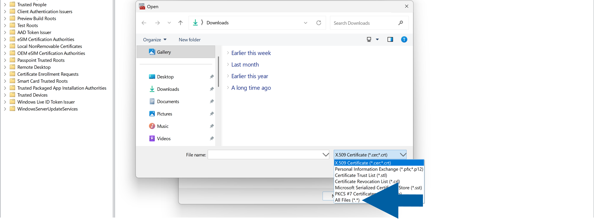

   :::

6. Click **Next**.

    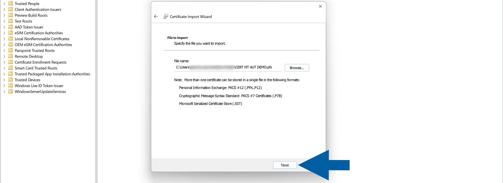

7. Enter the password for the certificate's private key.

8. Select **Mark this key as exportable** and make sure **Include all extended properties** is selected.

    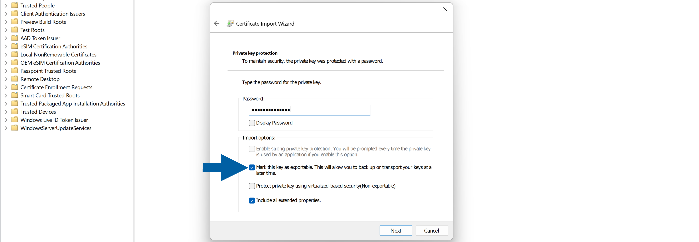

9. Click **Next**.

    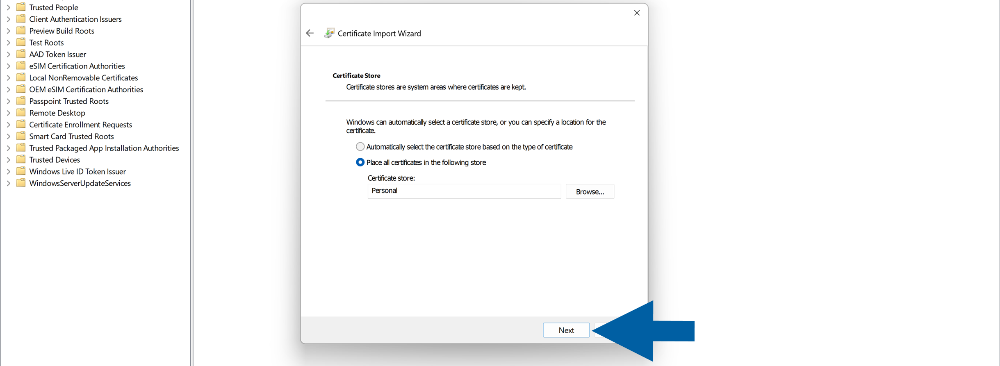

10. Make sure the correct certificate store is selected. In our example, this is **Personal**.

11. Click **Next**.

12. Review the import settings and click **Finish**.

    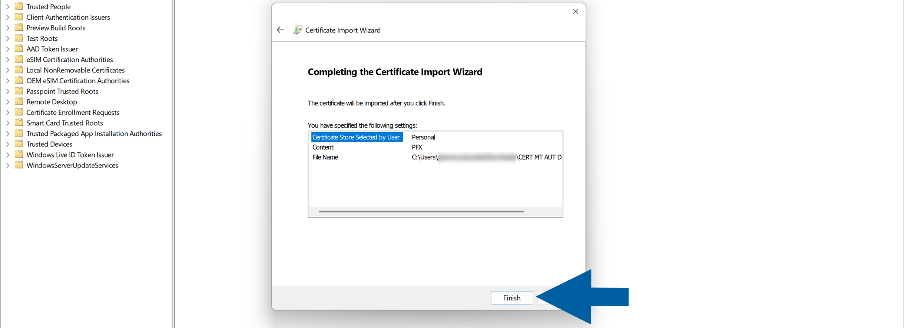

13. Repeat these steps for each KSeF certificate you need to import.

    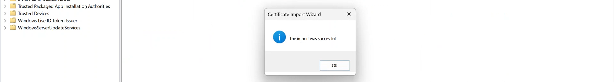

## Grant CompuTec AppEngine access to the private key

After importing the certificates, grant the account used by **CompuTec AppEngine** access to their private keys.

To set up the permissions, follow these steps:

1. In **Manage computer certificates**, right-click the certificate and choose **All Tasks** > **Manage Private Keys...**.

    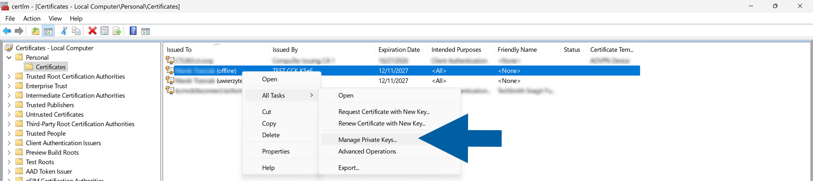

2. Click **Add...**.

    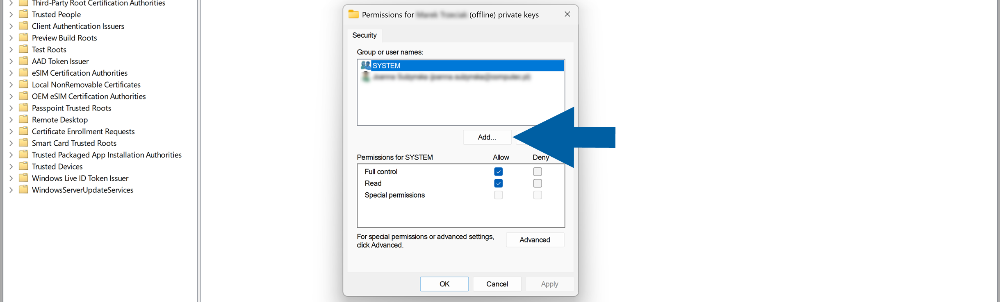

3. Enter the user, computer, service account, or group that requires access to the certificate, and click **OK**.

    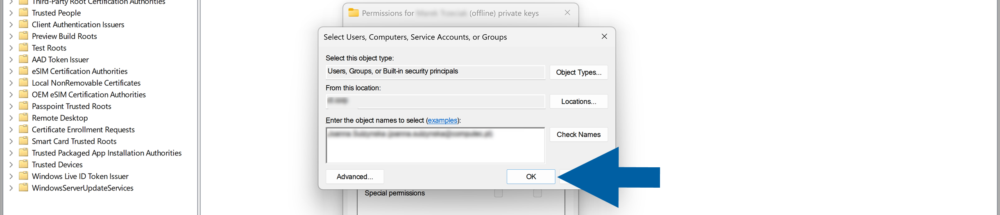

4. Make sure the required permissions are granted.
5. Click **Apply**, and then click **OK**.

    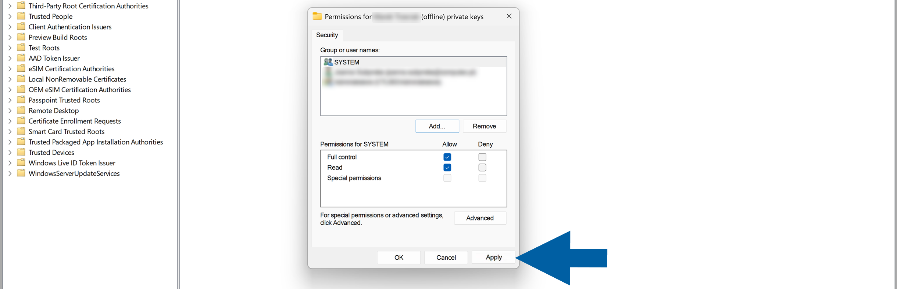

6. Repeat these steps for each KSeF certificate.

    :::warning[Important]
    The account that requires access depends on how CompuTec AppEngine is configured in your environment. Make sure you grant permissions to the account under which CompuTec AppEngine runs.
    :::

## Copy the certificate thumbprint

Copy the certificate thumbprint so you can use it when you configure certificate authentication in CompuTec KSeF.

To copy the thumbprint, follow these steps:

1. Double-click the certificate to open it.
2. Go to the **Details** tab.

    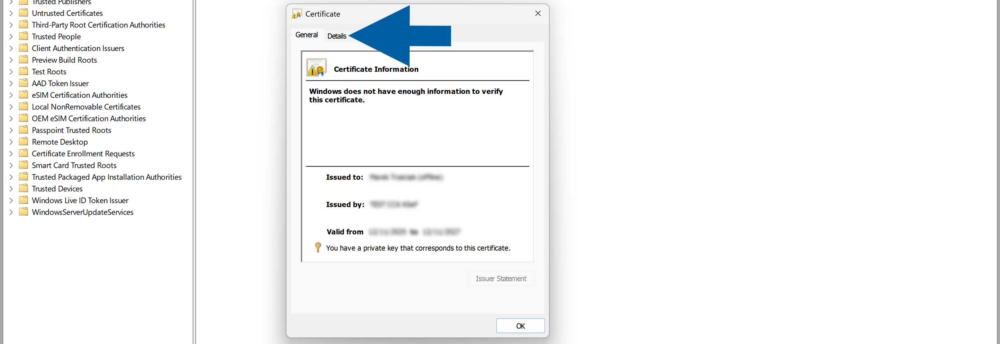

3. Find and select **Thumbprint**.

    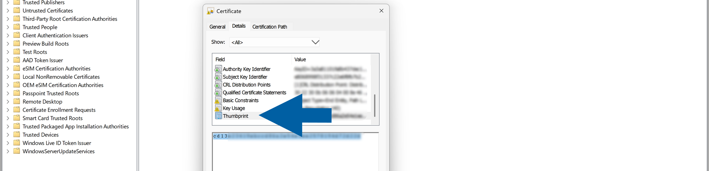

4. Select the thumbprint value and press **Ctrl+C** to copy it.

    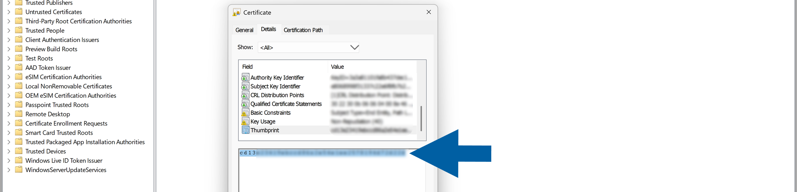

5. Convert all letters in the thumbprint to uppercase. For example, you can paste the value into Microsoft Excel and use the `=UPPER()` function.

    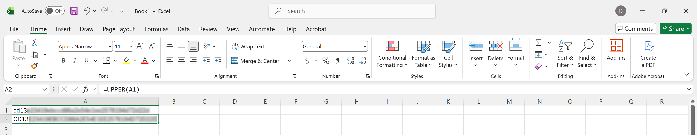

6. Save the uppercase thumbprint. You will enter it in **CertificateThumbprint** when configuring the plugin.
7. Repeat these steps for each certificate.

## Result

The KSeF certificates are installed in the Windows Certificate Store, and the account used by CompuTec AppEngine has access to their private keys.

You also have the certificate thumbprints required to configure authentication and offline processing in CompuTec KSeF.

## Additional Information

CompuTec KSeF can use separate certificates for:

- KSeF authentication.
- Offline processing and offline QR code generation.
- Make sure you use the correct certificate thumbprint for each purpose when you configure the **CompuTec KSeF Core** plugin.

## Next steps

After configuring the certificates, configure the **CompuTec KSeF Core** plugin.

During the configuration, use the certificate thumbprints you copied to configure certificate authentication and, if required, offline processing.

See [**Configure CompuTec KSeF Core**](/docs/ksef/administrator-guide/configuration/config-core).
