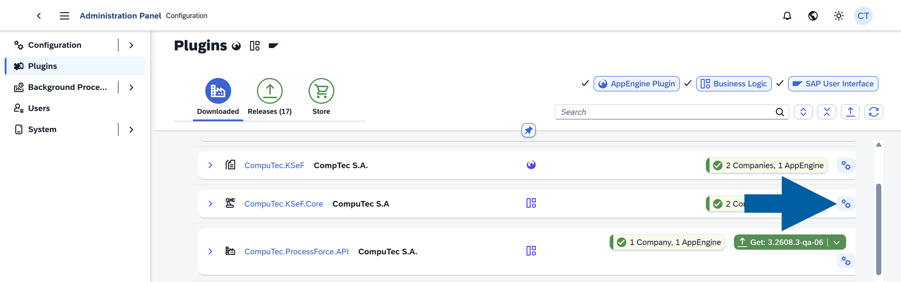
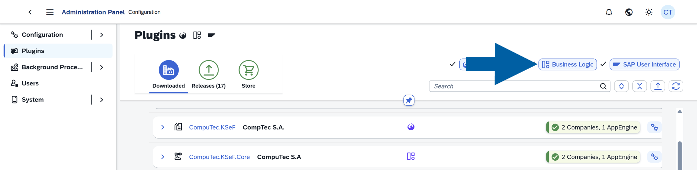
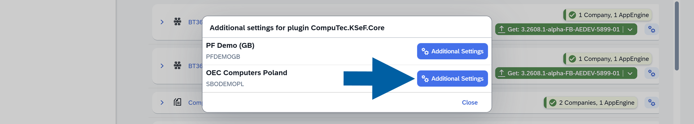
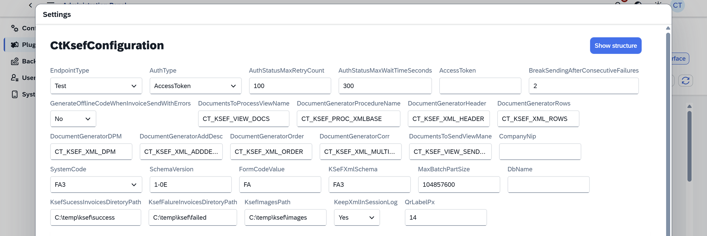
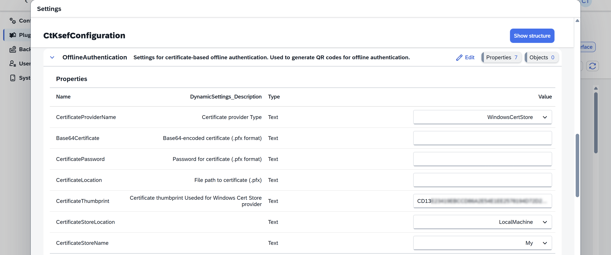
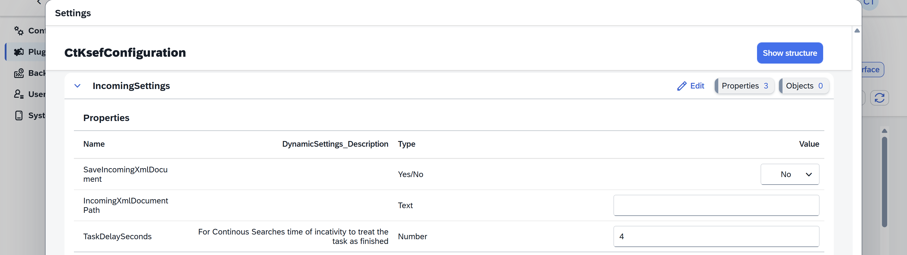
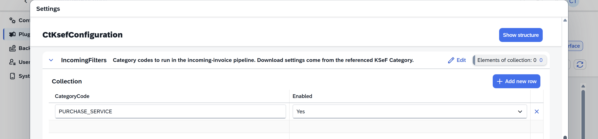
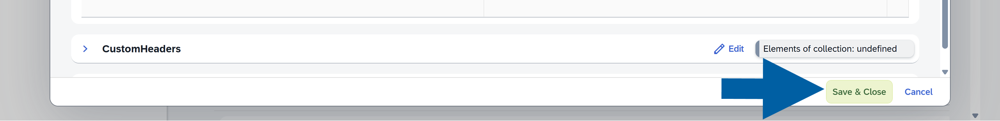

# Configure CompuTec KSeF Core

Configure the **CompuTec.KSeF.Core** plugin to define how CompuTec KSeF connects to KSeF and processes documents.

You can configure the KSeF environment, authentication, XML generation, schema settings, file storage, certificates, and incoming document retrieval.

## Before you start

Before you configure CompuTec KSeF Core:

- Install the CompuTec KSeF plugin for the required company.
- Configure the required KSeF certificates if you use certificate authentication.
- Copy the certificate thumbprints.
- Make sure you have access to the **CompuTec AppEngine Administration Panel**.

## Open the CompuTec KSeF Core configuration

To configure CompuTec KSeF Core Plugin in CompuTec AppEngine, follow these steps:

1. Log in to the **CompuTec AppEngine Administration Panel**.
2. Go to **Plugins** > **Downloaded**.
3. Find **CompuTec.KSeF.Core** and click the **gear icon** next to it.

    

    :::info[note]
    If **CompuTec.KSeF.Core** is not displayed in the **Downloaded** list, make sure **Business Logic** is selected in the filters.

    
    :::

4. Select the company you want to configure and click **Advanced Settings**.

    

5. Go to the **CtkSefConfiguration** section. Here, you can configure the KSeF environment and authentication method, define how invoice XML files are generated and sent, and specify where generated files are stored.

    

## Configure general KSeF settings

Configure the following settings:

### EndpointType

Select the KSeF environment:

- **Production** – Use this environment to send actual invoices to KSeF.
- **Demo** – Use this environment to test your configuration. It requires authentication and works as a sandbox. We recommend using it when testing your KSeF configuration.
- **Test** – Use this open test environment only when appropriate. It has limited access restrictions. We do not recommend using real company or invoice data here, as this may expose sensitive information.

:::warning[Important]
Do not use the **Test** environment with real company or invoice data. Use **Demo** to test your KSeF configuration and processes.
:::

### AuthType

Select how CompuTec KSeF authenticates with KSeF:

- **Certificate** – Uses certificate authentication. This is the recommended authentication method.
- **AccessToken** – Uses a KSeF access token.

:::note[Info]  
We recommend certificate authentication.
:::

### AuthStatusMaxRetryCount

Enter the maximum number of times CompuTec KSeF should check the KSeF authentication status.

:::note[Info]  
We recommend keeping the default value.
:::

### AuthStatusMaxWaitTimeSeconds

Enter the maximum time, in seconds, that CompuTec KSeF should wait for the KSeF authentication status.

:::note[Info]
We recommend keeping the default value.
:::

### AccessToken

If you selected **AccessToken** in **AuthType**, enter the KSeF access token.

### BreakSendingAfterConsecutiveFailures

Enter the number of consecutive errors after which CompuTec KSeF should stop sending documents to KSeF.

This setting prevents the system from continuing to send documents when repeated errors occur.

:::note[Info]
We recommend keeping the default value.
:::

### GenerateOfflineCodeWhenInvoiceSendWithErrors

Choose whether CompuTec KSeF should generate an offline QR code when an invoice cannot be sent to KSeF.

When enabled, CompuTec KSeF handles the invoice as an offline document and generates the appropriate QR code.

## Configure XML generation

When CompuTec KSeF processes an invoice, it generates an XML file containing the invoice data.

Configure the following settings to define which SAP Business One documents are processed and what data is included in the generated XML:

- **DocumentsToProcessViewName** – Defines which SAP Business One documents should have a KSeF XML file generated.
- **DocumentGeneratorProcedureName** – This setting is no longer used and will be removed in a future version.
- **DocumentGeneratorHeader** – Defines the invoice header data included in the XML.
- **DocumentGeneratorRows** – Defines invoice row data included in the XML.
- **DocumentGeneratorDPM** – Defines down payment data.
- **DocumentGeneratorAddDesc** – Defines additional invoice descriptions.
- **DocumentGeneratorOrder** – Defines order-related data for invoices and down payment invoices.
- **DocumentGeneratorCorr** – Defines correction invoice data, including corrections that refer to multiple base invoices.
- **DocumentsToSendViewName** – Defines which documents should be sent to KSeF.

:::warning[Important]  
You can customize XML generation procedures in **SAP HANA Studio** or **Microsoft SQL Server Management Studio**, depending on your database.

If you need to customize a standard procedure, create your own version and give it a unique name, for example, by adding your company name as a suffix. Enter the new procedure name in the corresponding setting.

Do not modify standard procedures directly. Plugin updates may overwrite standard procedures and remove your changes.
:::

## Configure company and KSeF schema settings

### CompanyNip

Enter your company's NIP without the PL prefix, for example, `1234567890`. This setting is required and must identify the company that communicates with KSeF.

### SystemCode

Select the KSeF form version.

- **FA3** – Current version.
- **FA2** – Version used by the previous KSeF version.

### SchemaVersion

Defines the KSeF schema version.

### FormCodeValue

Defines the form code required by the KSeF schema.

### KSeFXmlSchema

Defines the XML schema used for KSeF invoices.

:::note[info]
**SystemCode**, **SchemaVersion**, **FormCodeValue**, and **KSeFXmlSchema** depend on current KSeF requirements. Keep the default values unless you specifically need another supported schema.
:::

### MaxBatchPartSize

Enter the maximum size of a single batch part.

CompuTec KSeF can send documents to KSeF in batches. This setting controls the maximum size of each part.

### DbName

Enter the SAP Business One company database name if you want to restrict this CompuTec KSeF configuration to a specific database. Leave this field empty if the configuration should not be restricted to one database.

## Configure file storage

Configure where CompuTec KSeF stores generated XML files and QR code images.

### KsefSucessInvoicesDirectoryPath

Enter the location where CompuTec KSeF should store XML files for successfully processed invoices.

### KsefFailureInvoicesDirectoryPath

Enter the location where CompuTec KSeF should store XML files for invoices that failed processing or validation.

### KsefImagesPath

Enter the location where CompuTec KSeF should store generated QR code images.

These QR codes can then be used on invoice printouts.

:::warning[Important]
In a company environment, use shared network locations that both CompuTec AppEngine and users working with KSeF can access.

Make sure the account used to run CompuTec AppEngine has the required permissions to these locations.

CompuTec AppEngine must be able to access the configured directories and create them if they do not already exist. If a required directory cannot be accessed or created, CompuTec KSeF cannot start document processing.

Paths such as `C:\temp\...` are suitable for local testing. Use appropriate shared network locations in a company environment.
:::

### KeepXmlInSessionLog

Choose whether CompuTec KSeF should also store generated XML in the session log.

:::note[info]
We recommend keeping the default value.
:::

### QrLabelPx

Define the generated QR code label size in pixels.

:::note[info]
Keep the default value unless you need a different QR code size.
:::

## Configure certificate authentication

If you use certificate authentication, you also need to configure the certificates used by CompuTec KSeF. Use the **Authorization** tab to configure the certificate that CompuTec KSeF uses to authenticate with KSeF.

1. Open the **Authentication** tab.

    ![:::note\[Info\] ](media/core-config/ksef-config-24.png)

2. Configure the following settings.

### CertificateProviderName

Select how CompuTec KSeF accesses the certificate:

- **File** – Uses a certificate stored as a file.
- **Base64** – Uses a certificate provided as a Base64-encoded value.
- **WindowsCertStore** – Uses a certificate stored in the Windows Certificate Store.

:::note[info]
We recommend **WindowsCertStore**.
:::

### CertificateThumbprint

Enter the authentication certificate thumbprint in uppercase.

### CertificateStoreLocation

If you installed the certificate according to the certificate configuration guide, keep the default value: **LocalMachine.**

### CertificateStoreName

If you installed the certificate in the **Personal** certificate store, keep the default value: **My.**

If you use another certificate store, change the value accordingly.

## Configure offline authorization

Use the **OfflineAuthorization** tab to configure the certificate used to sign offline QR codes.

CompuTec KSeF uses this certificate when an invoice is handled in offline mode, for example, when KSeF is unavailable or the invoice cannot be sent online.

Configure the offline certificate if your company plans to use offline processing. If offline processing is not used, this certificate is not required.

1. Open the **OfflineAuthorization** tab.

    

2. Configure **CertificateProviderName:** Select how the offline certificate is provided: **File**, **Base64**, or **WindowsCertStore**.

    :::note[info]
    We recommend **WindowsCertStore**, as used in our configuration example.
    :::

3. Enter the offline certificate thumbprint in **CertificateThumbprint:** Enter the thumbprint of the **offline certificate** that you saved earlier. Enter the value in uppercase.

    :::info[Note]  
    Make sure you enter the thumbprint of the offline certificate here, not the authentication certificate configured in the **Authorization** tab.
    :::

4. Configure **CertificateStoreLocation** and **CertificateStoreName**.

    :::note[info]  
    If you followed the certificate configuration guide and use the Windows Certificate Store, use:

    - **CertificateStoreLocation**: **LocalMachine**
    - **CertificateStoreName**: **My**
    :::

## Configure incoming document settings

In the **IncomingSettings** tab, configure how CompuTec KSeF retrieves incoming documents from KSeF.

:::info[Note]
Complete this section if you use CompuTec KSeF to **retrieve incoming documents**.
:::

Configure the following settings:

### SaveIncomingXmlDocument

Choose whether CompuTec KSeF should save XML files retrieved from KSeF to disk.

:::note[info]
The default value is **No**.
:::

### IncomingXmlDocumentPath

If **SaveIncomingXmlDocument** is set to **Yes**, enter the location where CompuTec KSeF should store the retrieved XML files.

### TaskDelaySeconds

Enter the delay, in seconds, between requests for incoming documents.

:::note[info]
We recommend: `4`.
:::

## Configure incoming filters

Use the **IncomingFilters** tab to define which categories of KSeF documents CompuTec KSeF should retrieve.

The main category for incoming purchase invoices is `PURCHASE_SERVICE`. It covers purchase invoices issued to your company where your company is the invoice recipient.

To enable this category:

1. Open the **IncomingFilters** tab.
2. Click **+ Add new row**.
3. In **CategoryCode**, enter: `PURCHASE_SERVICE`.
4. Set **Enabled** to **Yes**.

You can configure other categories if your scenario requires retrieving documents where your company has another role.

:::info[Note]
If you do not use CompuTec KSeF to retrieve incoming invoices, do not enable an incoming category. For example, if purchase invoices are imported through a separate document workflow system, leave the category unconfigured or set **Enabled** to **No**.
:::

## Save the configuration

Click **Save & Close**.

## Result

The CompuTec KSeF Core plugin is configured for the selected company.

CompuTec KSeF can use the configured environment, authentication method, XML generation logic, certificates, file locations, and incoming document settings.

## Additional Information

Before starting an outgoing KSeF session, CompuTec KSeF validates the required configuration, including authentication settings, database settings, and required directories. If the validation fails, CompuTec KSeF does not start document processing.

Configure the required CompuTec AppEngine background processing jobs to generate and send XML files automatically and, if required, retrieve and process incoming documents.

## Next steps

After configuring CompuTec KSeF Core, configure the CompuTec AppEngine background processing jobs required for your KSeF process.

The background processing jobs can automatically generate and send outgoing invoice XML files and, if required, retrieve and process incoming documents.

See [**Configure CompuTec KSeF Background Processing**](/docs/ksef/administrator-guide/configuration/background-processing).
