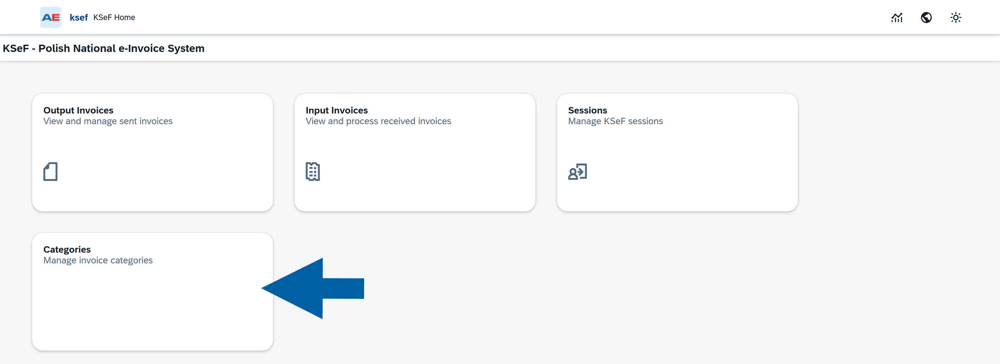

# Configure CompuTec KSeF Incoming Document Categories

Configure incoming document categories to define how CompuTec KSeF downloads, matches, and processes documents retrieved from KSeF.

Use category settings to control download filters, Business Partner matching, draft creation, document and item determination, base document matching, and field mappings.

Configure these categories only if your company uses CompuTec KSeF to process incoming documents.

## Before you start

Before you configure incoming document categories:

- Configure incoming document retrieval in the CompuTec KSeF Core plugin.
- Enable the required incoming-document background processing jobs.
- Make sure you have authorization to maintain KSeF categories in SAP Business One.

## Open an incoming document category

1. In SAP Business One, go to **Purchasing A/P** > **KSeF – Incoming Documents**.

   

2. Open **Categories**.

   

3. Click the category you want to configure.

   

4. Click **Edit**.

   

## Configure basic information

Use **Basic Information** to define the general processing settings for the category.

### Code

Displays the unique category code.

:::note[info]
Example: `PURCHASE_SERVICE`.
:::

### Description

Enter a description that helps users identify the category.

### Active

Select **Yes** to enable the category.

### Card Type

Select the SAP Business One Business Partner type used for documents in this category.

:::note[info]
For purchase invoices, select **Supplier**.
:::

### Auto Create BP

Choose whether CompuTec KSeF should automatically create a Business Partner when it cannot match an incoming KSeF document to an existing Business Partner.

:::note[info]
We recommend **No** so that users can review new Business Partners before creating them.
:::

### Default Bank Code

Enter the default bank code used when processing documents in this category.

### Default Document Type

Select the default SAP Business One document type.

:::note[info]
For `PURCHASE_SERVICE`, select **Invoice**.
:::

### Default Document Sub Type

Select the default document subtype.

:::note[info]
For `PURCHASE_SERVICE`, select **Service**.
:::

### Require All Lines

Choose whether all lines of the incoming KSeF document must be successfully matched before CompuTec KSeF can process the document.

:::note[info]
The default value is **No**.
:::

### Allow Partial Draft

Choose whether CompuTec KSeF can create a draft when only part of the incoming document can be processed.

:::note[info]
Use **No** when the SAP Business One document should reflect the complete KSeF invoice.
:::

### Manual Draft Creation

Select **Yes** if users should review an incoming document before manually creating its SAP Business One draft.

This prevents CompuTec KSeF from creating the draft automatically before the incoming document is reviewed.

## Configure the incoming download filter

Use **Incoming Download Filter** to define which documents CompuTec KSeF retrieves from KSeF and how it determines the download range.

### Use HWM (incremental)

Select **Yes** to use incremental downloading.

CompuTec KSeF keeps track of the last processed point and retrieves documents that have not yet been downloaded.

:::note[info]
We recommend this setting for regular KSeF processing.
:::

### Date Type

Select the KSeF date that CompuTec KSeF should use to filter documents.

:::note[info]
For regular processing, we recommend **Permanent Storage**.
:::

### Date From

Enter the beginning of the download period.

:::note[info]
Use this field, for example, when older KSeF documents have already been processed manually and should not be retrieved again.

If you leave the field empty, the current date is used by default.
:::

### Date To

Enter the end of the download period.

:::note[info]
For ongoing processing, leave this field empty.
:::

### Filter Criteria

Use **Filter Criteria** to further restrict which KSeF documents CompuTec KSeF retrieves.

Available criteria include:

- Subject Type.
- Form Type.
- Seller NIP.
- Buyer identification.
- Self Invoicing.
- Invoice Types.

:::note[info]
For purchase invoices where your company is the buyer, set **Subject Type** to **Subject 2 (Buyer)**.
:::

:::info[note]
Apply additional filter criteria only when you need to restrict which KSeF documents are retrieved. Otherwise, keep the default values.
:::

## Configure processing settings

Use **Processing Settings** to define how CompuTec KSeF groups, matches, and converts downloaded documents into SAP Business One drafts.

![Processing Settings configuration screen showing Processing Settings and Post Processors sections in a neutral administrative interface. The Processing Settings section shows Process Per CardCode set to Yes, Allow Partial Base Qty set to Yes, Draft Creation Mode set to SqlProcessor, SQL Procedure: Header set to CT_KSEF_INC_GetSL_Header, and SQL Procedure: Lines set to CT_KSEF_INC_GetSL_Rows. The Post Processors section shows Download set to CT_KSEF_INC_PP_DOWN, two additional download-related fields containing CT_KSEF_INC_PP_LINES and CT_KSEF_INC_PP_DOWN, Document Type blank, Document Lines set to CT_KSEF_INC_PP_LINES, and Draft and Target blank.](media/doc-categ-config/ksef-config-49.png)

### Process Per CardCode

Select **Yes** to process downloaded documents separately for each matched Business Partner.

### Allow Partial Base Qty

Choose whether CompuTec KSeF can process a document when the quantity on the incoming invoice differs from the quantity available on the matched base document.

:::note[info]
For example, if the base document contains a quantity of 100 and the incoming invoice contains 50, select **Yes** to allow the partial quantity to be processed.
:::

### Draft Creation Mode

Select how CompuTec KSeF creates SAP Business One drafts.

:::note[info]
In the example configuration, **SqlProcessor** is used. This allows SQL procedures to prepare the document data required to create the draft.
:::

### SQL Procedure: Header

Select the SQL procedure that prepares draft header data.

### SQL Procedure: Lines

Select the SQL procedure that prepares draft line data.

### Post Processors

Use the configured post-processors to perform additional processing at different stages, such as after document download, Business Partner matching, and document-line processing.

:::warning[Important]
Keep the default SQL procedures and post-processors unless your implementation requires custom processing.

If you need to customize a standard procedure, create a copy with a unique name and use that procedure in the configuration.

Do not modify standard procedures directly. Plugin updates may overwrite your changes.
:::

## Configure Business Partner determination

Use **CardCode Determination Rules** to define how CompuTec KSeF matches an incoming document to an existing SAP Business One Business Partner.

You can enable matching based on:

- **NIP** – Matches the supplier's NIP to the SAP Business One field configured in **NIP Field**. The example uses `LicTradNum`.
- **Name** – Matches the supplier name to the configured SAP Business One field. The example uses `CardName`.
- **Email** – Matches the Business Partner by email address.
- **REGON** – Matches by REGON.
- **KRS** – Matches by KRS.
- **Custom Procedure** – Uses custom Business Partner determination logic.
- **Custom Fields** – Uses custom fields for matching.

:::note[info]
In the example configuration, matching by **NIP** and **Name** is enabled.
:::

## Configure document type determination

Use **Document Type Determination Rules** to define which SAP Business One document type and subtype CompuTec KSeF should use for an incoming document.

A rule can include:

- Source field.
- Operator.
- Value.
- Resulting document type.
- Resulting document subtype.
- Optional custom procedure.
- Evaluation order.

CompuTec KSeF evaluates the rules according to their **Order**.

Enable only the rules required for your document processing scenario.

## Configure item code determination

Use **Item Code Determination Rules** to define how CompuTec KSeF matches incoming invoice lines to SAP Business One item codes.

![Item Code Determination Rules configuration screen in an administrative interface. The table shows two rules with columns for Order, Rule Type, Source Field, Match Table, Match Field, Result Column, Match Mode, Fallback Item Code, Allow Multiple, Custom Procedure, Comment, and Active. The first row has order 10, rule type truncated as Stata w..., match table OITM, result column ItemCode, match mode Exact, fallback item code Domyslny, and Allow Multiple set to No. The second row has order 20, rule type EAN, result column ItemCode, match mode Exact, and Allow Multiple set to No. Add Row and Column Settings controls appear above the table, with a scrollbar at the right.](media/doc-categ-config/ksef-config-51b.png)

You can use different matching methods, such as EAN, and configure a fallback item code when required.

:::info[note]
Configure document and item determination rules according to your SAP Business One data and business process.
:::

## Configure base document matching

Use **Base Document Configuration** to define how CompuTec KSeF matches incoming invoices to existing SAP Business One base documents.

![Base Document Configuration screen in an administrative interface. A table defines how target documents are matched to existing base documents, with Add Row and Column Settings controls above it. The column headings are Target Doc Type, Base Doc Type, Match By, Date Range (Days), Require Exact Qty, Allow Partial Qty, Priority, Comment, and Active. One row shows Target Doc Type Invoice, a blank Base Doc Type, Match By Document Number, Date Range 30, Require Exact Qty No, Allow Partial Qty Yes, blank Comment, and Active Yes. The clean, neutral interface supports administrative configuration.](media/doc-categ-config/ksef-config-52a.png)

For each rule, you can define:

- Target document type.
- Base document type.
- Matching method.
- Allowed date range.
- Quantity requirements.
- Priority.
- Whether the rule is active.

:::note[info]
For example, **Match By: Document Number** instructs CompuTec KSeF to use the document number when searching for a corresponding base document.
:::

## Configure field mappings

Use **Field Mappings** when CompuTec KSeF needs to transfer data from an incoming KSeF document to specific SAP Business One fields.

A mapping can define:

- Source.
- Target table.
- Target field.
- Transformation.
- Default value.
- Condition.

:::info[note]
Base document rules and field mappings are implementation-specific. Add or change them only when required by your document processing scenario.
:::

## Save the category

1. Review the category settings.
2. Click **Save**.

## Result

The incoming document category is configured.

CompuTec KSeF can use the category settings to retrieve and process incoming documents, including Business Partner matching, draft creation, document and item determination, and base document matching.

## Additional Information

Use the default configuration whenever it meets your business requirements.

Introduce custom SQL procedures, matching logic, or field mappings only when your implementation requires them.

## Next steps

After configuring incoming document categories, configure the required SAP Business One authorizations for CompuTec KSeF users.

Assign access according to each user's responsibilities, such as working with incoming invoices, outgoing invoices, or administrative configuration.

See [**Configure SAP Business One Authorizations for CompuTec KSeF**](/docs/ksef/administrator-guide/configuration/config-sap-auth).
