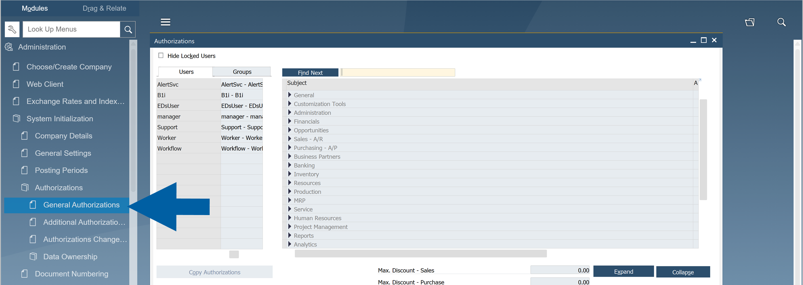
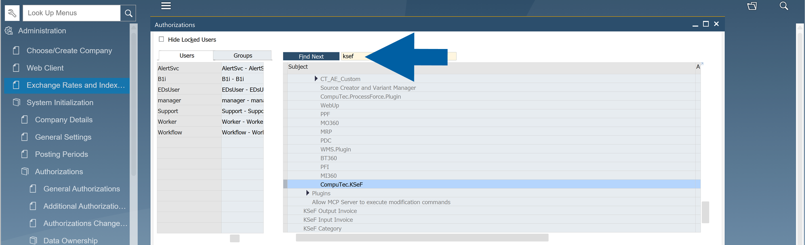

# Configure SAP Business One Authorizations for CompuTec KSeF

Configure SAP Business One authorizations to control which CompuTec KSeF functions users can access.

Assign authorizations according to each user's responsibilities. For example, users who work only with outgoing invoices do not need access to incoming document processing or administrative configuration.

## Before you start

Before you configure authorizations:

- Install CompuTec KSeF for the required company.
- Make sure you have permission to manage SAP Business One user authorizations.
- Identify which users work with outgoing invoices, incoming invoices, or KSeF administration.

## Open KSeF authorizations

To open KSeF authorizations, follow these steps:

1. In **SAP Business One**, go to **Administration** > **System Initialization** > **Authorizations** > **General Authorizations**.

   

2. Search for KSeF.

   

SAP Business One displays the KSeF-related authorizations.

## Assign CompuTec KSeF analytics authorization

Go to: **User Authorization** > **CompuTec AppEngine** > **Analytics** > **CompuTec.KSeF.**

Grant this authorization to users who need access to KSeF analytics and incoming KSeF functionality.

:::note[info]
Users who process incoming KSeF documents require this authorization.
:::

## Assign CompuTec KSeF plugin authorization

Go to: **User Authorization** > **CompuTec AppEngine** > **Plugins** > **CompuTec.KSeF**

Grant this authorization to users who work with CompuTec KSeF.

## Assign outgoing invoice authorization

Grant **KSeF Output Invoice** to users who need access to outgoing KSeF invoices.

:::note[info]
For example, assign this authorization to users responsible for issuing and sending sales invoices to KSeF.
:::

## Assign incoming invoice authorization

Grant **KSeF Input Invoice** to users who need access to incoming KSeF invoices.

:::note[info]
For example, assign this authorization to accounting users who process invoices received through KSeF.
:::

## Assign category administration authorization

Grant **KSeF Category** to administrators who maintain KSeF category configuration.

End users do not normally require this authorization.

:::info[note]
Assign KSeF authorizations according to each user's responsibilities. A user who works only with outgoing invoices does not need access to incoming invoice processing.

Limit **KSeF Category** to administrators who need to maintain the configuration.
:::

## Result

Users can access the CompuTec KSeF functions required for their responsibilities in SAP Business One.

## Additional Information

Review user authorizations when responsibilities change to make sure users have access only to the CompuTec KSeF functions they need.

## Next steps

After configuring SAP Business One authorizations, the required CompuTec KSeF configuration is complete.

Depending on your company's process, users can now:

- Send outgoing invoices to KSeF.
- Retrieve and process incoming KSeF documents, if incoming document processing is configured.

See **Send Outgoing Invoices to KSeF** for information about sending sales invoices.

If your company uses incoming document processing, see the CompuTec KSeF documentation for working with incoming invoices.
