# Install CompuTec KSeF Plugin

**Computec KSeF Plugin** in **CompuTec AppEngine** are installed using the **Plugins** page in the **CompuTec AppEngine Administration Panel**.

The installation and configuration process includes:

- **Download the plugin**: The plugin is added to the CompuTec AppEngine repository.

- **Install the plugin**: Installation prepares the plugin for use in a specific company. It assigns the plugin to the company, and applies any required database changes.

- **Activate it on the Computec AppEngine instance**: Activation makes the plugin available for use in the system. It assigns the plugin to an AppEngine instance, and  enables its functionality at runtime.

The system automatically handles dependencies and version compatibility.

:::info[Note]
Only one version of a plugin can be active on a single CompuTec AppEngine instance at a time.
:::

## Before you start

Before you start, make sure that:

- **CompuTec AppEngine** is installed and activated. [Read more](https://learn.computec.one/docs/appengine/administrators-guide/configuration-and-administration/installation)
- You have access to the **CompuTec Administration Panel**.
- At least one **CompuTec AppEngine** instance is configured and active. [Read more](https://learn.computec.one/docs/appengine/administrators-guide/configuration-and-administration/installation#step-5-activate-a-company-in-computec-appengine)
- Disable any custom code in the ``SP_TransactionNotification`` and ``SP_PostTransactionNotice`` stored procedures before installing the plugins. After the installation is completed successfully, you can re-enable your custom code.

## Install and activate CompuTec KSeF

To install and activate **CompuTec KSeF** follow these steps:

1. Log in to **CompuTec AppEngine Administration Panel**.

    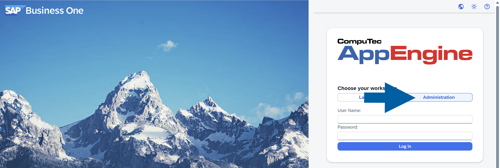

2. Go to **Plugins**.

    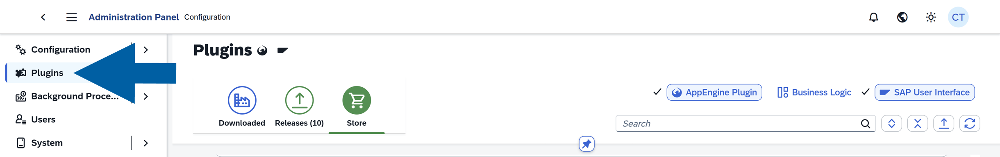

3. Navigate to **Store**.

    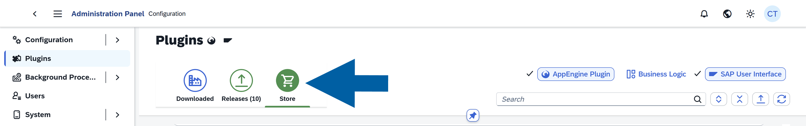

4. Find the **CompuTec.KSeF** plugin, and click **Get...** next to the plugin name on the list to install the latest plugin version.

    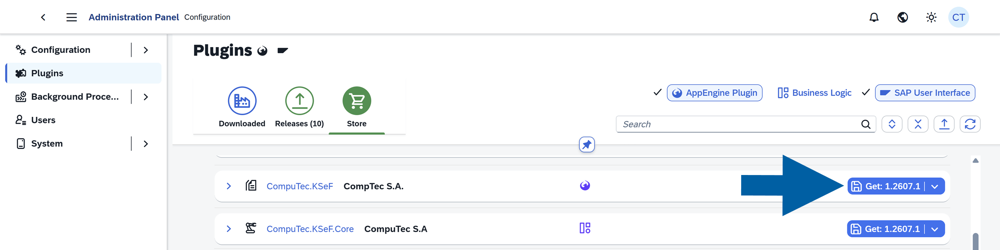

    :::note[info]
    (optional) To install a different version of the plugin:

    - Click the plugin name or the arrow next to the version number and click **Find different version**.
    - You will see the plugin details with all the available versions. [Read more](http://learn.computec.one/docs/appengine/plugins-user-guide/overview#plugin-versions)
    - Find the version you want to install and click **Get**.
    :::

5. Click **Get & Install**.

    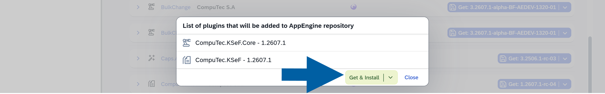

6. Click **+ Assign to AppEngine**.

    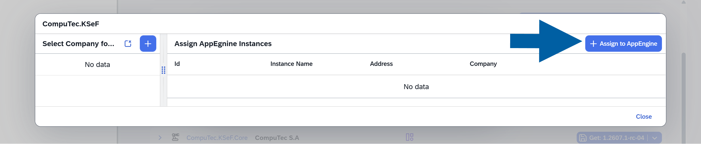

7. Select **Company** for installation and click **Accept**.

    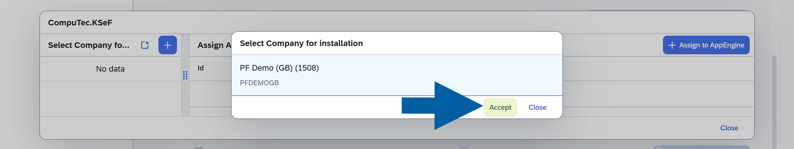

8. Select **CompuTec AppEngine Instance** for installation and click **Accept**.

    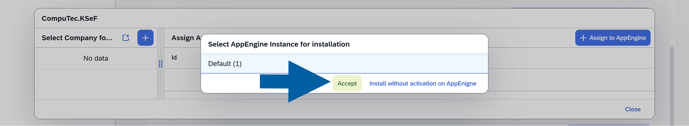

9. Review the installation details and click **Perform Installation**.

    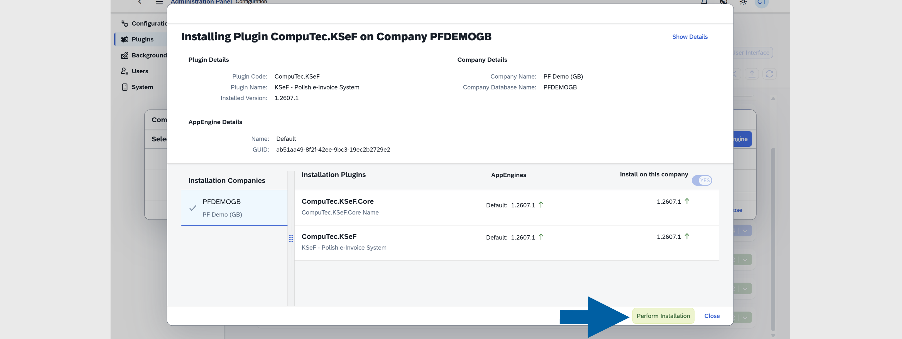

10. Click **OK** to confirm the plugin installation.

    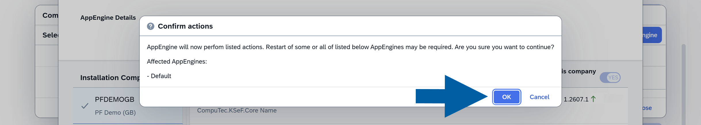

11. You can now track the installation progress. Once the installation is complete, click **Close**.

    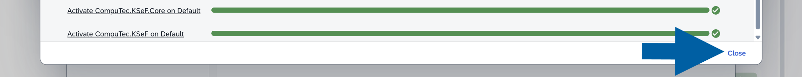

12. Click **Yes** to restart the **CompuTec AppEngine**.

    

13. Once the restart is complete, click **OK**.

14. Done! The plugin is now installed and ready to use.

    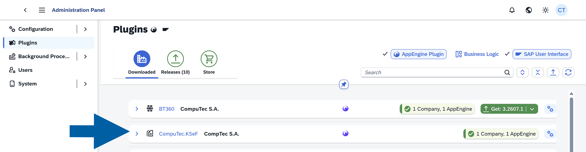

:::info[Note]

You don’t need to manage dependencies manually. During the installation, the system automatically:

- installs all required plugins
- ensures compatible versions are used
- includes any missing components

This allows you to continue with the setup without additional configuration steps.
:::

## After installation

After successful installation:

- the plugin appears in the **Downloaded** tab
- it is assigned to the selected **Company**
- it is active on the selected **CompuTec AppEngine Instance**
- the plugin is available in the **CompuTec AppEngine Launchpad**

:::info[Note]

To learn about new features or changes, refer to the plugin’s [release notes](http://learn.computec.one/docs/appengine/plugins-user-guide/overview#available-plugins).

:::
