# Create a Draft in SAP Business One

After the incoming invoice data and base documents have been reviewed and matched, you can create a draft document in **SAP Business One**.

The draft lets you review the document prepared from the incoming KSeF invoice before the final SAP Business One document is created.

## Before you start

Before creating the draft, make sure that:

- The correct Business Partner is assigned.
- The document type and subtype are correct.
- The required **Item Codes** or **G/L Accounts** are assigned.
- The invoice lines have been processed.
- The required base documents have been matched.

## Create the draft

1. Open the incoming invoice.

2. Review the invoice information and make sure that the required data has been processed and matched.

3. Click **Create Draft**.

    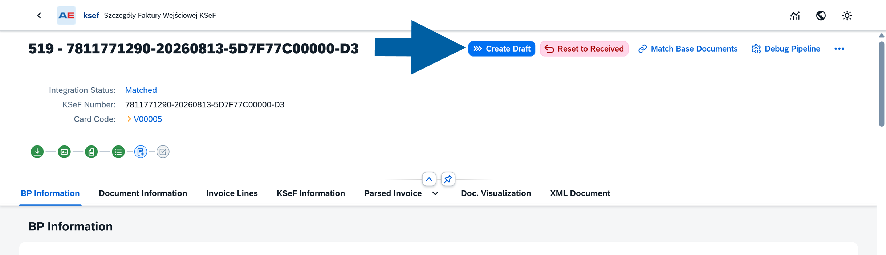

4. Wait for CompuTec KSeF to process the document.

5. After processing is complete, the incoming invoice is linked to the SAP Business One draft.

    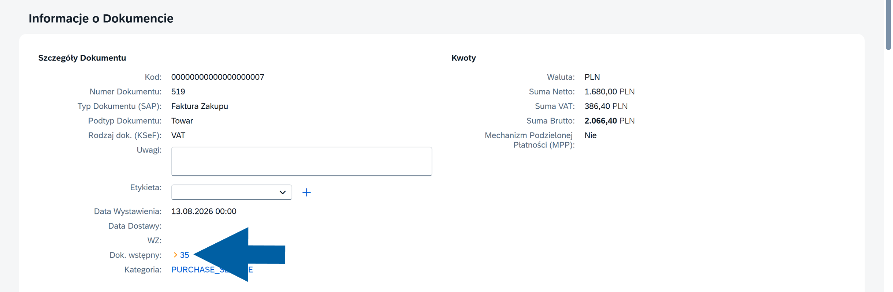

## Review the draft

After the draft has been created, its document number is available in CompuTec KSeF.

1. Click the draft document number to open the document in SAP Business One.

    

2. Review the resulting A/P invoice draft.

    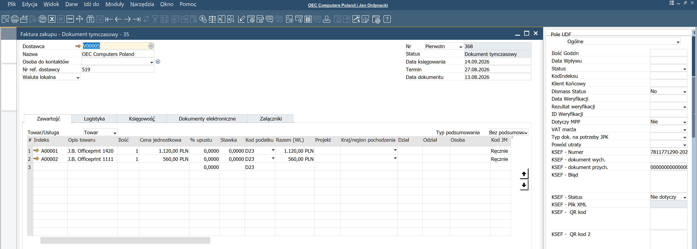

   Verify the information relevant to your invoice, including:

   - Business Partner
   - Document type
   - Item codes or G/L accounts
   - Quantities
   - Prices and amounts
   - Tax information
   - Base documents
   - KSeF information

3. If the information is correct, continue with your standard SAP Business One document process.

:::info[note]

The draft is created using the information processed in CompuTec KSeF, including the item or G/L account assignments and base document mappings that were previously reviewed.

:::

## Change the draft

If you need to correct an SAP Business One draft created from an incoming invoice, you can:

- **Reprocess the invoice in CompuTec KSeF** – Reset the invoice, make the required changes, and create a new draft.
- **Change the draft manually in SAP Business One** – Open the existing draft and edit it directly.

:::info[note]
Make changes to the draft only when required. Whenever possible, verify the Business Partner, document type, invoice lines, and base document matching in CompuTec KSeF before creating the draft.
:::

### Reprocess the invoice and create a new draft

If the draft needs to be changed, you can reset the incoming invoice and process it again in CompuTec KSeF.

1. Click **Reset to Received**.

    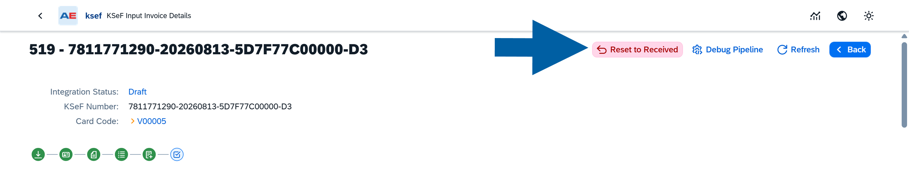

2. Confirm the action.

    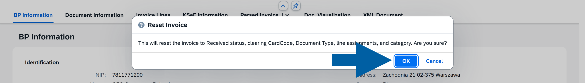

3. Process the invoice again:
    - Click **Process** to process the invoice data again.
    - If you need to change the base document assignment, click **Match Base Documents**.

    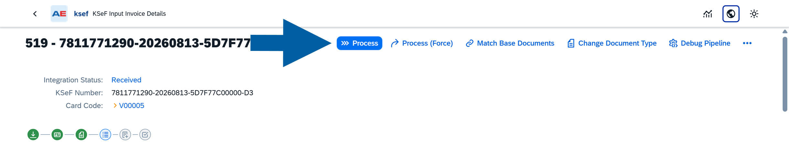

4. Review the processed invoice and make any required changes.

5. When the invoice data is correct, click **Create Draft**.

    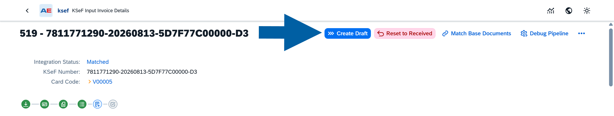

   CompuTec KSeF creates a new SAP Business One draft with a new draft number.

    :::info[note]
    The previous draft is not reused. If it is no longer required, delete the old draft in SAP Business One.
    :::

### Change the existing draft manually

Use this option when you want to keep the existing draft and make changes directly in SAP Business One.

1. Click the **draft document number** in CompuTec KSeF to open it in SAP Business One.

    

2. Review the document and identify the information that needs to be changed.

    

3. Make the required changes in the SAP Business One draft. For example, click **Copy from** > **Purchase Order**.

    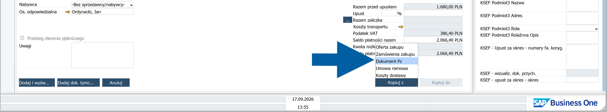

4. Select the new base document from the list and click **Choose**.

    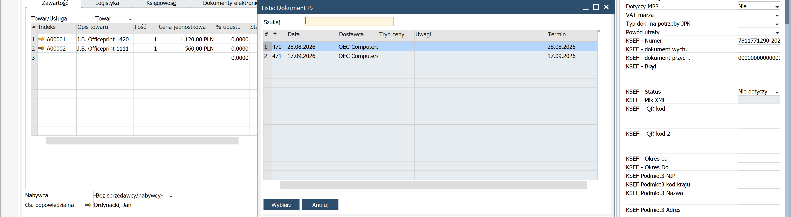

5. Review the updated document and save your changes.

    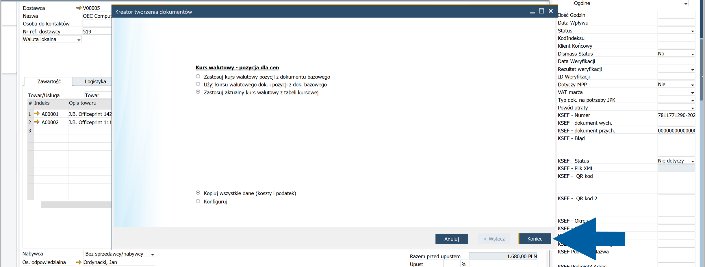

6. To save the number of our draft, click **Add a draft**.

    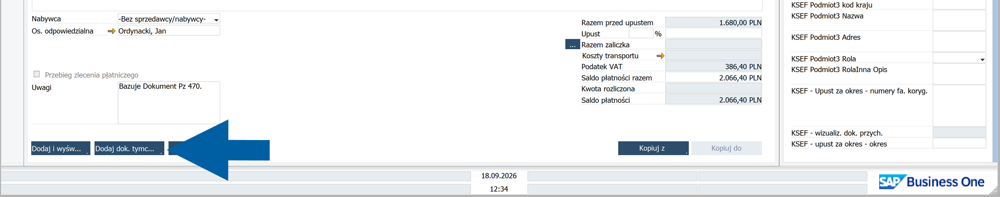

7. Close the draft and return to the incoming invoice in CompuTec KSeF.

8. Allow a few seconds for CompuTec KSeF to process the updated draft, and then open the draft again.

   The updated document data and KSeF number are displayed in the draft.

    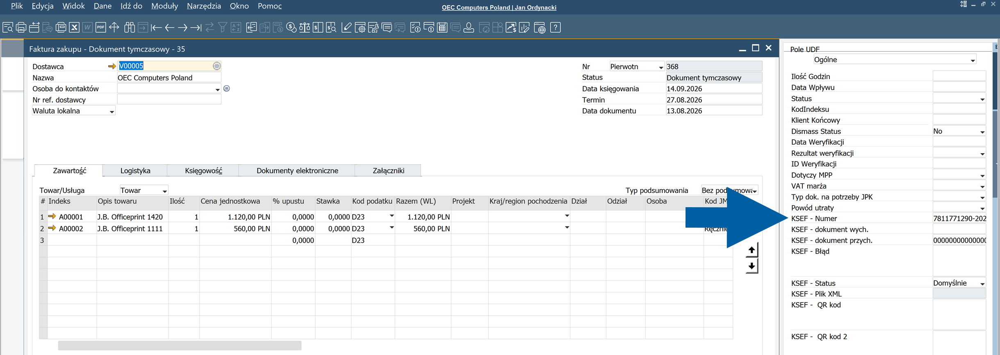

:::info[note]
Whenever possible, verify the Business Partner, document type, invoice lines, and base document matching in CompuTec KSeF before creating the draft. Modify the SAP Business One draft only when changes are required.
:::

## Result

An SAP Business One draft is created from the incoming KSeF invoice and linked to the invoice in CompuTec KSeF.

You can open the draft from CompuTec KSeF to review its details before creating the final SAP Business One document.

## Next step

After reviewing the draft, create the final SAP Business One document according to your standard purchasing process.
