# Prepare an Incoming Invoice for Processing

After an invoice is retrieved from KSeF, review its processing state and verify the information required to create the corresponding SAP Business One document.

At this stage, you can assign or create the Business Partner, review the detected document type and subtype, and correct the SAP Business One document type when required.

## Before you start

Before you start, make sure that:

- The invoice is available in **CompuTec KSeF** > **Input Invoices**. [Read more](/docs/ksef/user-guide/incoming-invoices/work-with-incom-invo-list)

## Prepare an incoming invoice for processing

### Check the processing state

1. Open **Input Invoices**.
2. Find the invoice you want to process.

    

3. Open the invoice details.

    

    :::note[info]
    The upper part of the page shows the current **Integration Status**, KSeF number, assigned Business Partner code, and processing stages.

    For a newly retrieved invoice, the **Integration Status** can be **Received**. At this stage, information required for further processing may still need to be determined or assigned.
    :::

### Review the source invoice

Before processing the invoice, you can review its original KSeF data and document visualization.

Use the available invoice tabs to compare the information retrieved by CompuTec KSeF with the source invoice.

For example, **Doc. Visualization** provides a readable representation of the KSeF invoice that can help you verify supplier, document, amount, and invoice-line information.

### Assign or create the Business Partner

CompuTec KSeF uses the supplier information from the KSeF invoice when determining the corresponding SAP Business One Business Partner.

In the **BP Information** section of your invoice, you can review the supplier information, including NIP, Name, Card Code, Address and Contact.

If the supplier does not yet have an assigned Business Partner code:

1. Click the Business Partner creation icon next to **Card Code**.

    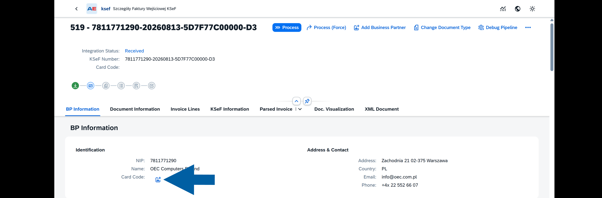

2. Select the required **Business Partner Series**, and click **Create**.

    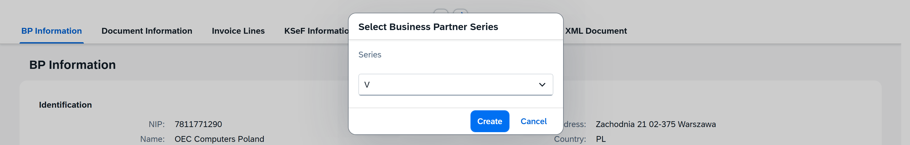

3. CompuTec KSeF creates the Business Partner in SAP Business One and assigns its **Card Code** to the incoming invoice.

4. After the Business Partner is assigned, click its **Card Code** to open the Business Partner master data when you need to review or maintain additional information.

    

#### Maintain Business Partner catalog numbers

For item documents, Business Partner catalog numbers can be used to associate supplier item information with SAP Business One items.

To review the available mappings:

1. In **BP Information** section of the invoice, click the Business Partner **Card Code**.

    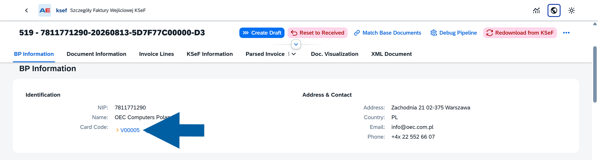

2. In the SAP Business One Business Partner master data, right-click and select **BP Catalog Numbers**.

    

3. Review the supplier catalog numbers and their corresponding SAP Business One item codes.

    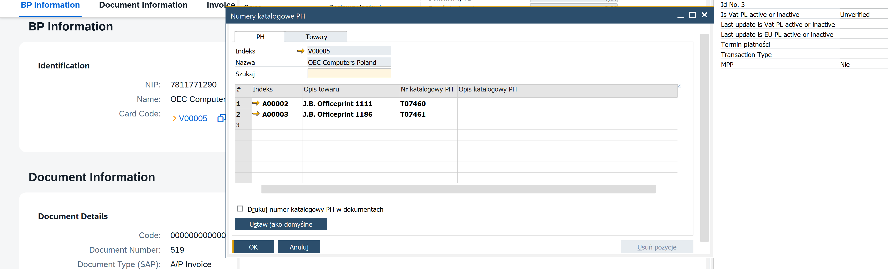

4. Add missing mappings when required.

5. Confirm the update and return to CompuTec KSeF plugin screen.

6. Return to the incoming invoice and process or review the invoice lines again.

### Review the KSeF document type

In the **Document Information** section, review how the incoming KSeF document will be processed in SAP Business One:

- **Doc. Type (KSeF)** – Shows the document type received from KSeF. For example, VAT identifies a VAT invoice, while KOR identifies a correction invoice.
- **Document Type (SAP)** – Shows the SAP Business One document type determined for the incoming invoice.
- **Document Sub Type** – Indicates whether the document will be processed as an Item or Service document.

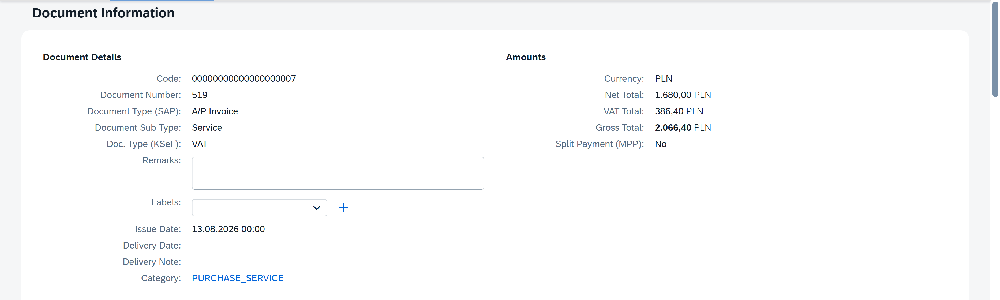

Additional information retrieved from the KSeF invoice can also be displayed in this section, depending on the data provided on the source invoice. This can include references, delivery information, payment information, and other document details.

#### KSeF document types

The **Doc. Type (KSeF)** field identifies the type of invoice received from KSeF.

CompuTec KSeF supports the following incoming document types:

- **VAT** – A standard VAT invoice or a settlelemt invoice. Both are processed as an A/P invoice in SAP Business One.
- **ZAL** – An advance invoice. It is based on a corresponding down payment request in SAP Business One.
- **KOR** – A correction invoice. It refers to an existing invoice that is being corrected.

:::info[note]
For a settlement invoice, CompuTec KSeF does not automatically assign the related down payment because it cannot be matched automatically.

After the A/P invoice draft is created, open the draft in SAP Business One and assign the appropriate down payment manually.
:::

#### Change the document type or subtype

If the automatically determined SAP Business One document type or subtype is not appropriate for the invoice:

1. Click **Change Document Type**.

    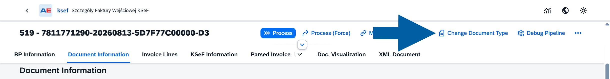

2. Select the required **Document Type (SAP)** and **Document Sub Type**. For example, if an invoice was determined as a service document but represents purchased items, change **Document Sub Type** from **Service** to **Item**.

    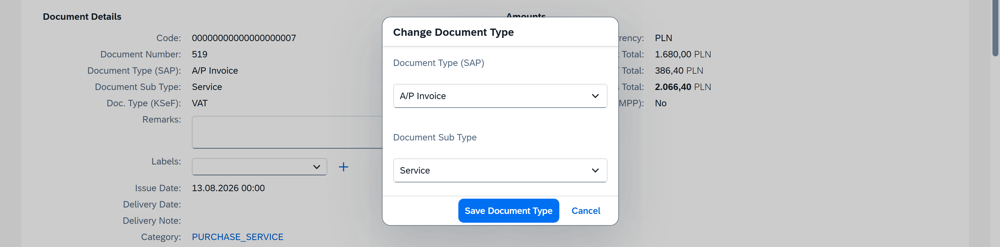

3. Click **Save Document Type**.
4. In our example, we changed `Service` to `Item`.

    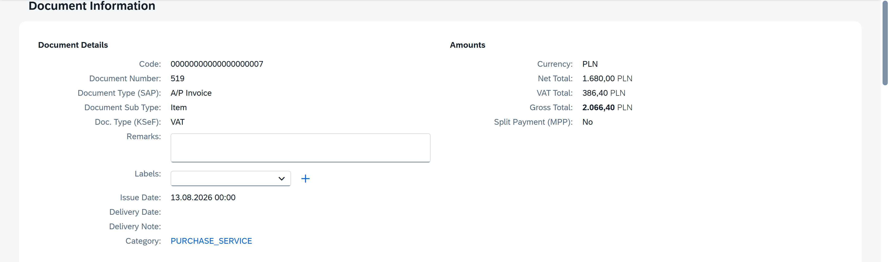

    :::info[Note]

    The document subtype affects subsequent invoice-line processing. Item documents require SAP Business One item matching, while service documents require G/L account assignment.

    :::

### Review bank account information

In **Document Information**, you can review the **Bank Account** section.

When applicable, this section displays bank account information associated with the invoice and Business Partner.

The **Account assigned to BP** field indicates whether the account is assigned to the Business Partner.

### Match incoming invoice lines

CompuTec KSeF processes the lines of an incoming invoice and attempts to assign the SAP Business One data required for each line.

    - For `Item` documents, invoice lines are matched with **SAP Business One item codes**.
    - For `Service` documents, the corresponding **G/L accounts** are determined.

Review the result before continuing with base document matching.

#### Review invoice lines

1. In the **Invoice Lines** section of the invoice, review the information retrieved for each invoice line, including the description, quantity, prices, tax information, and other available line data.

    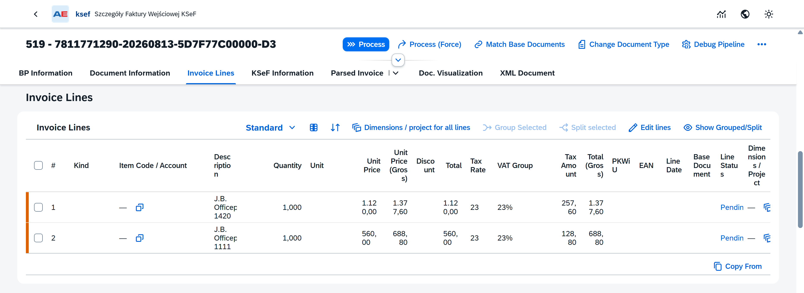

2. Check **Item Code / Account** and **Line Status**.

    :::info[note]

    If no corresponding SAP Business One **Item Code** or **G/L Account** has been determined, the line remains pending.

    You can assign the required value in one of the following ways:

    - Click **Process** to let CompuTec KSeF determine the value automatically. For `Item` documents, CompuTec KSeF attempts to match an **Item Code**. For `Service` documents, it attempts to determine a **G/L Account**.
    - Assign an **Item Code** or **G/L Account** manually in **Item Code / Account**.  
    - You can also manually change a value assigned during automatic processing.
    :::

#### Adjust invoice lines

You can adjust invoice lines when a single KSeF invoice line needs to be processed as multiple SAP Business One document lines.

For example, the quantity from one incoming invoice line may relate to more than one base document. In this case, you can split the incoming line and match each resulting line separately.

:::note[info]
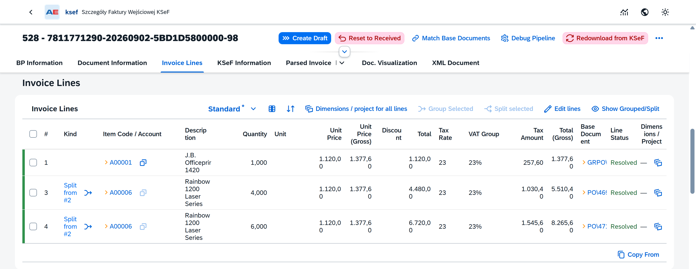

In this example, the original invoice line was split into two lines:

- One line contains a quantity of **4** and is matched with one purchase order.
- The other line contains a quantity of **6** and is matched with another purchase order.

Both lines use the same SAP Business One item code, but each line can be matched with the appropriate base document.
:::

To adjust invoice lines, use the available actions in **Invoice Lines**, such as **Group Selected**, **Split selected**, and **Edit lines**.

##### Split an invoice line

To split an invoice line:

1. In **Invoice Lines**, select the line that you want to split.

2. Click **Split selected**.

   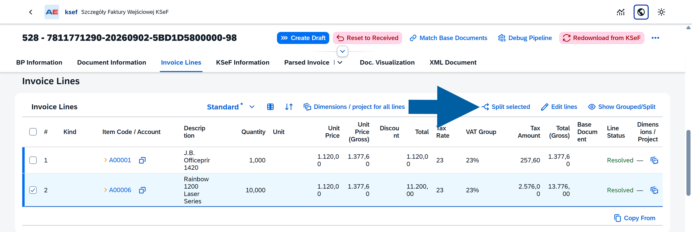

3. Specify the number of lines that you want to create and click **Next**.

   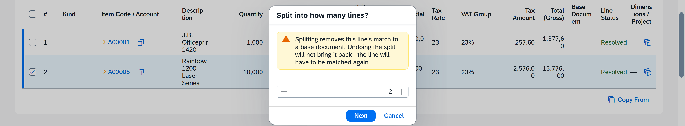

   :::info[note]

   Splitting a line removes its existing base document match. If you undo the split later, the previous match is not restored and the line must be matched again.

   :::

4. Review the resulting lines and adjust the **Quantity** and **Unit Price** for each line as required.

   The total quantity of the split lines should correspond to the quantity of the original invoice line.

   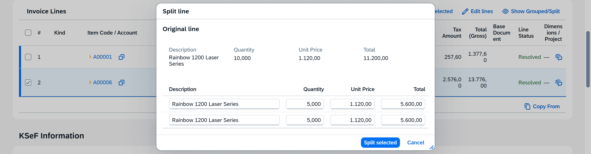

5. Click **Split selected** to confirm.

   The original line is replaced in the standard view by the newly created lines. The **Kind** column identifies the source line, for example, **Split from #2**.

   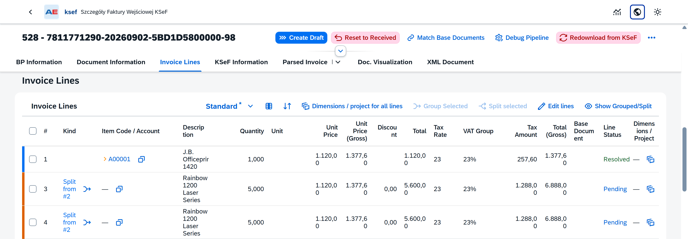

6. To view the original line together with its split lines, click **Show Grouped/Split**.

   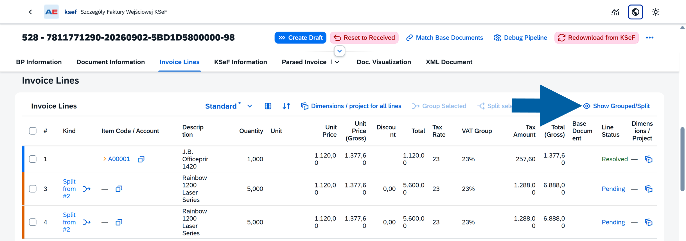

##### Undo a line split

If the line was split incorrectly, you can restore the original line.

1. Click **Show Grouped/Split** to display the original and split lines.

2. Find the split lines and click the undo split icon next to **Split from #...**.

   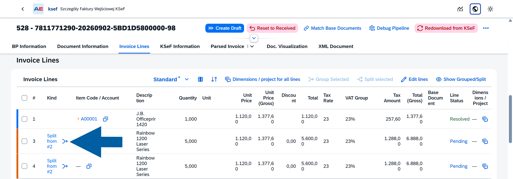

The split lines are removed and the original invoice line becomes available for processing again.

:::info[note]

If the original line was previously matched with a base document, undoing the split does not restore that match. Match the line with the required base document again.

:::

### Process the invoice

You can process the incoming invoice using one of the following actions:

- **Process** – Processes the invoice and determines the required SAP Business One data. Use this option when you want to review or change the results before creating a draft.
- **Process (Force)** – Processes the invoice and attempts to create the SAP Business One draft in the same operation. Use this option for invoices that you expect CompuTec KSeF to process without manual changes.

To let CompuTec KSeF process the invoice, follow these steps:

1. Click **Process**.

    

2. Wait for the processing steps to complete.

    

3. Review the processing result.

4. Click **Close**.

5. Return to **Invoice Lines** and check the values assigned to the lines.

    

#### Assign an Item Code or G/L Account manually

If a line has not been matched automatically during processing, or you want to change the assigned value:

1. Find the required line.

2. Click the selection icon in **Item Code / Account**.

    

3. Select the required SAP Business One item or G/L account.

    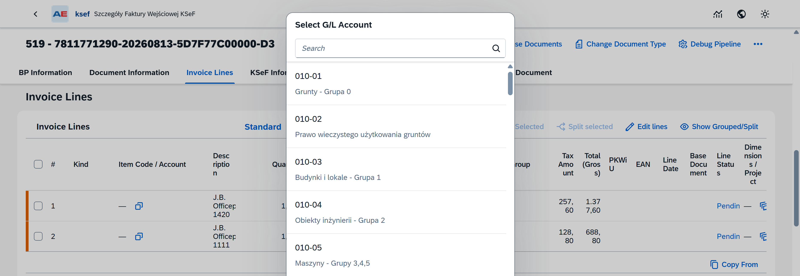

    :::note[info]
    The available selection depends on the document subtype.
    :::

When multiple invoice lines require the same adjustment, use the available line actions to update the required lines together when applicable.

#### Review item master data

After an item code has been assigned, you can click the code to open the corresponding SAP Business One item master data.

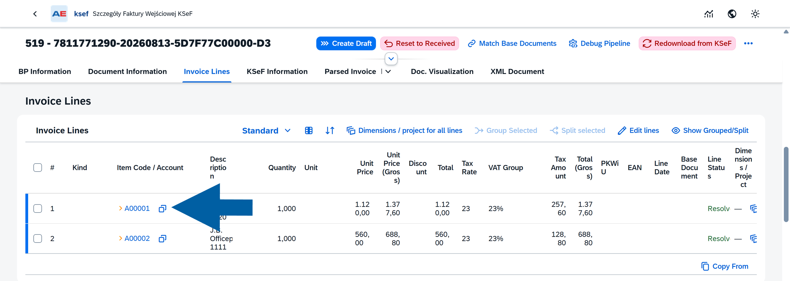

When required, maintain additional identification information used for item matching. For example, you can maintain an EAN in the **Bar Code** field of the item master data.

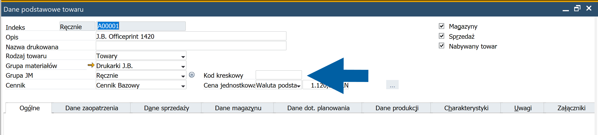

### Match base documents

CompuTec KSeF can match an incoming invoice with the corresponding base documents in **SAP Business One**.

The type of base document and the information used for matching depend on the incoming invoice type and subtype.

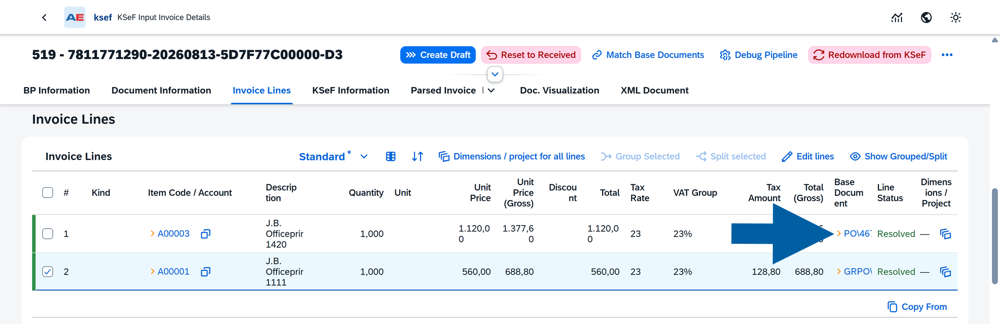

#### How base document matching works

CompuTec KSeF searches for base documents based on the incoming invoice type:

- **Advance invoice** – Searches for a corresponding paid down payment request in SAP Business One based on the invoice amount.
- **VAT invoice – Item** – Searches the supplier's open Goods Receipt POs using available information such as the document reference, item, and quantity.
- **VAT invoice – Service** – Searches the supplier's open purchase orders using available invoice-line information, such as the description and value.
- **Correction invoice** – Uses the KSeF number of the original invoice to find and verify the corresponding A/P invoice in SAP Business One.

:::info[note]

If CompuTec KSeF does not find the required base document automatically, or the proposed match is not appropriate, you can use **Match Base Documents** to select the base document and match the invoice lines manually.

:::

#### Match base documents manually

To review or change the base document matching:

1. Open the incoming invoice.

2. Click **Match Base Documents** at the top of the page.

    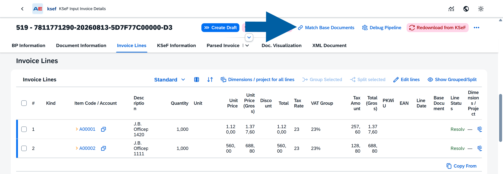

3. In **Select Base Documents**, review the documents available under **Candidate Base Documents**.

   :::info[note]
   The documents displayed here depend on the incoming invoice type and subtype.
   :::

4. Select the **SAP Business One document** that you want to use as the base document.

    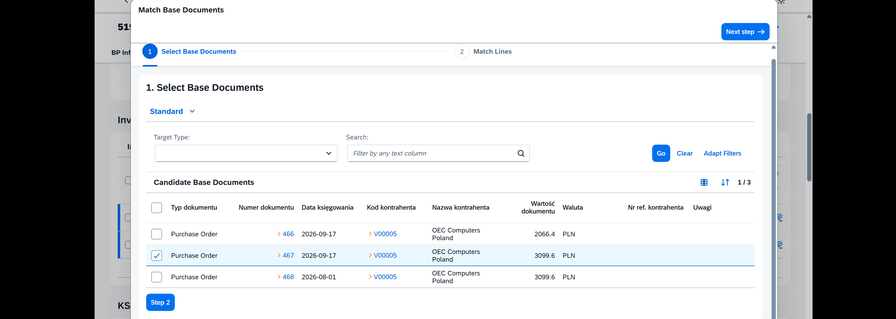

   :::note[info]
   You can use the available filters and search options to find the required document when necessary.
   :::

5. Click **Step 2** to continue to line matching.

6. In **Match Lines**, review the proposed mappings between **Base Document Lines** and **Incoming Invoice Lines**.

    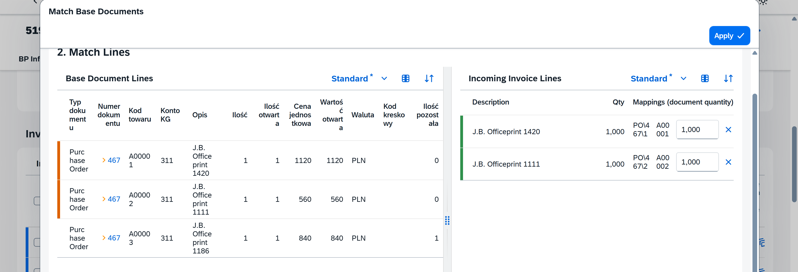

   The left side displays the lines from the selected SAP Business One base document. The right side displays the incoming KSeF invoice lines and their current mappings.

   :::info[note]
   A single incoming invoice can contain lines that correspond to different SAP Business One base document lines. Review the proposed line mappings and adjust them when required.
   :::

7. If the proposed mappings are correct, click **Apply**.

8. If you want to change a mapping, drag the required line from **Base Document Lines** on the left and drop it onto the corresponding **Incoming Invoice Line** on the right.

9. Click **Apply**.

10. The selected base documents and line mappings are applied to the incoming invoice.

#### Review the matched base documents

After applying the matching, return to **Invoice Lines**.

The **Base Document** column displays the SAP Business One document matched with each invoice line.

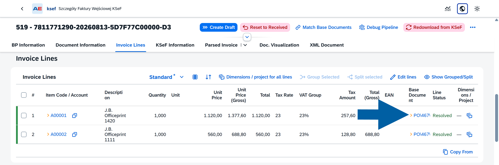

Review the following information:

- **Item Code / Account** – The SAP Business One item or G/L account assigned to the invoice line.
- **Base Document** – The SAP Business One base document matched with the line.
- **Line Status** – Indicates the current processing state of the invoice line.

When a line has been successfully processed and matched, its **Line Status** is **Resolved**.

The value in **Base Document** is a link to the corresponding SAP Business One document. Click the link if you want to review the source document and verify the match.

:::info[note]

Review the base document assignments before continuing, especially if you changed the automatically proposed mappings manually.

:::

## Result

The incoming invoice is prepared for SAP Business One draft creation.

The required invoice-line data is assigned, and any applicable base documents are matched. Review the invoice and make sure the processing results are correct before continuing.

If you used **Process (Force)** and processing was successful, CompuTec KSeF may have already created the SAP Business One draft.

## Next step

The next processing steps are described in [**Create and review an SAP Business One draft**]\(/docs/ksef/user-guide/incoming-invoices/create-draft-inco).
