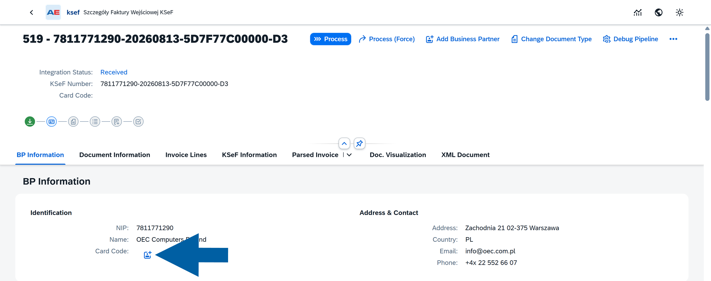
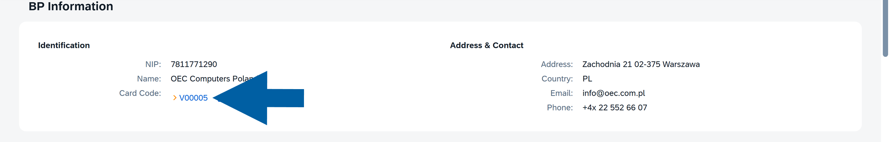
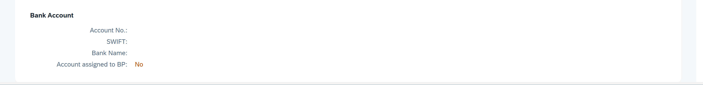
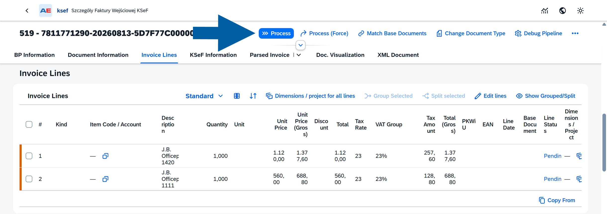
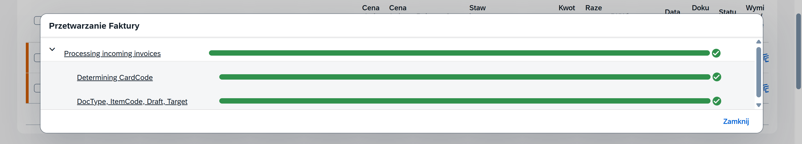
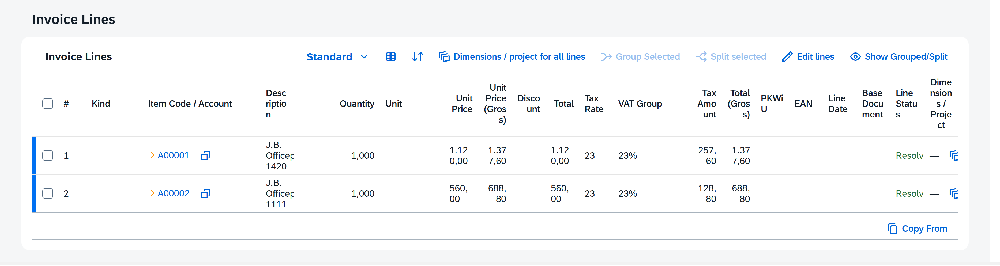
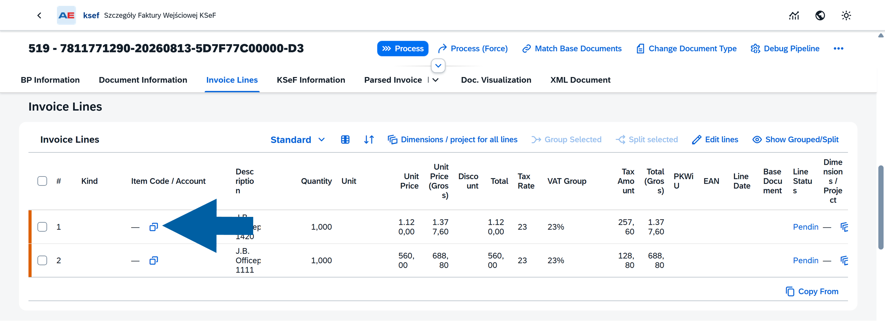
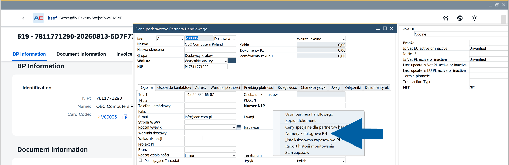

# Prepare an incoming invoice for processing

After an invoice is retrieved from KSeF, review its processing state and verify the information required to create the corresponding SAP Business One document.

At this stage, you can assign or create the Business Partner, review the detected document type and subtype, and correct the SAP Business One document type when required.

## Before you start

Before you start, make sure that:

- The invoice is available in **CompuTec KSeF** > **Input Invoices**. [Read more](/docs/ksef/user-guide/incoming-invoices/work-with-incom-invo-list)

## Prepare an incoming invoice for processing

### Check the processing state

1. Open **Input Invoices**.
2. Find the invoice you want to process.

    

3. Open the invoice details.

    

The upper part of the page shows the current **Integration Status**, KSeF number, assigned Business Partner code, and processing stages.

For a newly retrieved invoice, the **Integration Status** can be **Received**. At this stage, information required for further processing may still need to be determined or assigned.

### Assign or create the Business Partner

CompuTec KSeF uses the supplier information from the KSeF invoice when determining the corresponding SAP Business One Business Partner.

Open **BP Information** and review the supplier information, including NIP, Name, Card Code, Address and Contact.

If the supplier does not yet have an assigned Business Partner code:

1. Click the Business Partner creation icon next to **Card Code**.

    

2. Select the required **Business Partner Series**, and click **Create**.

    

CompuTec KSeF creates the Business Partner in SAP Business One and assigns its **Card Code** to the incoming invoice.

After the Business Partner is assigned, click its **Card Code** to open the Business Partner master data when you need to review or maintain additional information.

### Review the KSeF document type

In the Document Information section, review how the incoming KSeF document will be processed in SAP Business One:

- **Doc. Type (KSeF)** – Shows the document type received from KSeF. For example, VAT identifies a VAT invoice, while KOR identifies a correction invoice.
- **Document Type (SAP)** – Shows the SAP Business One document type determined for the incoming invoice.
- **Document Sub Type** – Indicates whether the document will be processed as an Item or Service document.

Additional information available on the KSeF invoice can also be displayed in this section. For example, a delivery note number can be available for an item-related document when it was provided on the source invoice.

### Change the document type or subtype

If the automatically determined SAP Business One document type or subtype is not appropriate for the invoice:

1. Click **Change Document Type**.

    

2. Select the required **Document Type (SAP)** and **Document Sub Type**.

    

3. Click **Save Document Type**.

For example, if an invoice was determined as a service document but represents purchased items, change **Document Sub Type** from **Service** to **Item**.

:::info[Note]

The document subtype affects subsequent invoice-line processing. Item documents require SAP Business One item matching, while service documents require G/L account assignment.

:::

### Review bank account information

In **Document Information**, review the **Bank Account** section.

When applicable, this section displays bank account information associated with the invoice and Business Partner.

The **Account assigned to BP** field indicates whether the account is assigned to the Business Partner.

## Match incoming invoice lines

CompuTec KSeF processes the lines of an incoming invoice and attempts to assign the SAP Business One data required for each line.

For item documents, invoice lines are matched with SAP Business One item codes. For service documents, the corresponding G/L accounts are determined.

Review the result before continuing with base document matching.

### Review invoice lines

1. In the **Invoice Lines** section of the invoice, review the information retrieved for each invoice line, including the description, quantity, prices, tax information, and other available line data.

    

2. Check **Item Code / Account** and **Line Status**.

If no corresponding SAP Business One item or G/L account has been determined, the line remains pending.

### Process the invoice

To let CompuTec KSeF process the invoice automatically:

1. Click **Process**.

    

2. Wait for the processing steps to complete.

    

3. Review the processing result.

4. Click **Close**.

Return to **Invoice Lines** and check the values assigned to the lines.

### Assign an item or G/L account manually

If a line has not been matched automatically, or you want to change the assigned value:

1. Find the required line.

2. Click the selection icon in **Item Code / Account**.

    

3. Select the required SAP Business One item or G/L account.

    

The available selection depends on the document subtype.

### Maintain Business Partner catalog numbers

For item documents, Business Partner catalog numbers can be used to associate supplier item information with SAP Business One items.

To review the available mappings:

1. In **BP Information** section of the invoice, click the Business Partner **Card Code**.

    

2. In the SAP Business One Business Partner master data, right-click and select **BP Catalog Numbers**.

    

3. Review the supplier catalog numbers and their corresponding SAP Business One item codes.

    

4. Add missing mappings when required.

5. Update the Business Partner master data.

Return to the incoming invoice and process or review the invoice lines again.

### Review item master data

After an item code has been assigned, you can click the code to open the corresponding SAP Business One item master data.

When required, maintain additional identification information used for item matching. For example, you can maintain an EAN in the **Bar Code** field of the item master data.

### Review G/L account assignment

For service documents, CompuTec KSeF attempts to determine the G/L account for the invoice line based on available processing information.

Review the assigned account before continuing.

If the account is not appropriate, use the selection option in **Item Code / Account** to assign another G/L account manually.

## Result

The required SAP Business One item codes or G/L accounts are assigned to the incoming invoice lines.

The invoice can now continue to base document matching when base documents are required.

## Next step

See **Match base documents**.
