# Work with the Incoming Invoice List

Use the **Input Invoices** list to view and manage invoices retrieved from KSeF before they are processed in **CompuTec KSeF**.

You can receive new invoices, find specific documents using filters, customize the information displayed in the list, save frequently used views, and perform actions on selected invoices.

## Before you start

Before you work with incoming invoices, make sure that:

- [CompuTec KSeF is configured](/docs/ksef/administrator-guide/configuration) to retrieve incoming documents.
- The required incoming document category is active.
- The required incoming-document [background processing jobs](/docs/ksef/administrator-guide/configuration/background-processing) are enabled.
- You have the required [SAP Business One authorizations](/docs/ksef/administrator-guide/configuration/config-sap-auth) for incoming KSeF invoices.

:::info[note]

How an incoming invoice is processed depends on your company's CompuTec KSeF configuration. Some processing steps can be performed automatically, while others may require user action.

:::

## Open incoming invoices

1. In SAP Business One, go to **Purchasing A/P** > **KSeF – Incoming Documents**.

    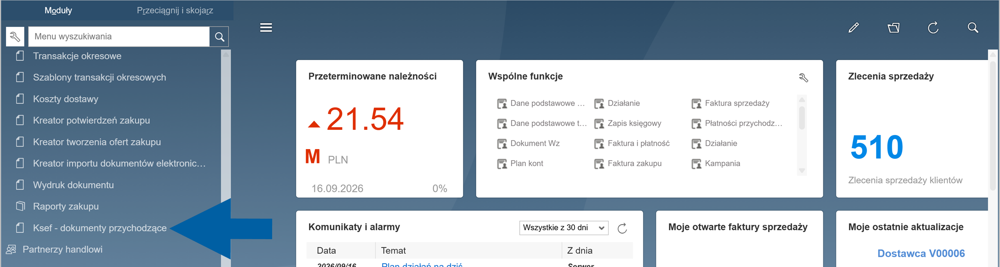

2. Open **Input Invoices**.

    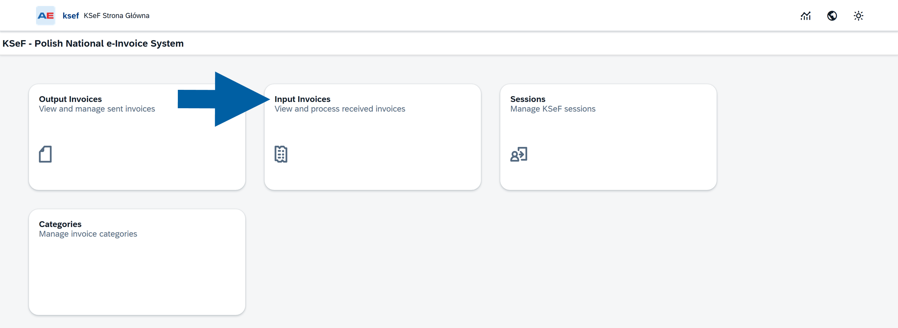

3. The **Input Invoices** list displays invoices retrieved from KSeF.

    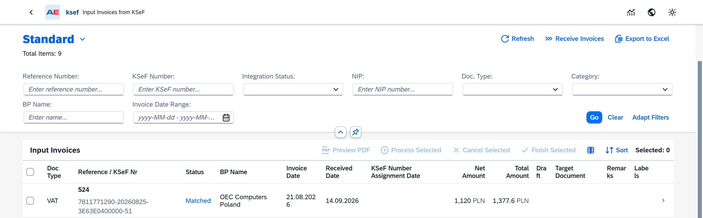

You can now find the invoice you want to work with or retrieve new invoices from KSeF.

## Receive new invoices

CompuTec KSeF retrieves incoming invoices according to the configured background processing settings.

If an expected invoice is not displayed in the list, you can manually check for new invoices.

1. Open **Input Invoices**.

2. Click **Receive Invoices**.

    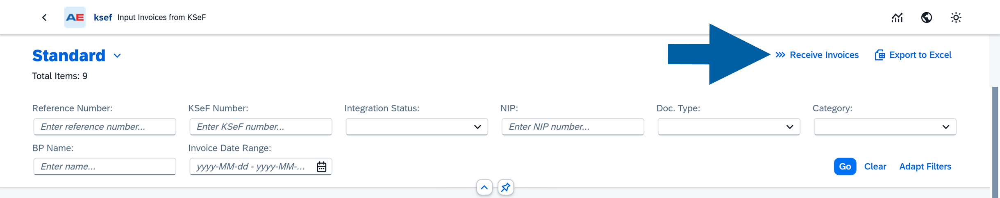

CompuTec KSeF checks when invoices were last retrieved and downloads new invoices available since that time.

:::info[Note]

At this stage, the retrieved invoices are stored in CompuTec KSeF for further processing.

Retrieving an invoice does not automatically create or post an SAP Business One purchasing document. No SAP Business One draft is created as part of the retrieval itself.

:::

## Select an invoice

1. Find the invoice you want to process in the **Input Invoices** list.

    :::note[info]
    The incoming documents list is automatically sorted with the most recent documents at the top. You can use **Sort** option to choose your sorting.

    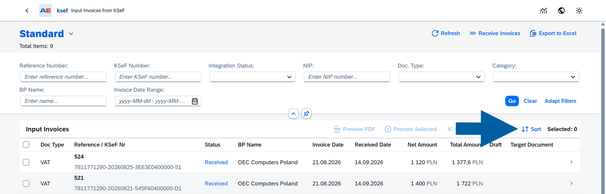

    :::

2. (Optional) Use the available filters to find a specific document. [Read more](/docs/ksef/user-guide/incoming-invoices/work-with-incom-invo-list#filter-incoming-invoices)

3. Select the invoice.

    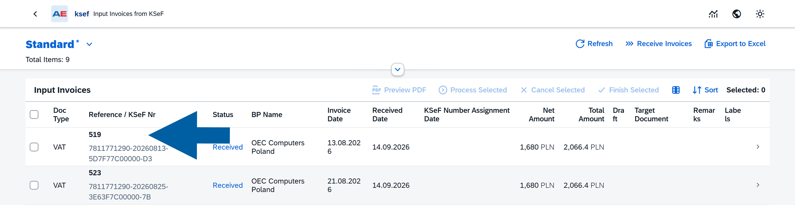

4. The invoice details open.

    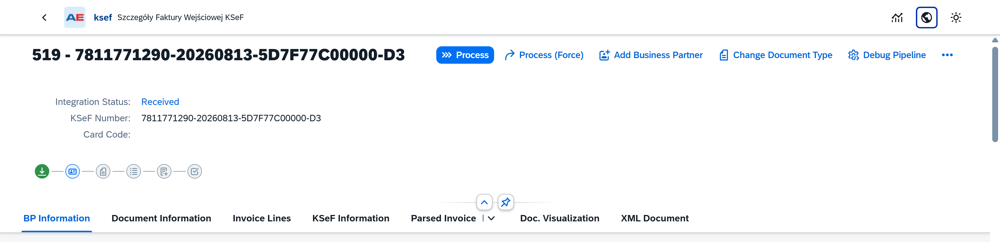

You can now review and process the selected invoice.

:::note[info]
For information about reviewing the invoice and preparing it for processing, see [**Prepare an incoming invoice for processing**](/docs/ksef/user-guide/incoming-invoices/prepare-for-process).
:::

## Filter incoming invoices

Use the filters above the **Input Invoices** list to find the documents you want to work with.

You can filter the list by:

- **Reference Number** – The invoice number assigned by the supplier.
- **KSeF Number** – The unique invoice number assigned by KSeF.
- **Integration Status** – The current stage of invoice processing.
- **NIP** – The supplier's tax identification number (NIP).
- **Doc. Type** – The KSeF document type, for example **VAT**, **KOR**, **ZAL**, **ROZ**, **UPR**, **KOR_ZAL**, or **KOR_ROZ**.
- **Category** – The processing category assigned to the invoice, for example **PURCHASE_ITEMS** or **PURCHASE_SERVICE**.
- **BP Name** – The name of the **Business Partner** associated with the invoice.
- **Invoice Date Range** – The invoice date or date range.

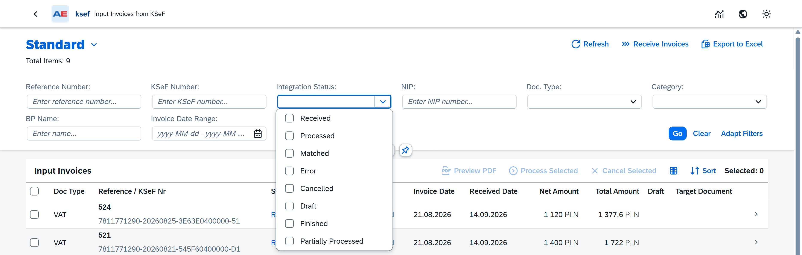

After entering or selecting the required filter values, click **Go** to apply them.

Click **Clear** to remove the current filter values.

### Integration statuses

You can use **Integration Status** to find invoices at a specific stage of processing.

The following statuses are available:

- **Received** – The invoice has been retrieved and is available in CompuTec KSeF. No SAP Business One document has been created yet.
- **Processed** – The invoice has been initially processed. CompuTec KSeF has determined the relevant items or accounts, and the invoice can continue to the next processing steps.
- **Matched** – The invoice has been matched.
- **Error** – An error occurred during processing.
- **Cancelled** – Processing of the invoice was cancelled.
- **Draft** – A draft document has been created in SAP Business One, but the final document has not yet been posted.
- **Finished** – The final document created from the imported invoice has been posted in SAP Business One.
- **Partially Processed** – Some invoice information was matched successfully, but additional information requires manual processing.

### Adapt the available filters

You can choose which filters are displayed above the invoice list.

1. Click **Adapt Filters**.

    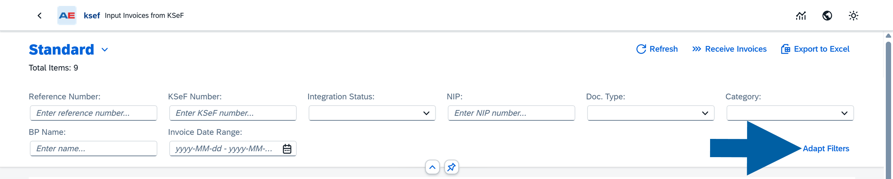

2. Select the filters you want to display.

    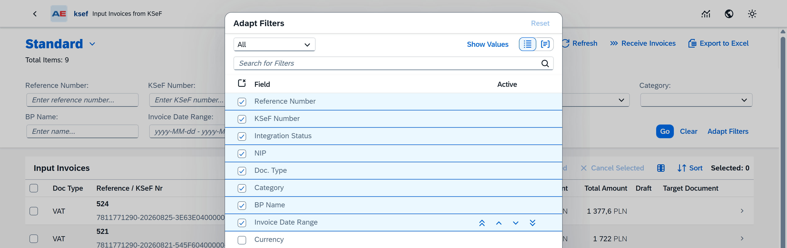

3. Click **OK**.

This lets you keep only the filters that are useful for your regular work.

## Choose which columns are displayed

You can customize the **Input Invoices** list by choosing which columns are visible.

1. Click the **Column Visibility** icon above the invoice list.

    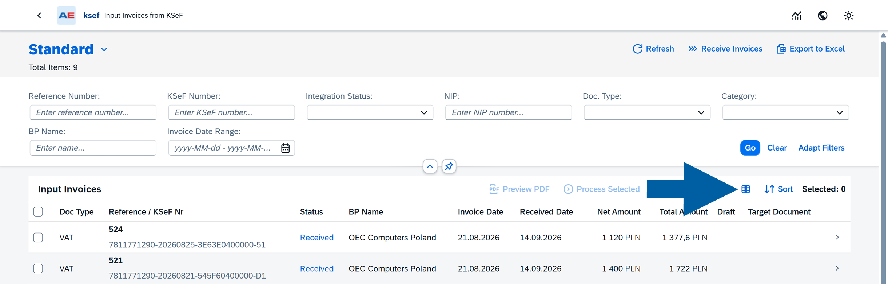

2. In **Column Visibility**, select the columns you want to display.

    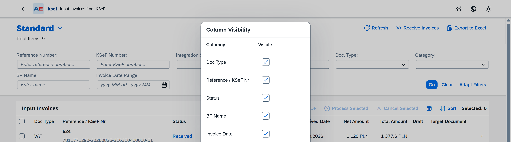

3. Click **Accept**.

The list is updated to display the selected columns.

## Sort incoming invoices

The incoming invoice list is displayed with the most recent documents at the top by default.

You can change the sorting when you want to organize the list by another field.

1. Click **Sort** above the invoice list.

    

2. In **Sort by**, select the field you want to use for sorting.

3. In **Sort order**, select **Ascending** or **Descending**.

   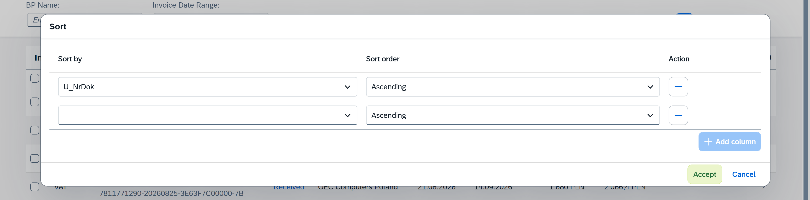

4. Click **Accept**.

The invoice list is displayed using the selected sorting settings.

## Save and manage views

If you regularly work with the same group of incoming invoices, you can save the current list configuration as a view.

For example, you can create a **Received** view that displays only invoices with the **Received** integration status. This lets you focus on newly retrieved invoices without displaying invoices that have already progressed to statuses such as **Finished**.

### Save a view

To save a view, follow these steps:

1. Configure the filters you want to use.

   For example, set **Integration Status** to **Received**.

2. Click **Go** to apply the filters.

3. Click the arrow next to the current view name, for example **Standard**.

   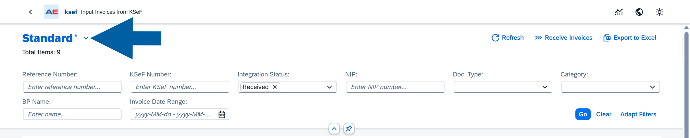

4. Click **Save As**.

   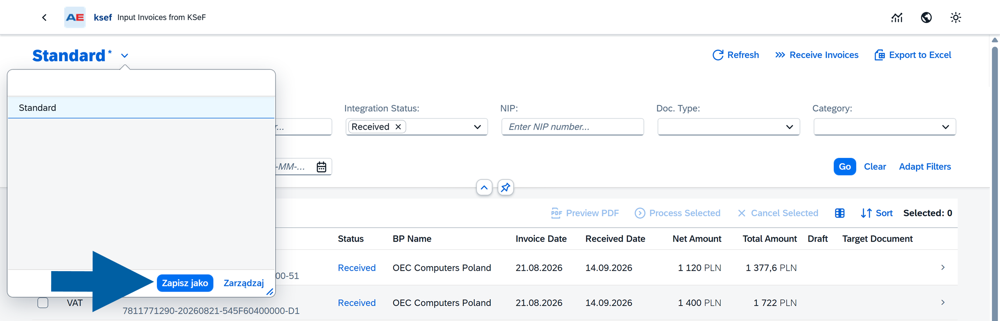

5. Enter a name for the view, for example **Received**.

6. To use this view automatically when you open the list, select **Set as Default**.

7. Click **Save**.

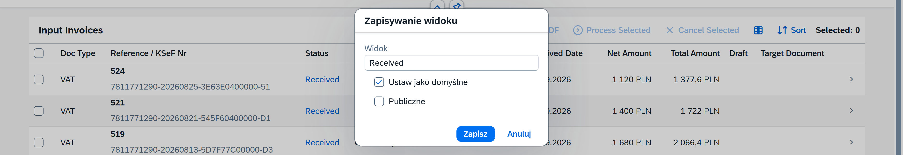

If you set the view as default, CompuTec KSeF opens the incoming invoice list using that view. For example, a default **Received** view can show invoices that still need to be processed without displaying invoices that have already reached **Finished**.

:::info[note]

A saved view changes how the invoice list is displayed. It does not change an invoice, its integration status, or its processing state.

:::

### Switch between views

To display the list using another saved view:

1. Click the arrow next to the current view name.
2. Select the required view.

For example, select **Received** to display the list using the filters saved in that view.

Select **Standard** to return to the standard view.

### Manage saved views

To manage your saved views:

1. Click the arrow next to the current view name.
2. Click **Manage**.

    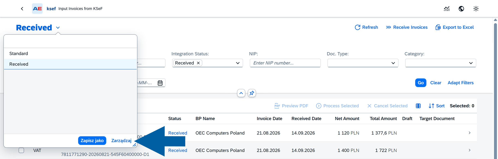

3. Review or modify the available views.

    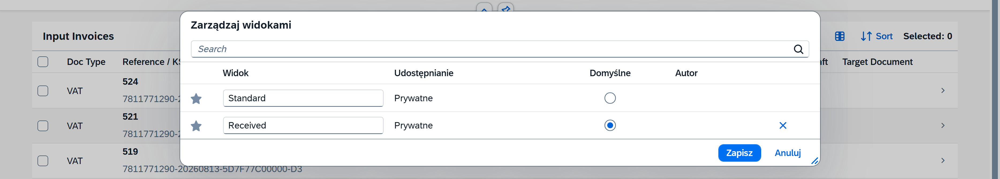

4. Save your changes.

Use view management when you want to change your saved views or select a different default view.

## Work with selected incoming invoices

You can select one or more invoices in the **Input Invoices** list and perform an action on the selected documents.

After you select at least one invoice, the following options become available:

- **Preview PDF** – Opens a PDF preview of the selected invoice.
- **Process Selected** – Processes the selected invoices according to the configured incoming document processing rules.
- **Cancel Selected** – Cancels further processing of the selected invoices. Use this option, for example, for invoices that have already been posted in SAP Business One, contain incorrect data, or should not be processed because they are not recognized as legitimate business documents.
- **Finish Selected** – Marks the selected invoices as finished.   

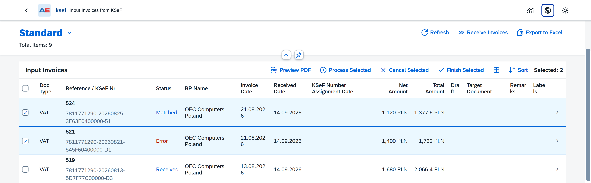

:::info[note]

After you cancel an invoice, its **Integration Status** changes to `Cancelled`, indicating that the invoice is not intended for further processing in CompuTec KSeF.

:::

## Result

You can use the **Input Invoices** list to find and organize invoices retrieved from KSeF and identify the documents that require further processing.

After you select an invoice, you can open its details and continue with Business Partner assignment, document verification, and invoice-line processing.

## Next steps

See [**Prepare an incoming invoice for processing**](/docs/ksef/user-guide/incoming-invoices/prepare-for-process) to review the processing state, assign the Business Partner, and verify the document information.
