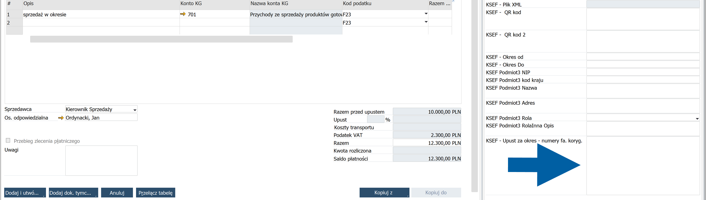

# Outgoing Invoice Scenarios

This article describes specific scenarios for preparing outgoing SAP Business One documents for KSeF.

For the standard process of creating and sending outgoing invoices, see [**Send Outgoing Invoices to KSeF**](/docs/ksef/user-guide/outgoing-invoices/send-outgoing-inv).

## Create a correction invoice for multiple invoices

When you create a correction invoice that applies to multiple invoices, provide the numbers of the corrected invoices in the **KSEF-Upust za okres-numery fa.koryg.** user-defined field (UDF).

1. In **SAP Business One**, create the correction invoice and enter its details.

2. Display the **UDF Fields** panel.

   :::info[Note]
   If the panel is not visible, select **View** > **UDF Fields**.

   
   :::

3. In **UDF Fileds** on th right, find **KSEF-Upust za okres-numery fa.koryg.** and use it to enter the numbers of the invoices that the correction applies to.

    

    :::info[note]
    If you want to enter multiple invoice numbers, separate them with commas or enter each invoice number on a new line.

    
    :::

4. Complete the remaining document information and add the document.

CompuTec KSeF uses the provided invoice numbers when preparing the correction invoice for KSeF.

## Next steps

See [**Send Outgoing Invoices to KSeF**](/docs/ksef/user-guide/outgoing-invoices/send-outgoing-inv) to learn how to send the document and monitor its KSeF processing.
