# Send Outgoing Invoices to KSeF

## Overview

Use **CompuTec KSeF** to send outgoing **SAP Business One** invoices to the **Polish National e-Invoice System (KSeF)**.

When you create a supported outgoing document in SAP Business One, CompuTec KSeF prepares it for KSeF by generating and validating the required XML file. The invoice can then be sent:

- Automatically, according to the configured sending schedule.
- Manually from CompuTec KSeF.
- Manually from the related SAP Business One document.

After KSeF successfully processes the invoice, CompuTec KSeF stores the assigned KSeF number and makes the invoice verification QR code available.

## Before you start

Before you send outgoing invoices, make sure:

- **CompuTec AppEngine** is installed and configured. [Read more](/docs/appengine/administrators-guide/configuration-and-administration/installation)
- CompuTec KSeF plugin is installed. [Read more](/docs/ksef/administrator-guide/installation/plugin-installation)
- CompuTec KSeF is configured for your company. [Read more](/docs/ksef/administrator-guide/configuration)
- Make sure you have access to **Output Invoices** in CompuTec KSeF. [Read more](/docs/ksef/administrator-guide/configuration/config-sap-auth)
- Create a supported outgoing document in SAP Business One.

CompuTec KSeF supports outgoing documents such as A/R invoices, corrections, and A/R down payment invoices.

## Open outgoing invoices

To open outgoing invoices, follow these steps:

1. Log in to the **CompuTec AppEngine Launchpad**.

   

2. Choose the company.

   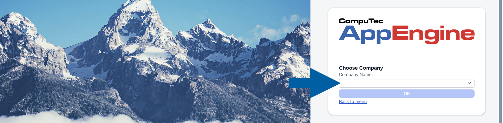

3. Open **CompuTec KSeF**.

   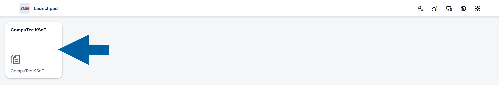

4. Select **Output Invoices**.

   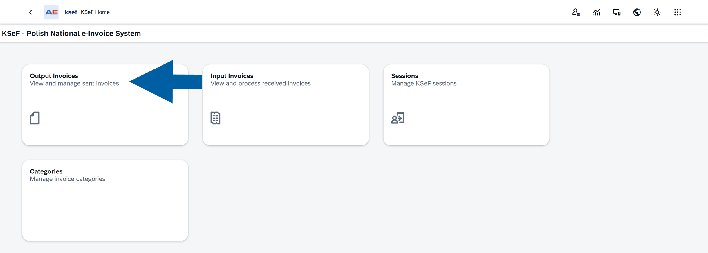

5. The **Output Invoices** list displays outgoing invoices and their current KSeF processing status.

    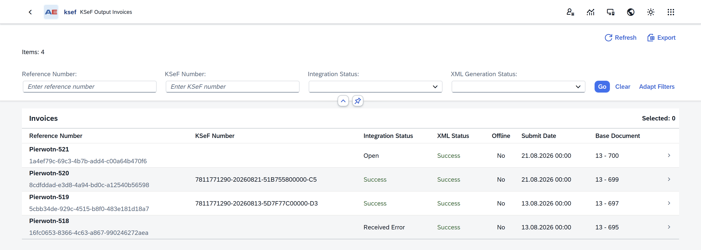

:::info[note]

To learn about the information available for an outgoing invoice, see **View outgoing invoice details**.

:::

## Send invoices automatically

If automatic sending is configured, you do not need to send each invoice manually.

1. Create the required outgoing document in **SAP Business One**.
2. **CompuTec KSeF** generates and validates the **XML file**.
3. The configured **background processing job** sends invoices that are ready for KSeF according to its schedule. [Read more](/docs/ksef/administrator-guide/configuration/background-processing)
4. **CompuTec KSeF** updates the invoice as it moves through the KSeF processing stages.

:::info[note]

An administrator or consultant configures the automatic sending schedule in CompuTec AppEngine. The sending frequency depends on your company's configuration. [Read more](/docs/ksef/administrator-guide/configuration/background-processing#change-the-schedule-of-a-time-based-job)

:::

## Send an invoice manually in CompuTec KSeF plugin

Use manual sending when you want to send an individual invoice without waiting for the automatic sending process.

1. In **CompuTec KSeF plugin**, open **Output Invoices**.

   

2. Click the invoice to open its details.

   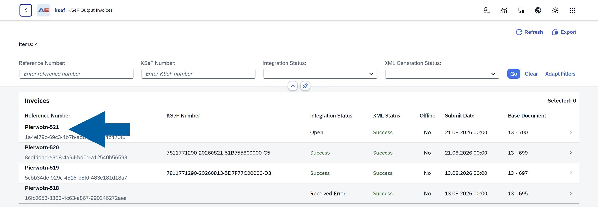

3. Make sure:

   - **Integration Status** is **Open**.
   - **XML Generation Status** is **Success**.

   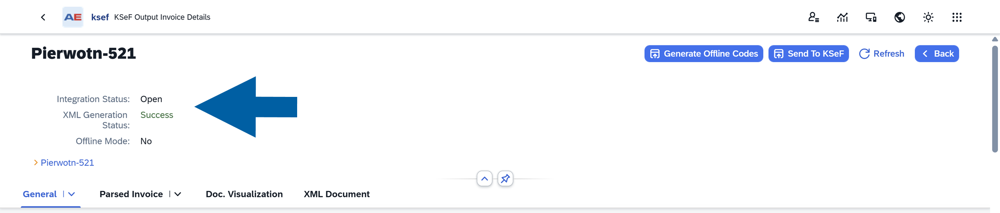

4. Click **Send to KSeF**.

   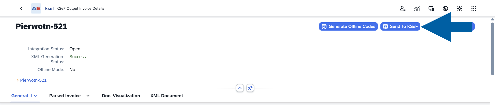

5. CompuTec KSeF starts the sending process.

   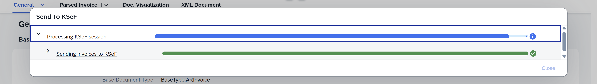

6. When CompuTec KSeF finishes sending the invoice, you will see **Success** in **Integration Status**.

   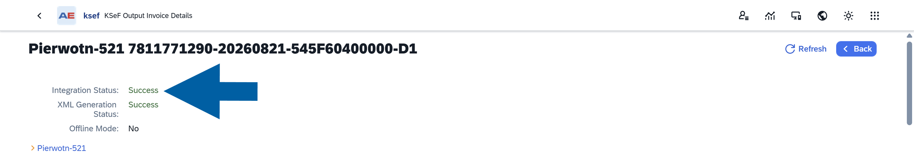

7. Now you can go back to **Output Invoices**
8. Click **Refresh** to display the latest information.

   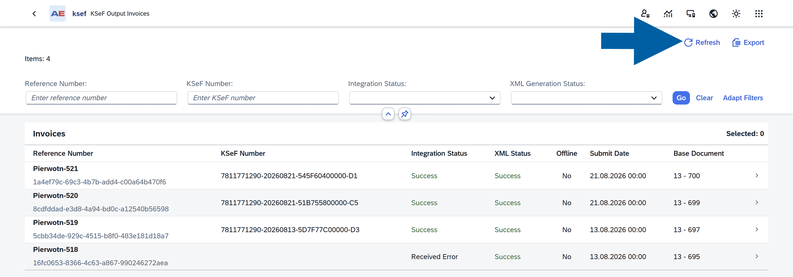

## Send an invoice from SAP Business One

You can also access CompuTec KSeF communication directly from the related SAP Business One document.

To send an invoice from SAP Business One, follow these steps:

1. Open or create the outgoing invoice in **SAP Business One**.

   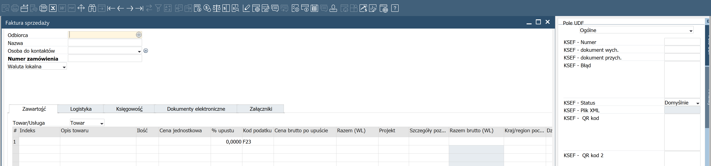

   :::info[note]

   Make sure the **UDF Fields** panel is displayed on the right. If the panel is not visible, select **View > UDF Fields**.

   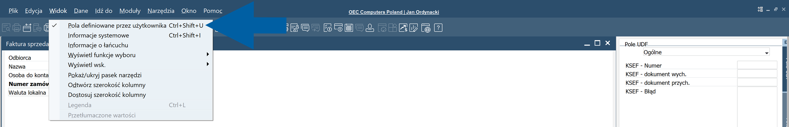

   :::

2. Check the KSeF status in the **UDF Fields** panel.

    For a document that follows the standard configured sending behavior, the initial status is **NO – Domyślne**.

    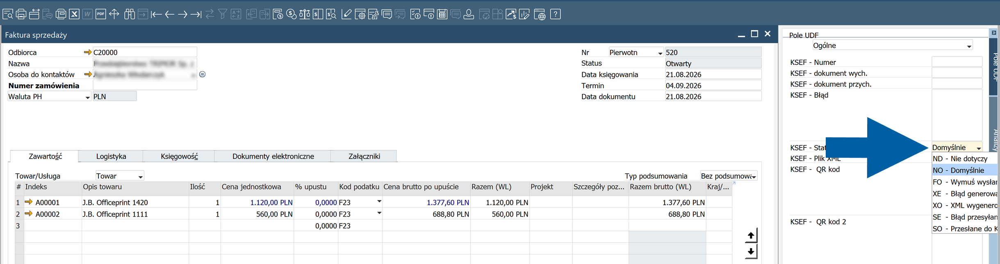

    :::info[note]

    The following statuses can appear during KSeF processing:

    - **ND - Nie dotyczy**: The document is not intended to be sent to KSeF.
    - **NO - Domyślne**: The document follows the default sending behavior defined in the company configuration. Whether the document is sent depends on that configuration.
    - **FO - Wymuś wysłanie**: Forces the document to be sent to KSeF regardless of the default configured behavior.
    - **XE - Błąd generowania**: XML generation failed, for example because required document data is incorrect or incomplete.
    - **XO - XML wygenerowane**: The XML file was generated successfully and the document is waiting to be sent.
    - **SE - Błąd przesyłania**: An error occurred while sending the document to KSeF.
    - **SO - Przesłane do KSeF**: The document was successfully sent to KSeF.

    :::

3. Add the document in SAP Business One.

   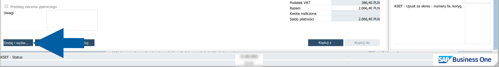

4. Refresh the document until the status changes to **XO – XML wygenerowane**.

   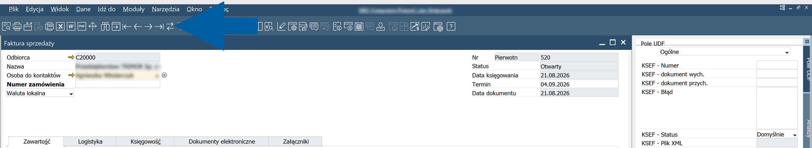

5. The invoice is now ready to be sent to KSeF.

   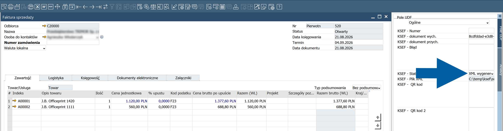

6. Right-click anywhere in the invoice and select **KSeF Communication**.

   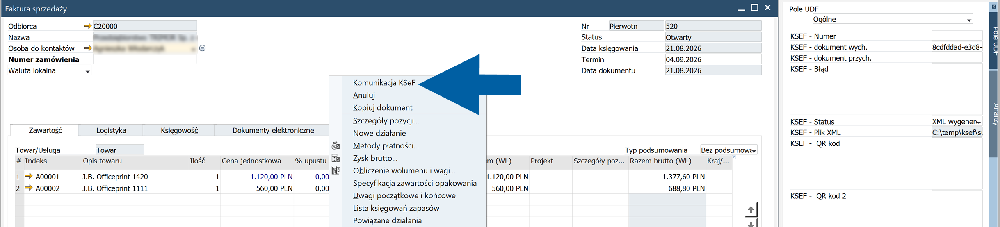

7. Select **Send to KSeF**.

   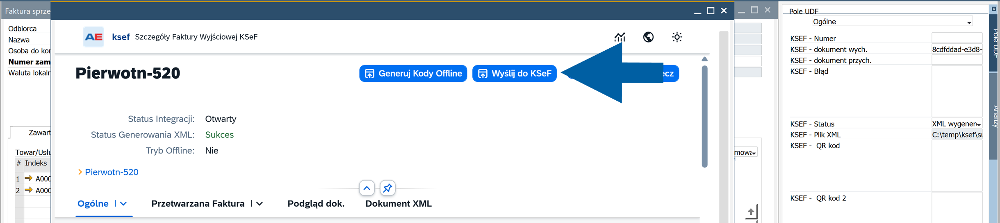

8. Wait for the sending process to complete.

9. When **Integration Status** shows **Success**, close the window.

   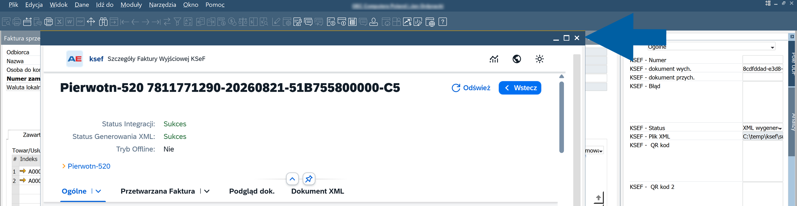

10. Refresh the SAP Business One document and check its KSeF status.

    After a successful operation, you should see **SO - Przesłane do KSeF** status.

    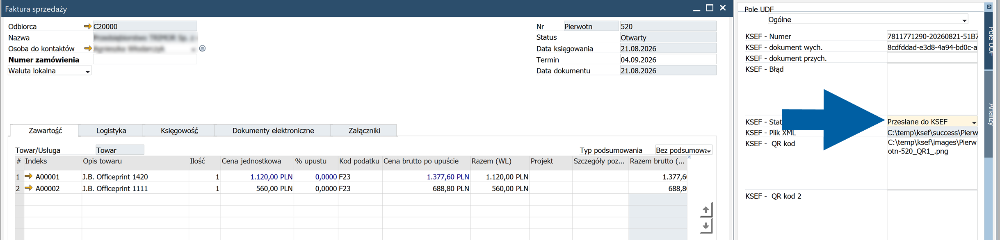

## About Integration Status

The **Integration Status** field in CompuTec KSeF lets you monitor the progress of an invoice during KSeF processing.

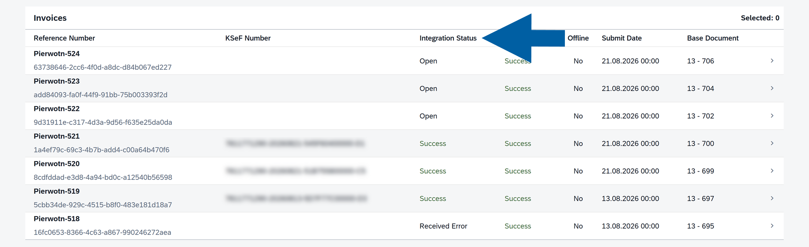

The main processing flow is: **Open** > **Processing** > **Submitted** > **Success**.

Processing can also end with **Error** or **Received Error**.

### Open

The invoice is ready for processing.

### Processing

CompuTec KSeF is processing the invoice.

Wait for processing to complete before taking further action.

### Submitted

The invoice was submitted and is waiting for confirmation from KSeF.

### Success

KSeF successfully processed the invoice.

CompuTec KSeF stores the KSeF number and makes the invoice verification QR code available.

### Error

The sending process failed.

This status can occur because of a temporary communication or processing problem. Depending on the configured background processing, CompuTec KSeF can retry failed sessions. You can also try sending the invoice manually again.

### Received Error

KSeF rejected the invoice.

Check **Error Description** in the invoice details to identify the problem. Correct the relevant SAP Business One data and follow your company's procedure for issuing the corrected invoice.

## Result

The outgoing invoice is submitted to KSeF.

After KSeF successfully processes the invoice:

- **Integration Status** changes to **Success**.
- KSeF assigns a KSeF number to the invoice.
- CompuTec KSeF stores the KSeF processing information.
- The invoice verification QR code becomes available.

## Additional information

CompuTec KSeF groups outgoing invoices into KSeF sessions during the sending process. You can use the session information available for an invoice to review its processing history.

If an invoice exists in SAP Business One but does not immediately appear in **Output Invoices**, XML generation may still be in progress. XML generation runs asynchronously after the SAP Business One document is saved.

## Next steps

After KSeF successfully processes the invoice, you can review its KSeF information, invoice data, QR code, processing dates, and session history in CompuTec KSeF.

See [**View outgoing invoice details**](/docs/ksef/user-guide/outgoing-invoices/view-outgoing-invo).
