# View Outgoing Invoices

Use **KSeF Output Invoice Details** in **CompuTec KSeF** to review an outgoing invoice and its KSeF processing information.

From this page, you can:

- Check whether the invoice was prepared and processed successfully.
- Find the official KSeF number.
- Open the invoice in the KSeF portal.
- View the invoice verification QR code.
- Check when the invoice was generated, submitted, and processed.
- Review the seller, buyer, invoice lines, VAT, and totals.
- Generate a visual representation of the invoice.
- View or download the XML document.
- Review the KSeF session associated with the invoice.

The information available on the page depends on the invoice's current processing status.

## Open the invoice details in CompuTec KSeF

1. Log in to the **CompuTec AppEngine Launchpad**.

   

2. Choose the company.

   

3. Open **CompuTec KSeF**.

   

4. Select **Output Invoices**.

   

5. Select the invoice you want to review.

   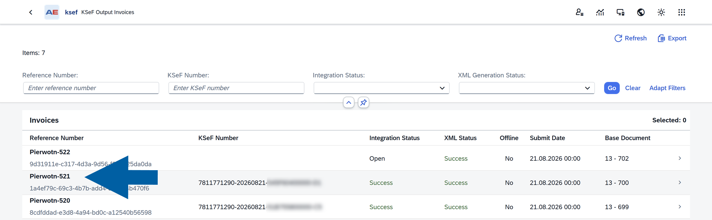

6. The **KSeF Output Invoice Details** page opens.

:::note[info]
You can also open the **CompuTec KSeF** details for an outgoing invoice directly from the related **SAP Business One** document.

1. Open the outgoing document in **SAP Business One**.
2. Right-click anywhere in the document.
3. Select **KSeF Communication**.
4. Open the KSeF invoice details.
5. The **KSeF Output Invoice Details** page opens for the selected SAP Business One document.

:::

## Check the invoice status

The top of the page provides a quick overview of the invoice and its current processing state.

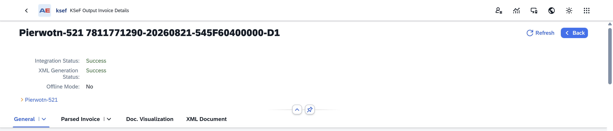

You can see:

- **Integration Status** – Shows the current stage of KSeF processing. For example, **Success** means that KSeF successfully processed the invoice. [Read more](/docs/ksef/user-guide/outgoing-invoices/send-outgoing-inv#about-integration-status)
- **XML Generation Status** – Shows whether CompuTec KSeF successfully generated and validated the XML document.
- **Offline Mode** – Shows whether offline processing applies to the invoice.

You can also select **Refresh** to display the latest information.

Some information, such as the KSeF number and verification QR code, becomes available only after the invoice reaches the appropriate processing stage.

:::info[note]
**XML Generation Status** and **Integration Status** represent different stages of invoice processing.

- **XML Generation Status** indicates whether CompuTec KSeF successfully prepared and validated the XML document required by KSeF.
- **Integration Status** indicates the progress of the invoice during communication with KSeF.

A successfully generated XML document does not mean that the invoice has already been accepted by KSeF. For example, **XML Generation Status** can be **Success** while the invoice is still waiting to be sent or processed by KSeF.
:::

## General

The **General** tab contains the main processing and KSeF information for the invoice.

### Basic Information

Use **Basic Information** to identify the invoice, its source SAP Business One document, and the KSeF session used to process it.

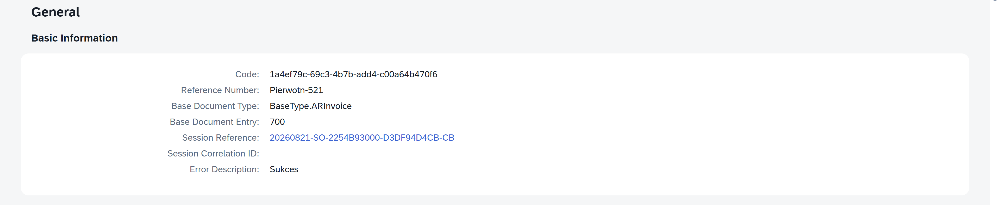

The section includes:

- **Code**: Identifies the invoice record in CompuTec KSeF.
- **Reference Number**: Shows the invoice reference number.
- **Base Document Type**: Shows the type of source SAP Business One document.
- **Base Document Entry**: Shows the internal entry number of the source SAP Business One document.
- **Session Reference**: Identifies the KSeF session in which the invoice was processed.
- **Session Correlation ID**: Provides an additional identifier for the processing session.
- **Error Description**: Displays information about the processing result or an error, when available.

If an invoice was not processed successfully, check **Error Description** for information that can help identify the problem.

### KSeF Information

The **KSeF Information** section contains information related to the invoice's processing in KSeF.

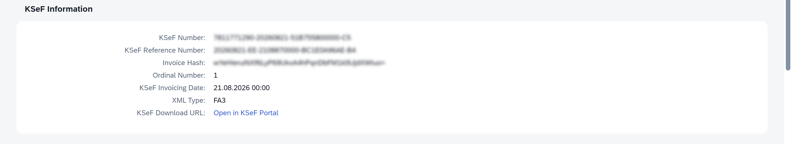

After successful processing, you can find:

- **KSeF Number**: The official number assigned to the invoice by KSeF.
- **KSeF Reference Number**: The reference assigned during KSeF processing.
- **Invoice Hash**: A value used to verify the invoice data.
- **Ordinal Number**: Shows the invoice's sequence number within the KSeF session.
- **KSeF Invoicing Date**: Shows the invoicing date recorded during KSeF processing.
- **XML Type**: Shows the XML format used for the invoice, for example **FA3**.
- **KSeF Download URL**: Provides the **Open in KSeF Portal** link. Click it when you want to access the invoice in the KSeF portal.

### QR Code I – Invoice Verification

After successful processing, **QR Code I – Invoice Verification** displays the QR code used to verify the invoice in KSeF.

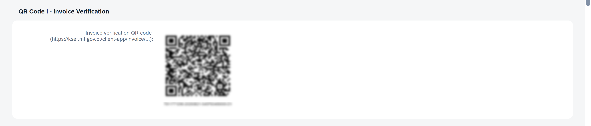

Users can scan the QR code to access the invoice verification information.

For invoices processed in offline mode, additional QR code information can be available.

### Timestamps

The **Timestamps** section shows when the main KSeF processing steps took place.

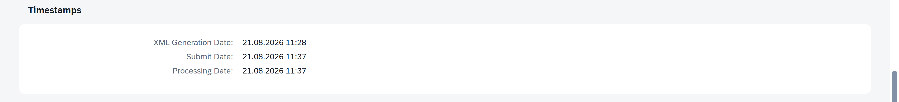

You can check:

- **XML Generation Date**: When the XML document was generated.
- **Submit Date**: When the invoice was submitted to KSeF.
- **Processing Date**: When KSeF processing was completed.

These timestamps can help you track the invoice through the sending process.

### Session History

The **Session History** section shows the KSeF sessions associated with the invoice.

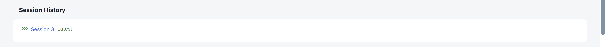

Select a session to open its details.

The **Latest** indicator identifies the most recent session associated with the invoice.

:::note[info]
This information is especially useful when you need to review the processing history of an invoice that was included in more than one session.
:::

## Parsed Invoice

Open **Parsed Invoice** to review the information contained in the invoice in a business-friendly format.

This view lets you check invoice data without reading the XML document.

### Seller Information

The **Seller Information** section displays information about the seller, such as the seller name, NIP, and contact information.

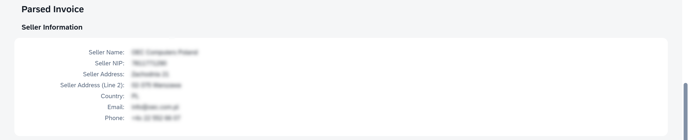

### Buyer Information

The **Buyer Information** section displays the buyer information included in the invoice, such as the buyer name, NIP, and address.

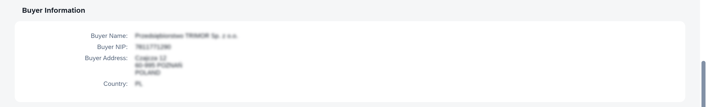

Additional buyer information can be displayed depending on the invoice data.

### Invoice Line Items

The **Invoice Line Items** section shows the individual items included in the invoice.

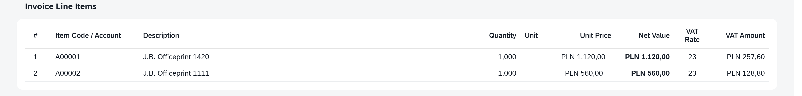

For each line, you can review information such as:

- Item code or account.
- Description.
- Quantity.
- Unit.
- Unit price.
- Net value.
- VAT rate.
- VAT amount.

Use this section to check what items and amounts are included in the invoice prepared for KSeF.

### Invoice Summary & Totals

The **Invoice Summary & Totals** section provides the financial summary of the invoice.

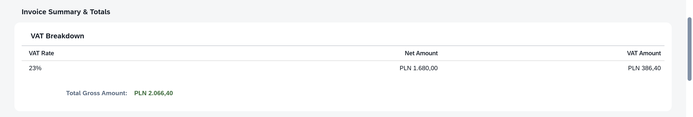

The **VAT Breakdown** shows the net and VAT amounts for each VAT rate included in the invoice.

You can also check the **Total Gross Amount**.

Together with the invoice lines, this section provides a quick way to verify the financial information contained in the invoice.

## Doc. Visualization

Use **Doc. Visualization** when you want to view the invoice as a formatted document instead of reviewing individual fields.

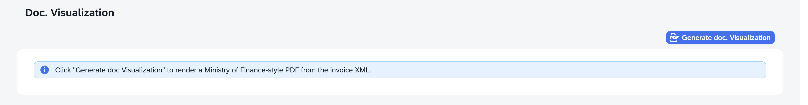

Click **Generate doc. Visualization** to create a Ministry of Finance-style PDF representation based on the invoice XML.

This view can be useful when you want to review the invoice in a familiar document format.

:::info[note]

The visualization is generated from the invoice XML. It represents the information contained in the XML rather than the original SAP Business One print layout.

:::

## XML Document

Use **XML Document** to view the XML document generated for KSeF.

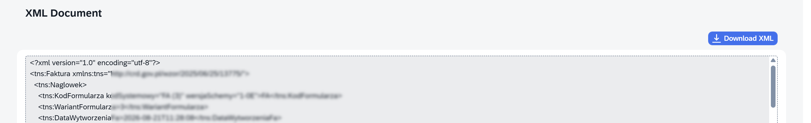

The XML contains the invoice data in the format used for KSeF processing.

You can:

- Review the XML directly on the page.
- Click **Download XML** to save a copy of the document.

Most business users can use **Parsed Invoice** or **Doc. Visualization** to review invoice information without working directly with XML.

The **XML Document** is mainly useful when the actual file used for KSeF processing needs to be reviewed or provided for further investigation.

## What to check after successful processing

When the invoice has been successfully processed, you can use this page to confirm the result.

Check that:

- **Integration Status** is **Success**.
- **XML Generation Status** is **Success**.
- A **KSeF Number** has been assigned.
- **KSeF Invoicing Date** is available.
- The invoice verification QR code is available.
- **Submit Date** and **Processing Date** are available.

You can also select **Open in KSeF Portal** to access the invoice in KSeF.

## What to check if processing is not successful

If the invoice was not processed successfully:

1. Check **Integration Status** and **XML Generation Status** at the top of the page.
2. Check **Error Description** under **Basic Information**.
3. Open **Parsed Invoice** to review the invoice data prepared for KSeF.
4. Review **Session History** to check the invoice's sending history.
5. If necessary, open **XML Document** to review or download the generated XML.

The information available depends on the stage at which the problem occurred.

## Result

You can use **KSeF Output Invoice Details** to review the complete processing information available for an outgoing invoice.

The page brings together the invoice status, KSeF information, verification QR code, processing dates, session history, invoice contents, document visualization, and XML document in one place.

## Next steps

Depending on the invoice result:

- If the invoice was processed successfully, no further action is required.
- To review the KSeF session used to process the invoice, select the session in **Session History**. See **View and Monitor KSeF Sessions**.
- If the invoice was not processed successfully, use **Error Description**, **Parsed Invoice**, **Session History**, and, if necessary, **XML Document** to investigate the problem.

:::note[info]
To learn more about sending and monitoring outgoing invoices, see [**Send Outgoing Invoices to KSeF**](/docs/ksef/user-guide/outgoing-invoices/send-outgoing-inv).
:::
