# KSeF Sessions

Use **KSeF Sessions** in **CompuTec KSeF** to monitor the sending of outgoing invoices to KSeF.

A session contains one or more outgoing invoices sent to KSeF as part of the same sending process. Sessions are created when invoices are sent automatically or when you manually send an invoice.

Use the session information to:

- Check whether the sending process completed successfully
- See how many invoices were included in the session
- Check how many invoices were processed successfully or failed
- Review the invoices included in a session
- Identify errors that occurred during processing
- Monitor a session that is still being processed
- Reprocess a session when this action is available

:::info[note]

You normally do not need to create or manage sessions yourself. CompuTec KSeF creates them as part of the outgoing invoice sending process.

:::

## View KSeF sessions

To view KSeF sessions, follow these steps:

1. Log in to the **CompuTec AppEngine Launchpad**.

    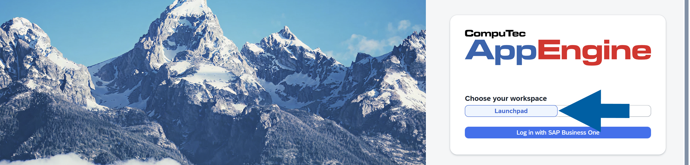

2. Choose the company and log in.

3. Open **CompuTec KSeF**.

    

4. Select **Sessions**.

    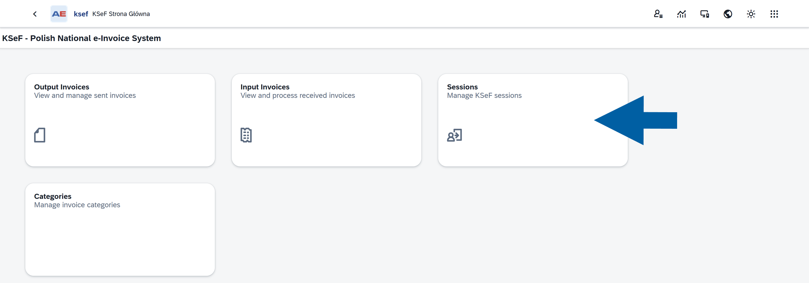

5. The **Sessions** list displays the KSeF sessions created when outgoing invoices are sent.

    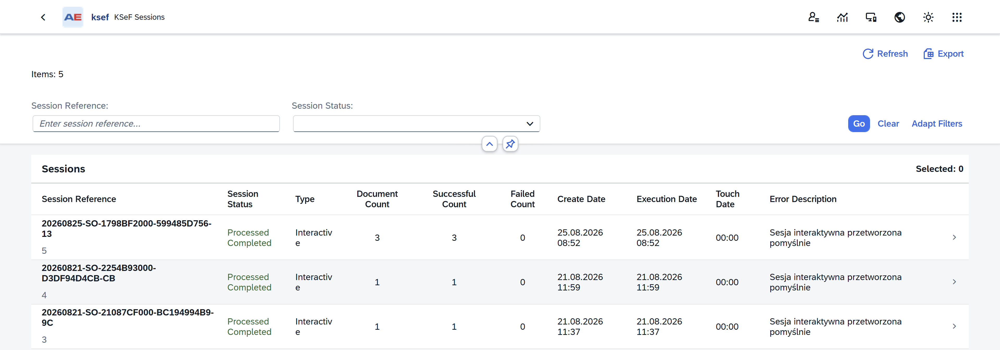

## Find a session

Use the filters at the top of the **Sessions** page to find the sessions you want to review.  

By default, you can filter sessions by:

- **Session Reference**
- **Session Status**

To add date filters or change which filters are displayed:

1. Click **Adapt Filters**.

    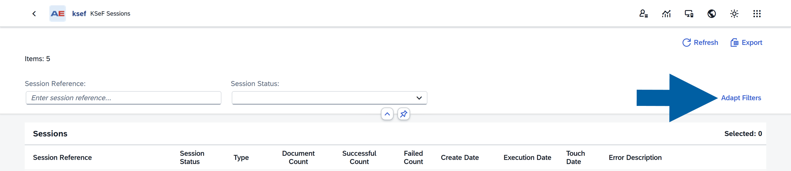

2. Select the filters you want to display.

    Available filters include:
    - **Session Reference**
    - **Session Status**
    - **Date From**
    - **Date To**

    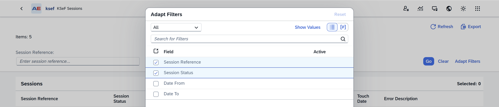

    :::note[Info]
    **Date From** and **Date To** filters are useful when you want to review sessions created or processed during a particular period.
    :::

3. Click **Go**.

4. The **Sessions** list displays the sessions that match your filter criteria.

    :::note[info]
    Use **Clear** to remove the entered filter values and display the sessions without the applied criteria.

        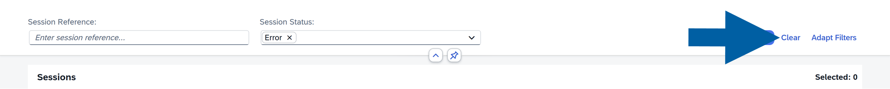
    :::

## Review the Sessions list

The Sessions list provides an overview of each sending process.

Use the following information to monitor a session:

- **Session Reference**: Displays the reference assigned to the session. Use this value to identify a specific KSeF session.

- **Session Status**: Shows the current status and processing stage of the session. Use this information to determine whether the session is still being processed, completed successfully, or requires attention.

- **Type**: Shows how the invoices in the session were sent.
    The session can be:

        - **Interactive**: Invoices are sent individually within the session. 
        - **Batch**: Invoices are sent as a batch. 

- **Document Count**: Shows the number of invoices included in the session.

- **Successful Count**: Shows how many invoices in the session were processed successfully.

- **Failed Count**: Shows how many invoices in the session failed processing.

    :::info[note]

    A session can contain both successfully processed and failed invoices. Check **Successful Count** and **Failed Count** before investigating individual invoices.

    :::

- **Create Date**: Shows when the session was created.

- **Execution Date**: Shows when the session was processed.

- **Touch Date**: Shows the latest activity for the session.

- **Error Description**: Displays information about an error when the session does not complete successfully. It can also display information confirming successful processing.

## View session details

To review a session. follow these steps:

1. Open **Sessions**.

    

2. Find the session you want to review.

3. Click the session to open its details.

    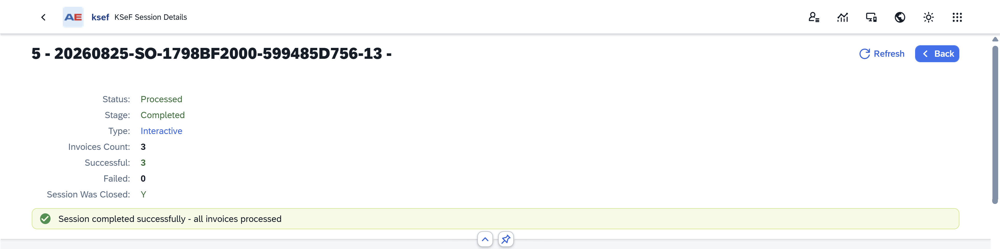

At the top of the page, you can quickly check:

- **Status**
- **Stage**
- **Type**
- **Invoices Count**
- **Successful** invoice count
- **Failed** invoice count
- Whether the **session was closed**

CompuTec KSeF can also display a message indicating the current result of the session.

Depending on the session, the message can indicate that:

- `Session completed successfully`
- `Session completed with errors`
- `Session is still being processed`
- `An error occurred`

## Understand Session Status

The **Session Status** shows the overall state of the KSeF session.

The following statuses can appear:

- `New`: The session was created and processing has not yet completed.
- `Processing`: The session is currently being processed. Wait for processing to complete before investigating individual results.
- `Closed`: The session was closed on the KSeF side.
- `Processed`: The session completed successfully. Review the invoice counts and invoice list to confirm the results.
- `Error`: An error occurred while processing the session. Open the session details and review the available error information.
- `Authentication Error`: KSeF authentication failed. This normally requires an administrator to check the KSeF authentication configuration.
- `Session Not Closed`: The session was not properly closed in KSeF. The session may require recovery or reprocessing.

:::info[note]

A **Session Status** describes the overall result of the sending session. Individual invoices within the same session can have their own processing results.

:::

## Understand session stage

In addition to its status, a session has a **Stage** that shows where it is in the sending process.

The following stages can appear:

- `Created`: The session was created and invoices were assigned to it.
- `Submitting`: The invoices are being sent to KSeF.
- `Waiting For KSeF Confirmation`: The documents were submitted and CompuTec KSeF is waiting for confirmation from KSeF.
- `Confirmed By KSeF`: KSeF confirmed the session and CompuTec KSeF is retrieving the processing results.
- `Completed`: Session processing is complete.
- `Error`: An error prevented the session from completing normally.

The **Status** tells you the overall state of the session, while **Stage** helps you understand where the session currently is, or where processing stopped.

## Review session information

The session details contain additional information about the sending process.

### Basic Information

Use this section to review general session information, including:
    - Session **Code**
    - Session **Name**
    - Session **Status**
    - Processing **Stage**
    - Session **Type**
    - **Processing Status**
    - Whether the **session was closed**.

    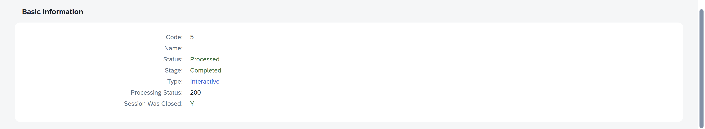

### Session Information

Use this section to review information assigned to the KSeF session, including:
    - **Session Reference Number**
    - **Correlation ID**
    - **KSeF UPO**
    - **Invoice counts**

    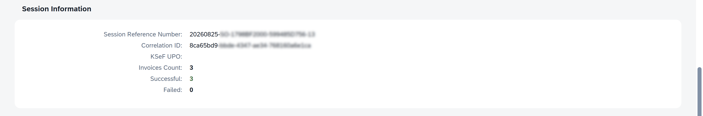

### Timestamps

Use this section to review when different session events occurred.

    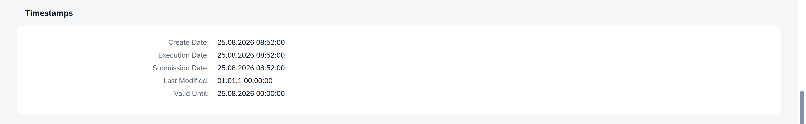

Depending on the processing stage, the available dates can include:

    - **Creation Date**
    - **Execution Date**
    - **Submission Date**
    - Latest activity
    - Session validity

These timestamps can help you determine when the session was sent and when it was last processed.

### Invoices

Use the **Invoices** section to review the outgoing invoices included in the session.

    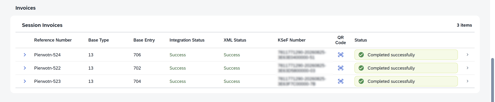

For each invoice, you can check information such as:

- **Reference Number**
- **Base Type**
- **Base Entry**
- **Integration Status**
- **XML Status**
- **KSeF Number**
- **QR Code**, when available
- **Session Status**

This is especially useful when the session contains multiple invoices and some of them failed.

For example, if **Successful Count** is `9` and **Failed Count** is `1`, use the **Invoices** section to identify the invoice that requires attention.

:::info[note]

The result of an individual invoice can differ from the overall session information. When a session contains failed invoices, review the affected invoice before deciding what action to take.

:::

## Monitor an active session

If a session is still being processed, CompuTec KSeF can display information about the active process. The progress information shows how many documents have already been processed.

Wait for the active process to complete, and then refresh the session to review the final result.

## Reprocess a session

If session processing stops because of an error, the **Reprocess** action can be available.

The action is available for sessions with:

- `Error` status
- `Authentication Error` status

To reprocess a session, follow these steps:

1. Open the affected session.
2. Review the error information.
3. Make sure the cause of the problem has been resolved.
4. Click **Reprocess**.
5. Monitor the session until processing completes.
6. Review the final invoice results.

:::info[notes]

**CompuTec KSeF** can also recover interrupted sessions **automatically** when the appropriate background processing jobs are configured. You may not need to reprocess a session manually. [Read more](/docs/ksef/administrator-guide/configuration/background-processing)

If the session shows `Authentication Error`, contact your administrator if you do not manage the KSeF configuration. Authentication settings or certificates may need to be checked before the session can be processed successfully.

:::

## Find the session for an invoice

You can also access session information when reviewing an outgoing invoice.

1. Open **Output Invoices**.

    

2. Open the required invoice.

3. Find the session information in the invoice details.

4. Open the related session to review the complete sending process.

    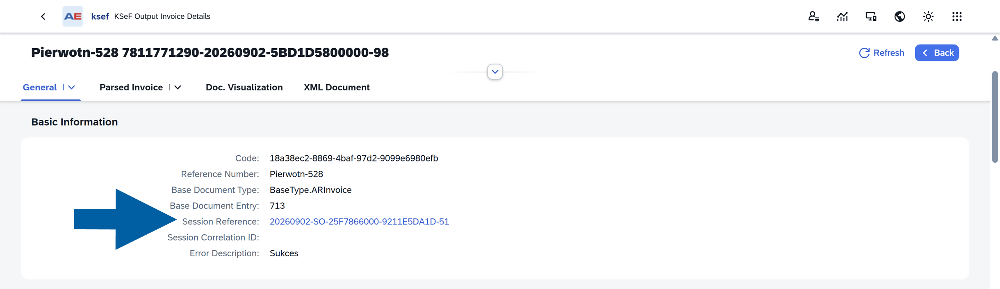

5. An invoice also contains **Session History**, which lets you review its session assignments. This is useful when an invoice was included in more than one sending attempt.

    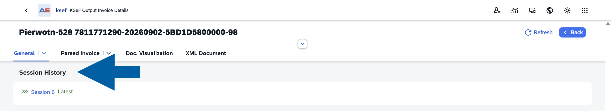

:::note[Info]
See [**View Outgoing Invoices**](/docs/ksef/user-guide/outgoing-invoices/view-outgoing-invo) for more information.
:::

## Result

You can use **CompuTec KSeF Session** information to monitor the sending process and determine whether the invoices included in a session were processed successfully.

If a session contains errors, use the session details and invoice list to identify which invoices require attention.

## Next steps

If all invoices in the session were processed successfully, no further action is required.

To review the **KSeF information** assigned to a specific invoice, including its KSeF number, QR code, XML document, and processing history, see [**View Outgoing Invoices**](/docs/ksef/user-guide/outgoing-invoices/view-outgoing-invo).

If a session or invoice contains an error, review the available error information before retrying the process.
