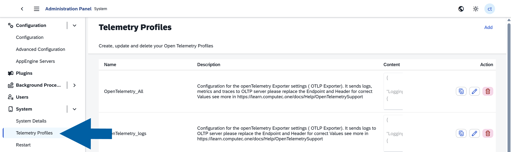
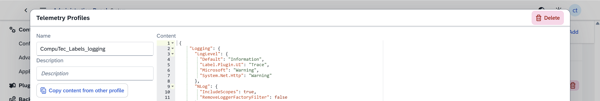
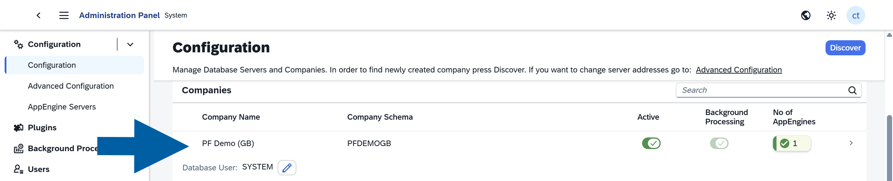
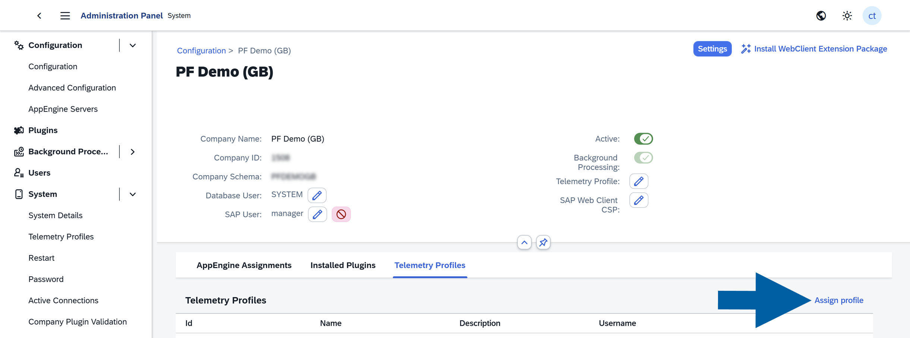
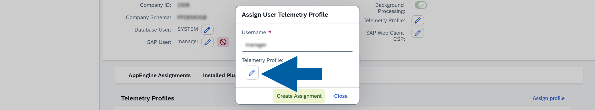

# Log Files

Use log files to investigate issues with **CompuTec Labels** and provide diagnostic information to CompuTec Support.

## Service, manager, and installation logs

These log files are stored in the following folder:

```text
C:\ProgramData\CompuTec\CT Label Printing\Logs
```


The file names identify the component:

| File name prefix | Component |
| --- | --- |
| `CTLP` | Service |
| `CTLPM` | Manager |
| `WixSetup` | Installation |

:::info
The `ProgramData` folder is hidden by default. You can open it by pasting the path into the **File Explorer** address bar or the **Run** dialog (**Win+R**).
:::

## Detailed logging for the CompuTec Labels UI Plugin

The **CompuTec Labels UI Plugin** (`Label.Plugin.UI`) runs in the **SAP Business One desktop client** through **CompuTec.Start**.

By default, CompuTec.Start logs only errors. Enable detailed logging to record plugin activity when troubleshooting an issue.

:::info[note]
The following procedure applies to the current Windows user. It does not require administrator rights or changes to installed files.
:::

### Enable detailed logging

#### Step 1: Create the configuration file

1. Create a folder for the logging configuration, for example `C:\CompuTec\Logging`.
2. Create a file named `ct_debug_logging.json` in this folder.

    

3. Add the following content to the file:

   ```json
   {
     "Logging": {
       "LogLevel": {
         "Default": "Information",
         "Label.Plugin.UI": "Trace",
         "Microsoft": "Warning",
         "System.Net.Http": "Warning"
       },
       "NLog": {
         "IncludeScopes": true,
         "RemoveLoggerFactoryFilter": false
       }
     },
     "NLog": {
       "targets": {
         "file": {
           "type": "File",
           "fileName": "${specialfolder:folder=CommonApplicationData:cached=true}\\CompuTec\\CompuTec.Start\\${environment-user}-${shortdate}.log"
         }
       },
       "Rules": [
         {
           "logger": "*",
           "minLevel": "Trace",
           "writeTo": "file"
         }
       ]
     }
   }
   ```

4. Save the file.

    

Keep the file in this location while detailed logging is enabled.

#### Step 2: Set the environment variable

1. Open **Windows PowerShell**.
2. Run the following command:

   ```powershell
   [Environment]::SetEnvironmentVariable('CT_DEBUG', 'C:\CompuTec\Logging\ct_debug_logging.json', 'User')
   ```

   If you saved the file in a different location, replace the path in the command with its full path.

The command creates a persistent `CT_DEBUG` environment variable for the current Windows user.

:::note[info]
Alternatively, you can create the variable in **Windows Settings**:

1. Search for **Edit environment variables for your account** in **Windows Settings**.
2. Open the matching result.
3. Under **User variables**, click **New**.
4. Enter `CT_DEBUG` in **Variable name**.
5. Enter the full path to `ct_debug_logging.json` in **Variable value**.
6. Click **OK** to save the variable.
7. Click **OK** to close the environment variables window.

:::

#### Step 3: Restart SAP Business One

1. Close the **SAP Business One** client completely.
2. Start **SAP Business One** again.

:::important
Restarting only the add-on is not enough. **CompuTec.Start** inherits environment variables from the **SAP Business One** client, so you must restart the entire client to apply the change.
:::

### Reproduce the issue and collect the log

1. Perform the actions that cause the issue, such as opening a document and printing a label.
2. Open **File Explorer**.
3. Go to the following folder:

   ```text
   C:\ProgramData\CompuTec\CompuTec.Start
   ```

    :::info
    The `ProgramData` folder is hidden by default. You can open it by pasting the path into the **File Explorer** address bar or the **Run** dialog (**Win+R**).
    :::

4. Find the log file for the Windows user and the date when you reproduced the issue. The file name uses the following format:

   ```text
   <WindowsUserName>-<YYYY-MM-DD>.log
   ```

5. Send the file to [**CompuTec Support Portal**](https://support.computec.pl/) with a description of the actions you performed.

#### Check that detailed logging is enabled

After reproducing the issue, check the log for entries marked `INFO` or `DEBUG` with logger names beginning with `Label.Plugin.UI`.

For example:

```text
2026-10-02 12:56:36.7820|DEBUG|Label.Plugin.UI.Events.Custom.PrintPreviewEventHandler.PrintPreviewEventHandler|Printed [1] items
```

If the log still contains only `ERROR` entries:

- Check that `CT_DEBUG` points to the correct file.
- Check that the configuration file exists at that location and contains the JSON shown above.
- Close the SAP Business One client completely and start it again.
- Ask your CompuTec AppEngine administrator whether an assigned CompuTec.Start profile overrides the local logging configuration.

### Disable detailed logging

Detailed logging can generate large files. Disable it when troubleshooting is complete.

1. Open **Windows PowerShell**.
2. Run the following command to remove the user environment variable:

   ```powershell
   [Environment]::SetEnvironmentVariable('CT_DEBUG', $null, 'User')
   ```

3. Close the **SAP Business One** client completely.
4. Start **SAP Business One** again.

If logging was enabled through a **CompuTec.Start** profile, ask your **CompuTec AppEngine** administrator to disable it in the profile.

### Configure logging centrally

Administrators can enable detailed logging for the **CompuTec Labels UI Plugin** through a **telemetry profile** in the **CompuTec AppEngine Administration Panel**. It does not require users to create a local configuration file or set the `CT_DEBUG` environment variable.

This option is useful when logging is needed on multiple workstations or when a user cannot change their environment variables.

#### Create a telemetry profile

1. Open the **CompuTec AppEngine Administration Panel**.
2. Go to **System** > **Telemetry Profiles**.

    

3. Click **Add**.

    

4. Enter a name and description that identify the profile as a detailed logging configuration for the CompuTec Labels UI Plugin.
5. Paste the JSON configuration from [**Create the configuration file**](/docs/labels/getting-help/log-files#step-1-create-the-configuration-file) into the profile content.

    

6. Click **Add** to save the profile.

#### Assign the profile to a user

1. Go to **Configuration**.
2. Open the company for which you want to enable logging.

    

3. Open the **Telemetry Profiles** tab.
4. Click **Assign profile**.

    

5. Enter the user's name in **Username**.
6. Click the edit icon under **Telemetry Profile**.

    

7. Select the profile you created.
8. Click **Create Assignment**.

#### Apply the configuration

1. Close the SAP Business One desktop client completely.
2. Start SAP Business One again.
3. Reproduce the issue.
4. Collect the log file as described in **Reproduce the issue and collect the log**.

**CompuTec.Start** downloads the assigned profile each time it starts. Settings in this profile override matching settings in the local configuration, including the file referenced by `CT_DEBUG`.

:::warning[important]
Detailed logging can generate large files. Disable it in the assigned profile when troubleshooting is complete, then restart the SAP Business One client.
:::

### Configuration priority

**CompuTec.Start** loads configuration sources in the following order. Settings in a later source override matching settings in earlier sources.

| Order | Configuration source | Description |
| --- | --- | --- |
| 1 | `appsettings.json` in the same folder as `start.exe` | Installed default configuration. The default log level is `Error`. |
| 2 | `<ASPNETCORE_ENVIRONMENT>.appsettings.json` in the same folder as `start.exe` | Optional environment-specific configuration used by developers. |
| 3 | File referenced by the `CT_DEBUG` environment variable | User configuration described in this section. |
| 4 | CompuTec.Start profile downloaded from CompuTec AppEngine | Centrally managed configuration assigned to a user or company. |
