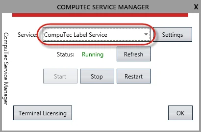
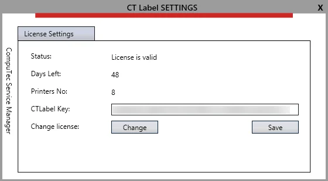
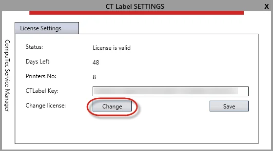
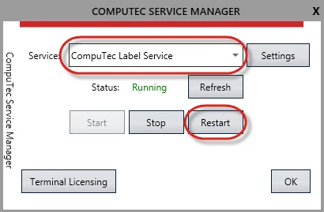
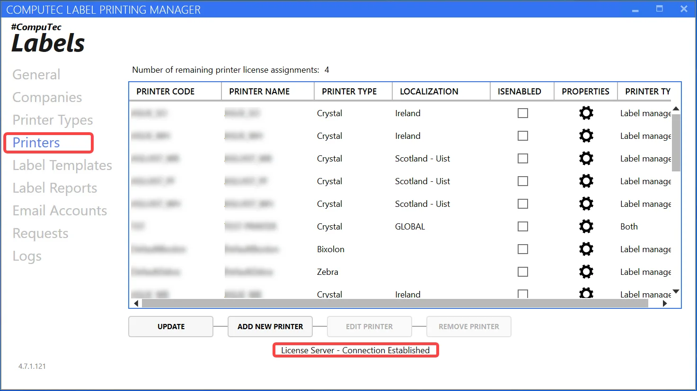
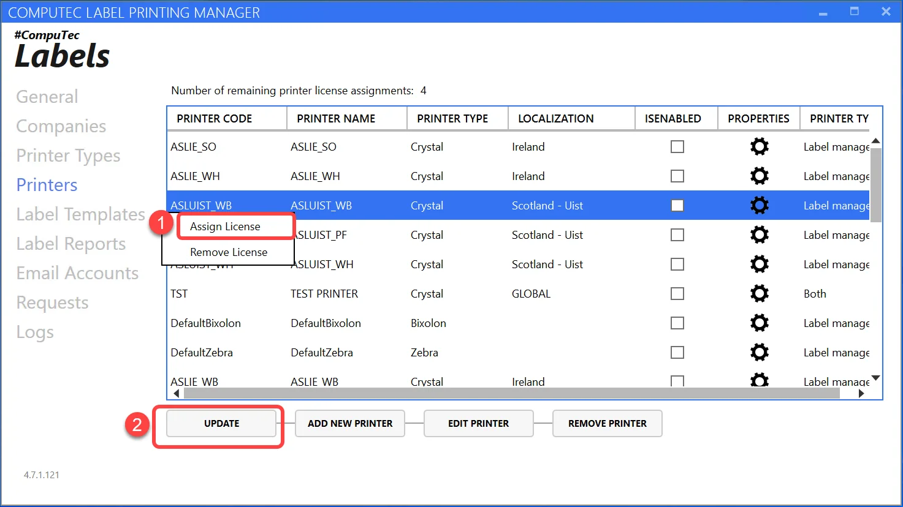

# Licensing

This document provides a step-by-step guide on the licensing process required for the legal operation of CompuTec Labels.

---

## CompuTec Service Manager

To use CompuTec Labels, you must have CompuTec License Server version 5.5 or above. You can download it from [here](/docs/processforce/releases/download#computec-license-service).

## Installation and Setup

:::note
    CompuTec Service Manager is a tool available within CompuTec License Server.
:::

1. Run the installation file.
2. Once the installation is complete, launch CompuTec Service Manager.
3. From the drop-down list, select CompuTec Label Service:
4. Click Settings to open the configuration form:

    

5. Choose Settings. The following form will be displayed:

    

## Obtaining a License File

To obtain a license file, please send the following information to CompuTec Support:

1. **CompuTec Labels Key**: number from CTLabel Keys from a screenshot above.

    :::note
        To make the support procedure easier, please copy the from the field (do not send a screenshot)
    :::
2. **Required Printer Licenses**: Specify the number of printer licenses:

    - For partner demo/test purposes: 1 printer license
    - For a client’s production system: The number of purchased licenses

CompuTec Support will provide a license file in .xml format.

## License Assignment

### Main License Assignment

To assign the main license file:

1. Open Settings in CompuTec Service Manager.
2. In the CT Labels Settings form, click Change and browse to the license file obtained from CompuTec Support:

    

3. After importing the license, restart both CompuTec License Server and CompuTec Label Service by clicking the highlighted button:

    

### Printer License Assignment

To assign printer licenses:

1. Navigate to CompuTec Label Printing Manager > Printers.
2. A message will indicate whether the system is connected to the license server.

    
3. If the license is valid, you will see the number of available printer license assignments. For example, in the screenshot above, two printer licenses are fully assigned.
4. To allocate a license to a printer:
    - simply right-click on it
    - select "Assign a license"
    - click "Update"

    

---
