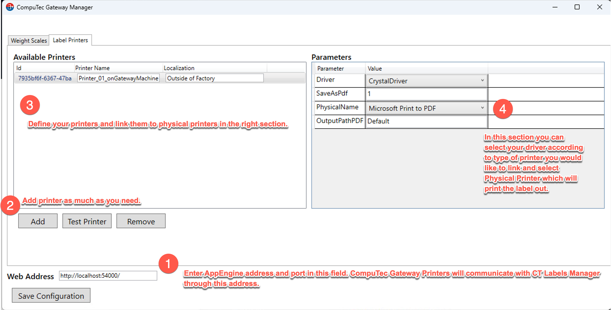
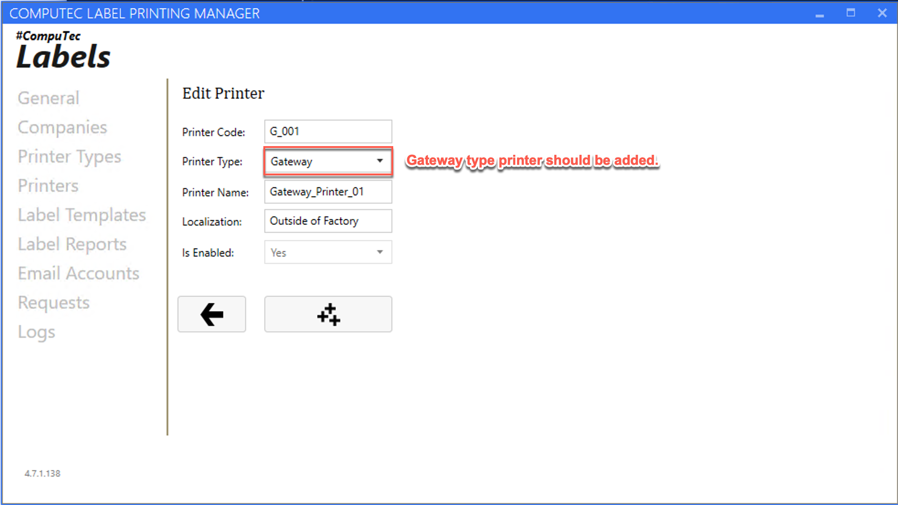
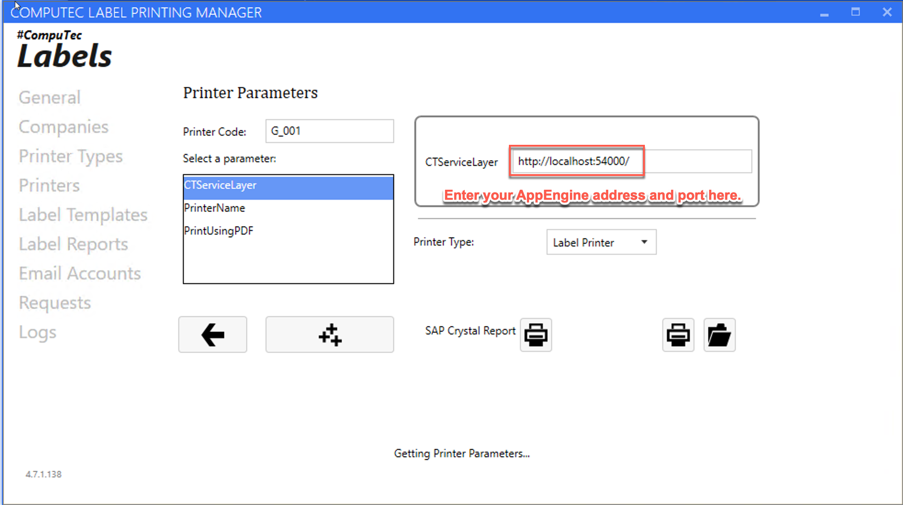
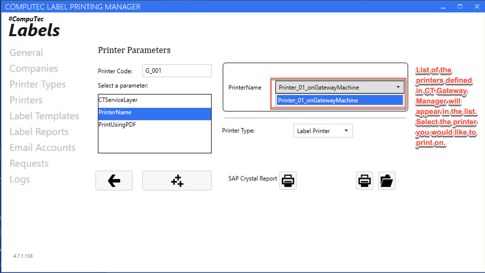

# Configuration

You can find the configuration steps for the required applications on this page.

---

**Configuration in CompuTec Gateway Manager**

You can launch the CompuTec Gateway Manager from the default path: C:\Program Files (x86)\CompuTec\CompuTec Gateway\CompuTec Gateway Manager.exe

**Configuration in CompuTec Label Printing Manager**

The configuration process in CT Label Printing Manager involves adding a Gateway-type printer and specifying the AppEngine address as illustrated below.

The CompuTec Gateway Manager can be downloaded from the following page. [Click here to navigate to the page](https://learn.computec.one/docs/labels/releases/download/#computec-gateway-manager).

---
