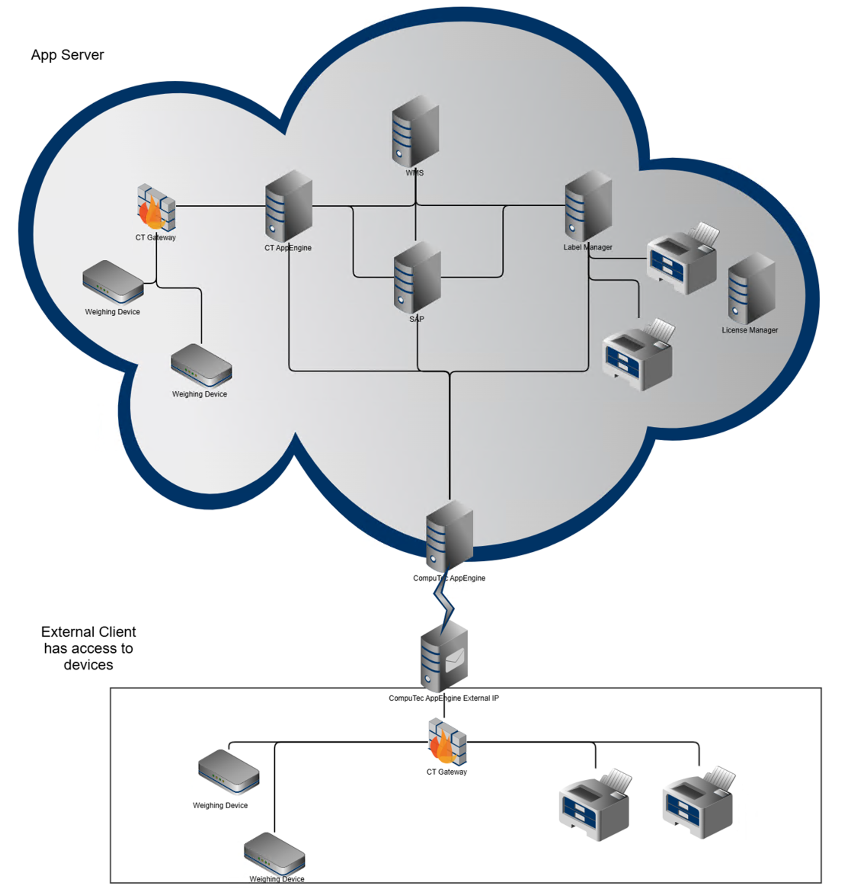

# Overview

CompuTec Gateway Manager serves as a crucial middleware solution, connecting **CompuTec Labels**, **CompuTec WMS**, and **CompuTec PDC** with essential peripheral devices such as **printers** and **weight scales**. It acts as a **redirector**, ensuring seamless communication between these applications and the devices, even when they are located on different machines or networks. The Gateway Manager allows for **remote access** to printers and weight scales that might otherwise be inaccessible due to network restrictions.

These applications communicate with **CompuTec Gateway Manager** through the CompuTec AppEngine address and port, ensuring an efficient and secure data exchange process.

---

## Integrated Applications with CompuTec Gateway Manager

1. **CompuTec Labels**

    CompuTec Labels is a comprehensive label and report printing management system designed to integrate with CompuTec Gateway Manager for remote and local printer connectivity. This integration ensures:

        - Seamless label printing even when the printer is not directly accessible from the CompuTec Labels Application Server.
        - The ability to define and configure logical printers, which are linked to physical printing devices.
        - Print jobs can be routed through the CompuTec Gateway Manager if the printer is not directly accessible.

    For more information on printer configuration, please refer to the Printer Integration Guide. [Click here to navigate to the page](https://learn.computec.one/docs/labels/setup/computec-gateway-printer/configuration/).

2. **CompuTec WMS**

    CompuTec WMS integrates with CompuTec Gateway Manager to ensure accurate data capture from weight scales. The integration provides:

    - Real-time weight data that is transmitted from the scale to the system, enabling capturing weighed items actual weight directly on application UI.
    - Automated workflows, reducing the need for manual data entry and improving accuracy in warehouse operations.
    - Seamless communication between warehouse systems and peripheral devices such as printers and scales.

    For detailed weight scale configuration in WMS, refer to the Weight Scale Integration Guide. [Click here to navigate to the page](https://learn.computec.one/docs/wms/user-guide/weight-scales/overview/).

3. **CompuTec PDC**

    CompuTec PDC utilizes CompuTec Gateway Manager to facilitate the collection of production data and streamline processes. The integration provides:

    - Real-time weight data from connected weight scales for weighed raw material consumption.
    - Remote or local label printing at various stages of the production process.
    - Efficient communication with peripheral devices such as printers and scales through the CompuTec AppEngine platform.

    For detailed weight scale configuration in PDC, refer to the Weight Scale Integration Guide. [Click here to navigate to the page](https://learn.computec.one/docs/pdc/administrator-guide/weight-scales-integration/overview/).

## Communication Flow Between Applications and Gateway

For label printing to function effectively, both the CompuTec Labels Printing Manager and CompuTec Gateway Manager need to be properly configured. The communication process follows these steps:

1. **Label Request Initiation**: a label request is triggered by one of the following applications: SAP B1, CompuTec WMS, or CompuTec PDC.
2. **Processing by CompuTec Labels Service/Manager**: the CompuTec Label Service/Manager receives the request and identifies the printer assigned for the task. If the printer is configured as a gateway printer, the service proceeds to forward the request to the CompuTec Gateway Manager.
3. **Forwarding to CompuTec Gateway via CompuTec AppEngine**: the CompuTec Label Service forwards the request details to the gateway machine via the CompuTec AppEngine address and port, using the CompuTec Gateway Plugin to ensure a secure and reliable connection.
4. **Processing by CompuTec Gateway Service**: upon receiving the request, the CompuTec Gateway Service processes the print job and adds it to the printer queue.
5. **Label Printing**: the print job is sent to the physical printer, where the label is printed according to the specifications outlined in the request.

---
