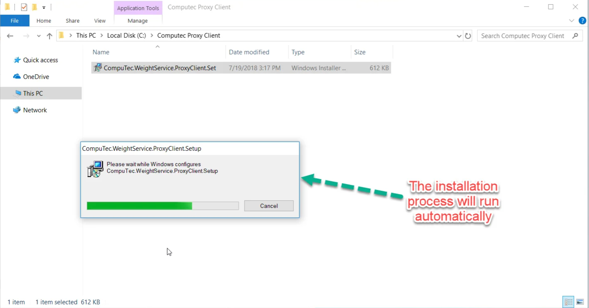

# Installation

To ensure the proper functioning of CompuTec Gateway Manager, follow the prerequisites and installation steps outlined below.

---

## Prerequisites

Before installing the required applications, make sure to:

- Configure your firewall to allow traffic on port 8080 in the CompuTec Gateway Server/Machine.
- Install .NET Framework 4.7.1.
- Have CompuTec AppEngine installed.

## Installation Steps

:::info Requirement
    **CompuTec AppEngine** must be installed to be able to use **CompuTec Gateway** and upload **CompuTec Gateway Plugin**.
:::

You need to install the following applications:

1. **CompuTec Gateway Plugin**:

    - **For CompuTec AppEngine v2**
        - Download: [Click here to navigate to the page](https://learn.computec.one/docs/labels/releases/download/#appengine-computec-labels-plugin).
        - Installation guide: [Click here to navigate to the page](https://learn.computec.one/docs/appengine/administrators-guide/configuration-and-administration/overview/#plugins).

    - **For CompuTec AppEngine v3**
        - Download and Installation Guide: [Click here to navigate to the page](https://learn.computec.one/docs/appengine/next/administrators-guide/configuration-and-administration/plugins/overview/).

2. **CompuTec Gateway Manager**

    - Download: [Click here to navigate to the page](https://learn.computec.one/docs/labels/releases/download/#computec-gateway-service).

        

---
By following these steps, you can successfully set up CompuTec Gateway Manager, ensuring seamless integration with CompuTec AppEngine. Be sure to verify all prerequisites before installation to avoid any configuration issues.
