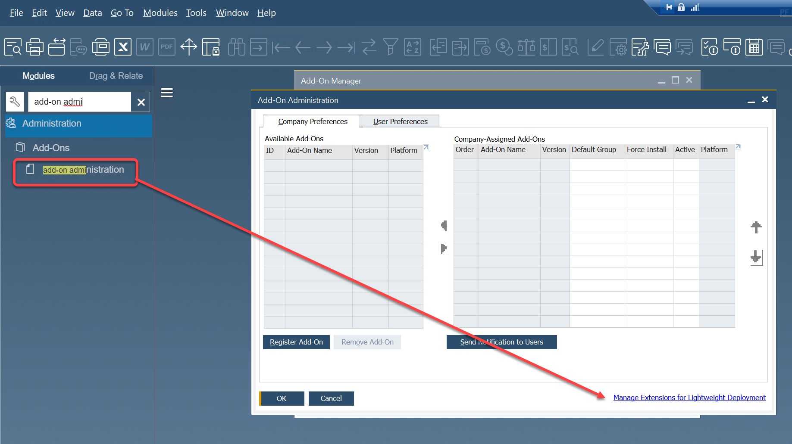
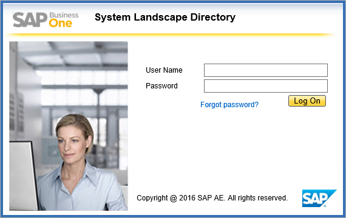
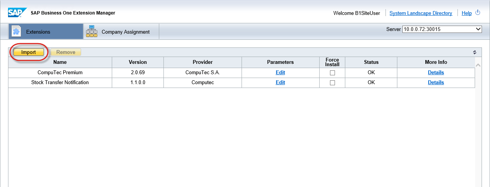
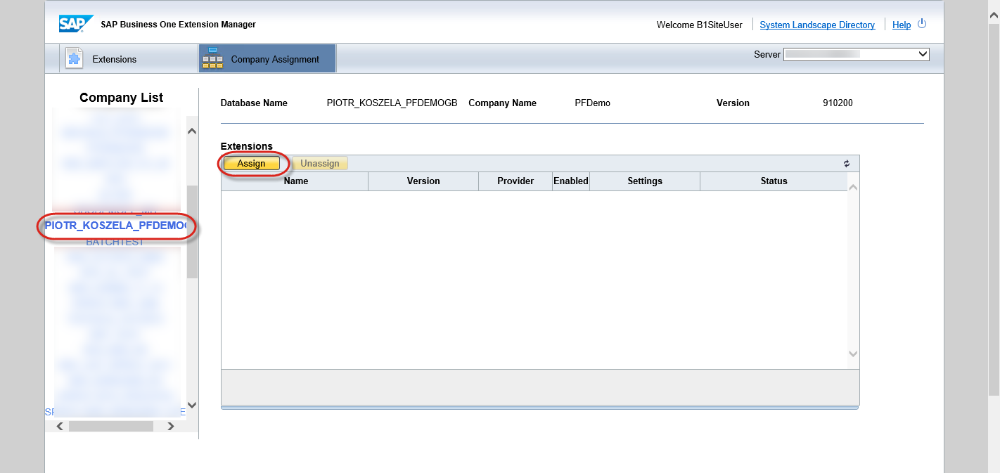
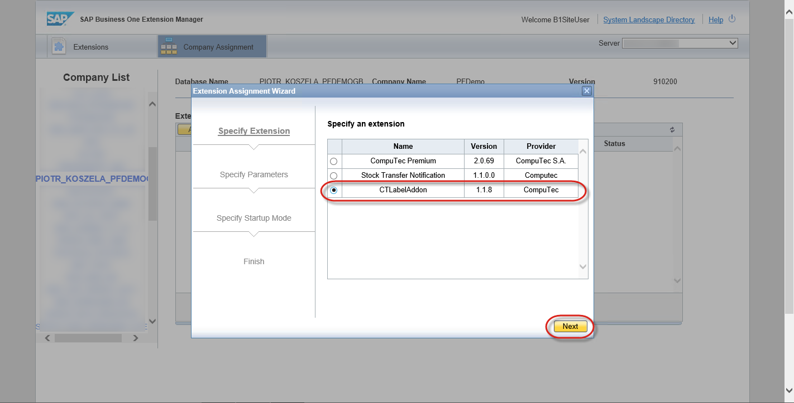
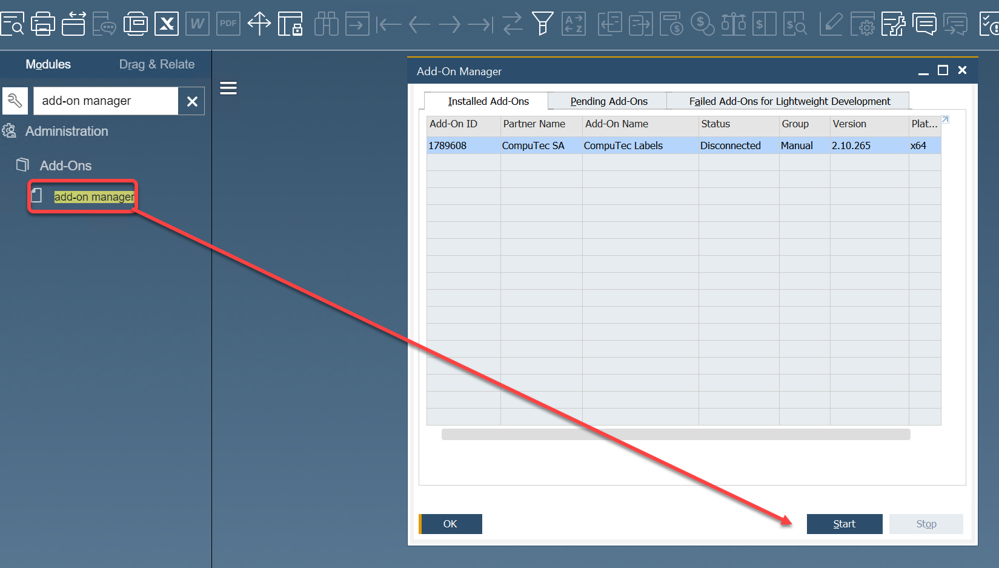

# CompuTec Labels SAP Addon

CompuTec Labels SAP add-on is an extension utilizing printing SAP objects from the Business One Client.

## Installation

Download installation files from the [download](../releases/download.md#computec-labels-sap-addon)  page.

This is a lightweight deployment add-on. As such, install it, log in to your SLD Service, import and assign the add-on from there.

You can check how to do this here

1. Choose the right option in SAP Business One:
    
2. Log in to the System Landscape Directory:
    
3. Choose import and browse to the path with the add-on installation file:
    
4. Go to Company Assignment, choose the required database from Company List and click Assign:
    
5. Choose the CTLabelAddon option and go through the installation by clicking Next:
    
6. It is recommended to set up the manual type of Startup Mode on the first run of the application. It can be changed later to Automatic or Mandatory.

Once it's done re-log your company, run the add-on, and wait until the installation is finished.

