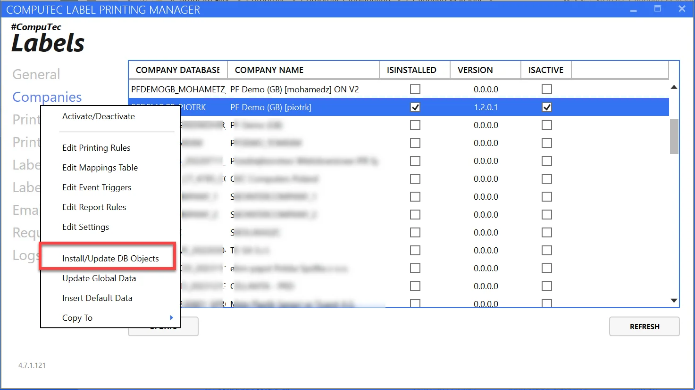
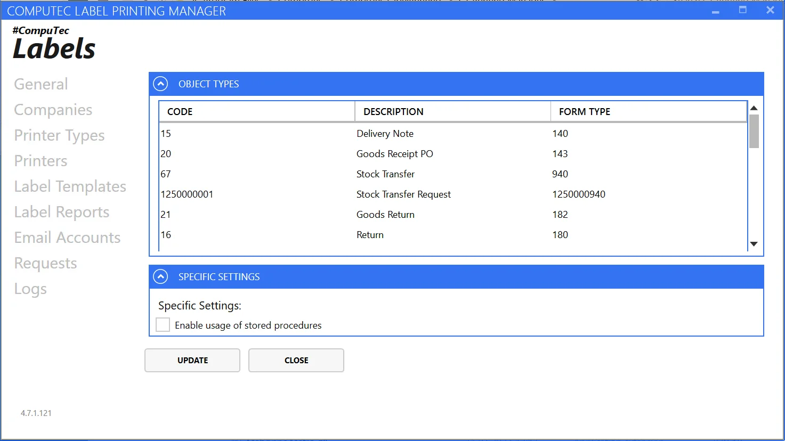
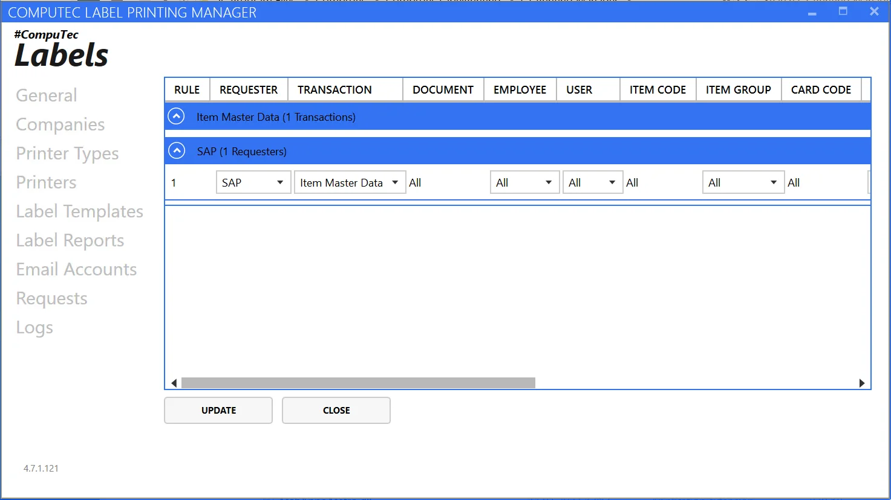
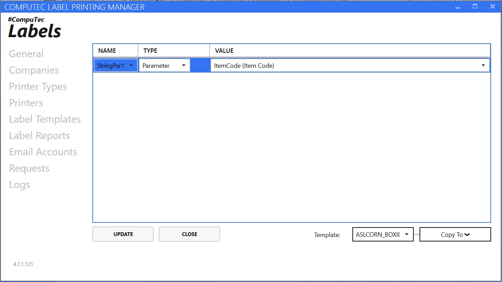
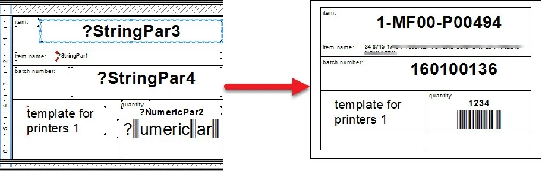
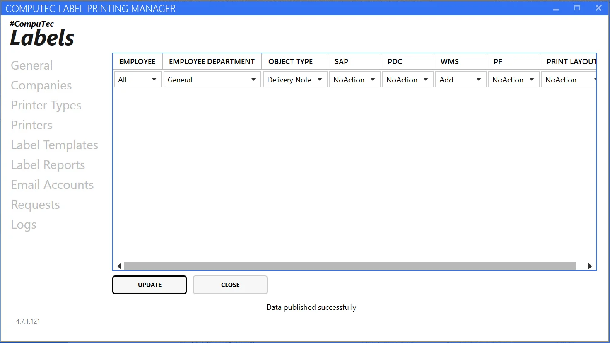

# Company Installation and Configuration

This guide provides detailed steps for installing and configuring CompuTec Labels for a specific company.

---

To begin using CompuTec Labels, the application database objects must be installed on the designated database. This process creates tables that store all CompuTec Labels-related information.

**Steps to Install Database Objects**:

1. Select the company row.
2. Right-click and choose Install/Update.
3. Enter SAP Business One user credentials.
4. Monitor the status bar for completion confirmation.

    

**Once the installation is complete**:

1. Activate the database (using the context menu in the screenshot above).
2. Click Refresh and then Update.

The application is now ready to configure settings for the specific company.

By right-clicking, you can navigate to Printing Rules, Mapping Parameters, Event Triggers, Report Rules, and Settings View.

:::note
    Note that to change any of the settings, you have to enter database credentials (username and password)
:::

## Settings View



Here, you can check a list of Object that can be chosen for Transaction. If you want to add new objects to the list for your CompuTec Labels installation, please contact [CompuTec Support](http://support.computec.pl/).

The Specific Settings tab allows you to enable the Usage of Storage Procedures. This option allows you to find templates that are not defined in the printing rules. It is useful for implementing custom logic in template identification. The procedure name for this is:

    ```text
    CT_LP_SELECTPRINTTEMPLATES
    ```

Please note that the template code returned by this procedure has to match the **TEMPLATENAME** defined on the label [templates tab](./general-configuration.md#label-templates).

## Printing Rules View



In this view, we define new printing rules. The printing rule defines an action in which printing occurs. Rules are grouped first by the requester and then by the transaction.

To define a new rule, right-click on the table and choose Add new rule.

- **Requester**: The application requesting printing (SAP, WMS, or PDC).
- **Transaction**: Transaction on which a specific print occurs. By default, the following transactions are available: Delivery Note, Goods Receipt PO, Stock Transfer, Stock Transfer Request, Goods Return, Return, Item Master Data, Additional Batch Details, Storage Unit, Goods Issue, DraftGRPO.
- **Document**: Define whether the rule concerns all of the documents in the chosen transaction or just one (in this case, you must specify its document number).
- **Employee**: The employee is defined in SAP Business One for whom this printing rule works. You can set up a specific one or all.
- **User**: SAP Business One for whom this printing rule works. You can set up a specific one or all.
- **Item Group**: Specify a particular item group or all.
- **Card Group**: Business Partner type of a specific document. You can choose either Customers or Suppliers.
- **Branch**: Define which company branch the rule applies to.
- **WHSCode**: Code of a Warehouse for which the rule works:
        - Unit of Measure
        - Header
        - Ignore All Others
- **Template**: Assign a printing template to the rule.

## Mapping Parameters View

Here, you can define mapping parameters, determining which data is assigned to specific variables in a label layout. A mapping scheme is defined in a particular [template](./general-configuration.md#label-templates). Specific fields on a printing template will be filled with data assigned to parameters.



In this view, we provide parameter mappings for each template.

1. Choose a template from the drop-down list.
2. Right-click and insert a new parameter.
3. Configure the following settings:

    - first column: select a parameter of interest, which will be mapped later.
    - second column: select Parameter or SQL.
    - On setting up Type to Parameter, you can choose the following values:

        - Item Code
        - Quantity
        - Supplier/Customer Code
        - Start From
        - BarCode
        - Item Name

    - Choosing the SQL option means that you have to put in SQL or HANA queries to get a specific parameter from the database.

An Example of parameters used in a template and a final label based on it:



Click Update to save changes.

## Event Triggers View



In this view, we define the action of which Employee printing will proceed.

These rules are called event triggers. To add a new one:

1. Right-click on the table and choose "Add".
2. Specify the employee and department for which the rule will be valid (you can select "All" for both values).
3. Choose the Object Type for which the rule is set.
4. In columns SAP, PDC, WMS, and ProcessForce, you can choose an action for a specific application with which CompuTec Labels is connected. You can choose the following actions:

    - **OnChange**: Printing starts on the update of a document.
    - **Add**: Printing starts with the addition of a document.
    - **NoAction**: No action is taken automatically; you have to choose the right option from the application to start printing.

5. Click "Update" to save changes.

:::note
    Event Triggers are considered in CompuTec solutions: SAP CompuTec Labels add-on, CompuTec WMS, CompuTec PDC, and ProcessForce. You can print only from objects defined in this table in these solutions.
:::

---
