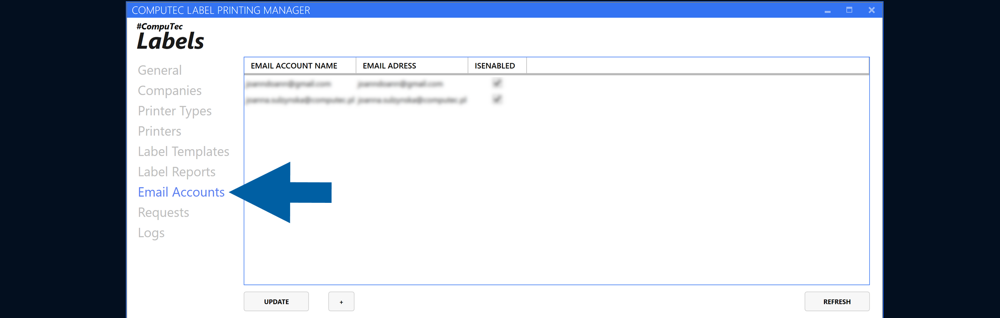
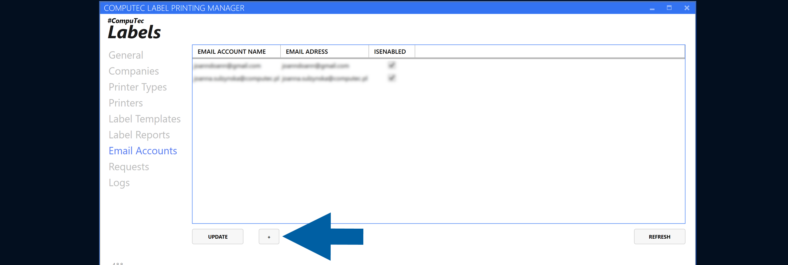
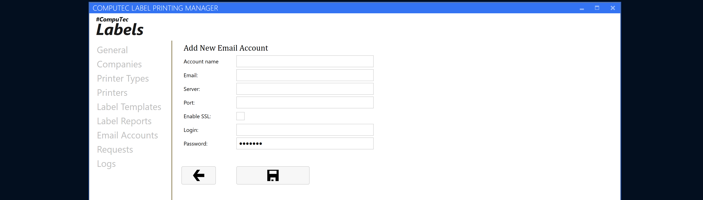
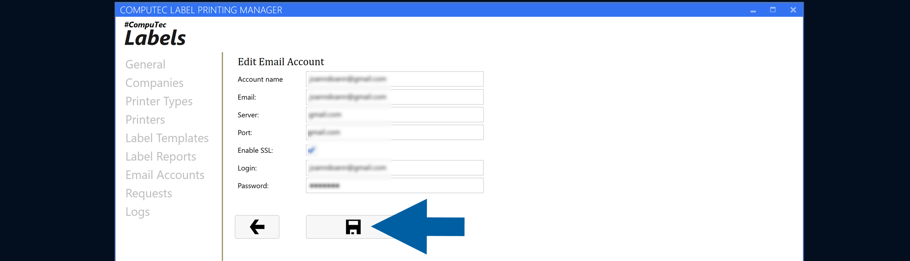

# Configure an Email Account

Configure an email account in **CompuTec Labels Printing Manager** to enable **CompuTec Labels** to use the account for sending emails.

## Before you start

Make sure you have the email account details required for your configuration.

## Configure an email account

To configure a new email account, follow these steps:

1. In **CompuTec Labels Printing Manager**, go to **Email Accounts**.

    

2. Click the **plus (+) icon**.

    

3. Add the email account details.

    

4. Click the **save icon**.

    

## Result

The email account is configured and can be selected when you configure email sending in **CompuTec Labels**.
