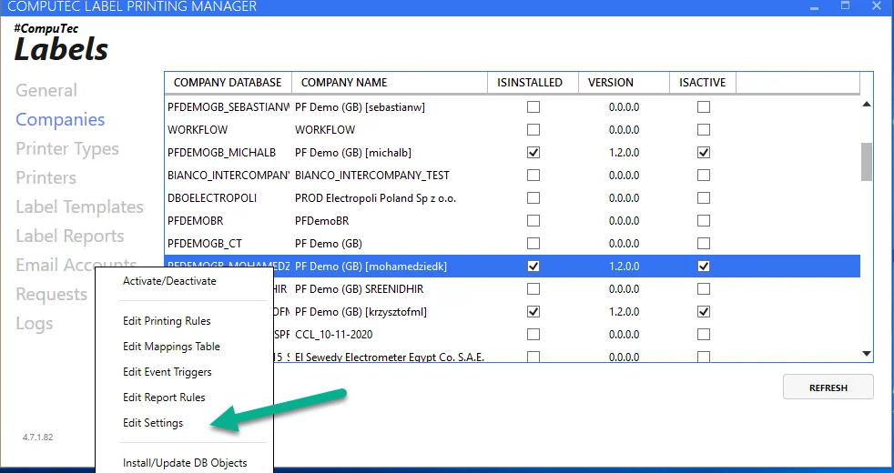
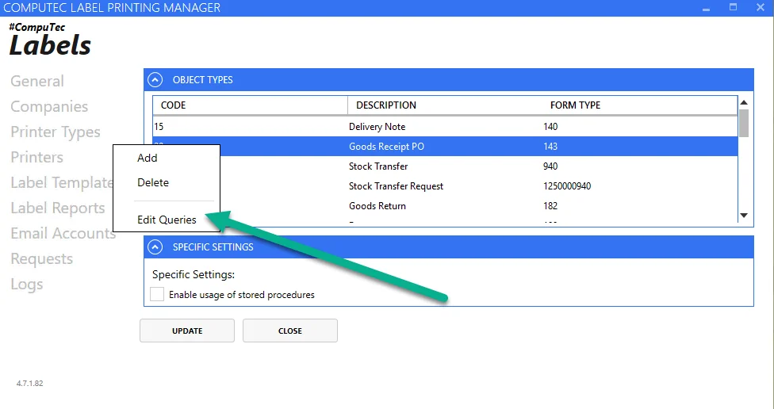
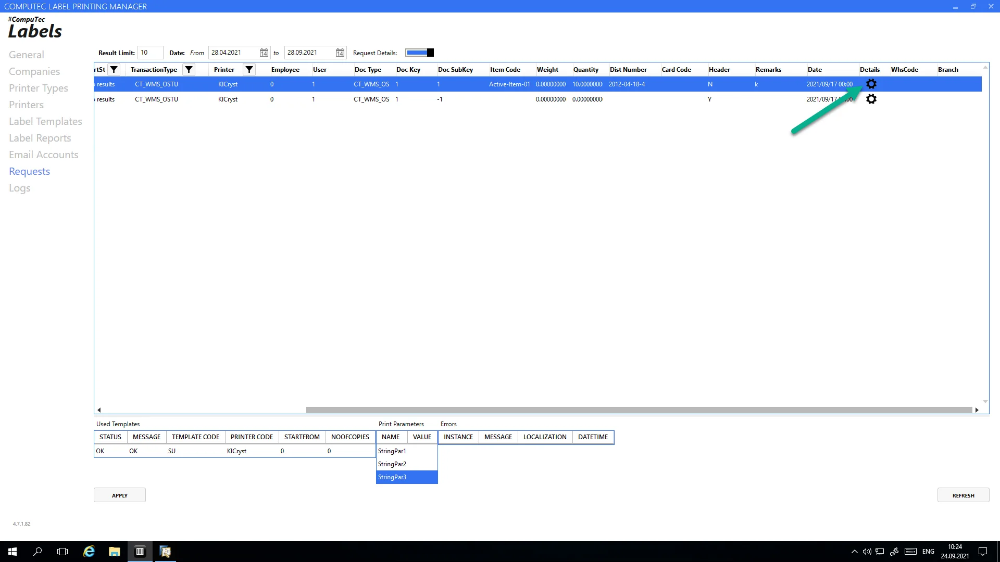
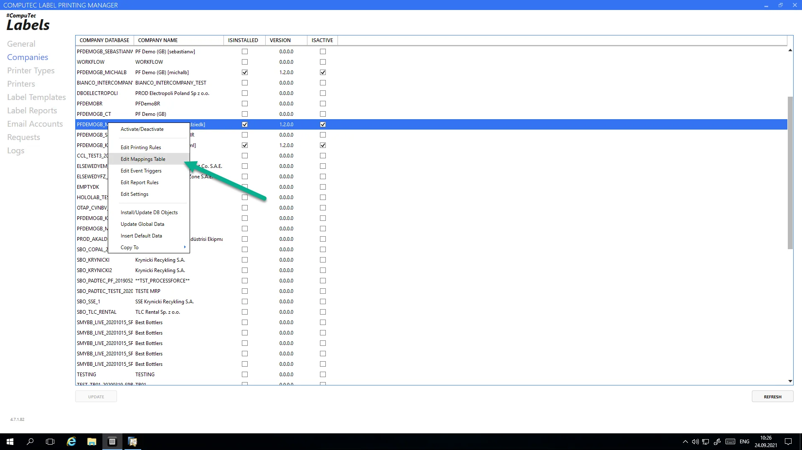
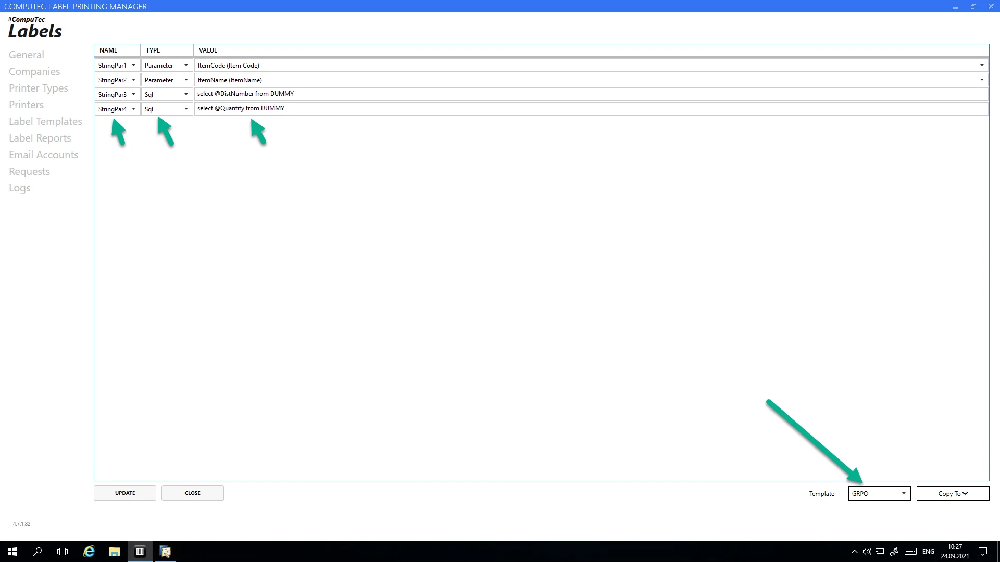
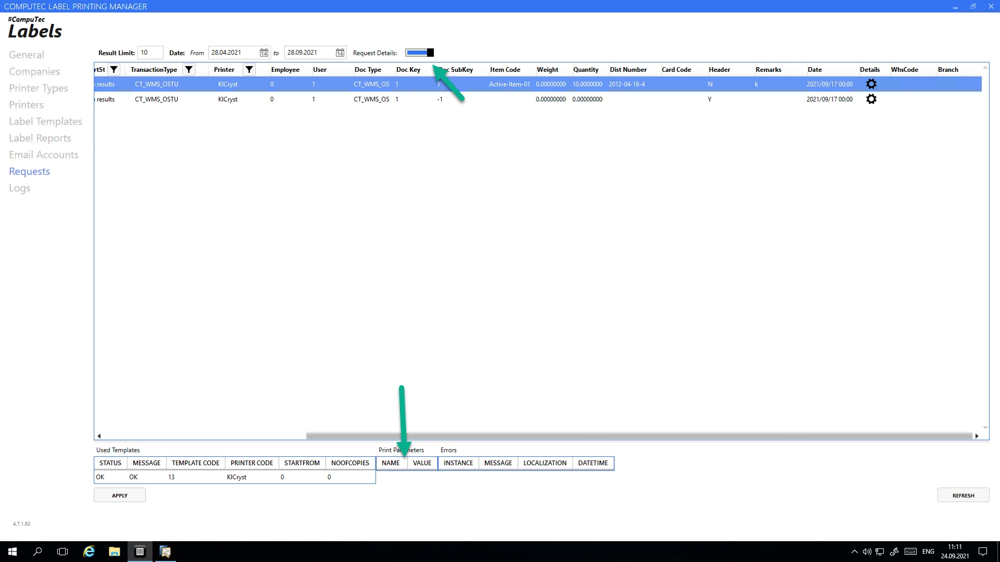

# Gathering more Information from Database to Label

There are two primary ways to retrieve additional information from the database for labeling purposes: using attributes and query parameters. You can implement either method independently or combine them for greater flexibility.

---

## Using Attributes

Attributes refer to additional columns collected by the application when initiating a print request from systems such as ProcessForce, CompuTec WMS, or SAP Business One. These attributes are determined before the print request is sent to the Label Manager.

Each document type configured in Label Manager has two embedded queries responsible for preparing printing requests. The queries’ results dictate the data sent to CT Label for processing. You can modify these queries to include additional information.

To access and modify these queries:

1. Navigate to the Edit Settings section.

    
2. Select the desired document type and click on Edit Queries.

    

You will find two query types:

- **Add Query**: Executes when a document is initially added to the system.
- **Update Query**: Executes when a document is updated in the system.

:::warning
    We recommend adding this new column in both queries.
:::

    ```sql
    select  CURRENT_SCHEMA "CompanyDatabase" ,'Printer' "Printer",'20' "TransactionType",'SAP' "Requester",
            t0."UserSign" "EmpID",t0."UserSign" "UserSign",'20' "DocumentType"
            ,t0."DocEntry" "DocumentKey",-1 "DocumentSubKey",'' "ItemCode",0 "Weight", '' "DistNumber",t0."CardCode" "CardCode",
            'Y' "Header" ,0 "Quantity", '' "UoM"
            from OPDN t0
            where t0."DocEntry"=@list_of_cols_val_tab_del
            union all
            select CURRENT_SCHEMA "CompanyDatabase" ,'Printer' "Printer",'20' "TransactionType",'SAP' "Requester",
            t0."UserSign" "EmpID",t0."UserSign" "UserSign",'20' "DocumentType"
            ,t0."DocEntry" "DocumentKey",t1."LineNum" "DocumentSubKey",t1."ItemCode" "ItemCode",t1."Weight1" "Weight",
            IFNULL(t5."DistNumber", IFNULL(t4."DistNumber",''))"DistNumber",t0."CardCode" "CardCode",
            'N' "Header" ,abs(IFNULL(t3."Quantity",t1."InvQty") )"Quantity", t6."InvntryUom" "UoM"
            from OPDN t0
            inner join PDN1 t1 on t0."DocEntry"=T1."DocEntry"
            inner join oitm t6 on t1."ItemCode"=t6."ItemCode"
            left outer join oitl t2 on t0."DocEntry"=t2."DocEntry" and t1."LineNum"=t2."DocLine" and t2."DocType"='20'
            left outer join itl1 t3 on t2."LogEntry"=t3."LogEntry"
            left outer join obtn t4 on t3."ItemCode"=t4."ItemCode" and t3."SysNumber"=t4."SysNumber" and t2."ManagedBy"=10000044
            left outer join osrn t5 on t3."ItemCode"=t5."ItemCode" and t3."SysNumber"=t5."SysNumber" and t2."ManagedBy"=10000045
            where t0."DocEntry"=@list_of_cols_val_tab_del
    ```

This query is divided into two parts:

1. The first part sends header-level information to CompuTec Labels.
2. The second part processes individual batch and serial number details.

In the example below, the system creates a label request for the header object and each Batch and Serial number separately. By changing these queries, you can manipulate the number of requests sent to the Printer.

### Adding a Column to the Query Updates Label Attributes

In this example, we will add the example text to a new column:

    ```sql
    'This is my custom information for item '|| 't1."ItemCode" "MyCustomInfo"
    ```

    ```sql
    select  CURRENT_SCHEMA "CompanyDatabase" ,'Printer' "Printer",'20' "TransactionType",'SAP' "Requester",
            t0."UserSign" "EmpID",t0."UserSign" "UserSign",'20' "DocumentType"
            ,t0."DocEntry" "DocumentKey",-1 "DocumentSubKey",'' "ItemCode",0 "Weight", '' "DistNumber",t0."CardCode" "CardCode",
            'Y' "Header" ,0 "Quantity", '' "UoM",'This is my custom information for header '  "MyCustomInfo"
        from OPDN t0
        where t0."DocEntry"=@list_of_cols_val_tab_del
        union all
    select CURRENT_SCHEMA "CompanyDatabase" ,'Printer' "Printer",'20' "TransactionType",'SAP' "Requester",
            t0."UserSign" "EmpID",t0."UserSign" "UserSign",'20' "DocumentType"
            ,t0."DocEntry" "DocumentKey",t1."LineNum" "DocumentSubKey",t1."ItemCode" "ItemCode",t1."Weight1" "Weight",
            IFNULL(t5."DistNumber", IFNULL(t4."DistNumber",''))"DistNumber",t0."CardCode" "CardCode",
            'N' "Header" ,abs(IFNULL(t3."Quantity",t1."InvQty") )"Quantity", t6."InvntryUom" "UoM" 'This is my custom information for item '|| 't1."ItemCode" "MyCustomInfo"
        from OPDN t0
        inner join PDN1 t1 on t0."DocEntry"=T1."DocEntry"
        inner join oitm t6 on t1."ItemCode"=t6."ItemCode"
        left outer join oitl t2 on t0."DocEntry"=t2."DocEntry" and t1."LineNum"=t2."DocLine" and t2."DocType"='20'
        left outer join itl1 t3 on t2."LogEntry"=t3."LogEntry"
        left outer join obtn t4 on t3."ItemCode"=t4."ItemCode" and t3."SysNumber"=t4."SysNumber" and t2."ManagedBy"=10000044
        left outer join osrn t5 on t3."ItemCode"=t5."ItemCode" and t3."SysNumber"=t5."SysNumber" and t2."ManagedBy"=10000045
        where t0."DocEntry"=@list_of_cols_val_tab_del
    ```

### View Attributes

You can see all calculated Attributes of specific requests just by selecting Detail Information on the requests screen.



## Using Query Parameters

Query parameters allow the Label Manager to dynamically gather data when preparing label information for the printer driver.

The Query parameters are specified in the Mappings table settings.



Select a template for which you want to map the query to the output parameter.



### Possible Parameters

In the Type column, you have two options to choose from:

- **Parameter**: hardcoded values
- **SQL**: custom queries

In the Value column for SQL type, you must enter the query that is executed to obtain the value, then pass it to the print parameter.

Input parameters for the custom query have a prefix of @

Example:

- @TransactionType
- @DocumentKey
- @MyCustomInfo

The list of the input parameters is a column in the template query from point no. 1.

### Viewing the Query Results

The calculated values for custom queries are in the request details.



---
