# General Configuration

All configuration settings are managed via the Manager application included with the installation. After launching the application, navigate through the menu on the left to access different settings.

---

The following steps outline how to configure the service. The order of execution is not essential:

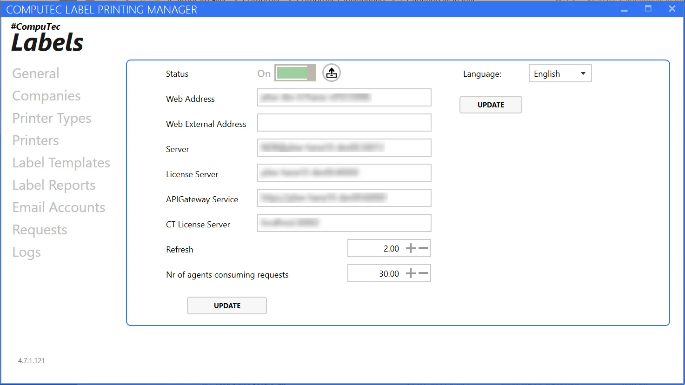

## Service Status

- **Status**: displays whether the service is On or Off. Use the adjacent icon to toggle the status. Restarting the service is recommended after making changes such as adding a printer or modifying rules.

Click here to find out more

1. Open: Control Panel > System and Security > Windows Firewall:

  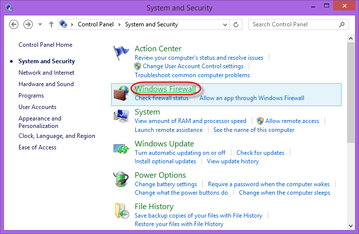
2. Click the Advanced settings:

  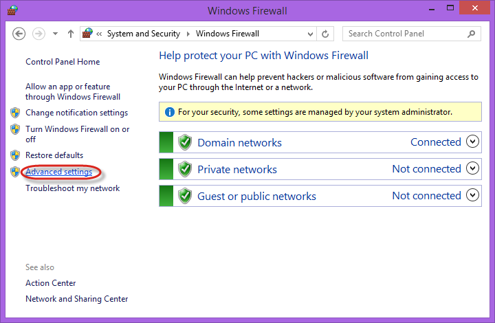
3. Select Inbound Rules and choose New Rule... in the Actions window - this runs New Inbound Rule Wizard:

  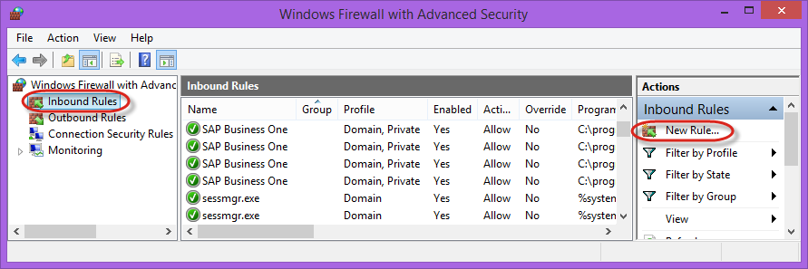
4. Choose Port as the rule type:

  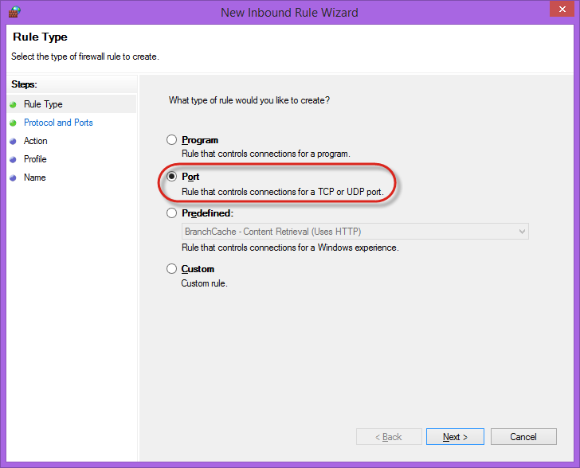
5. Choose TCP protocol and specify 33006 local port:

  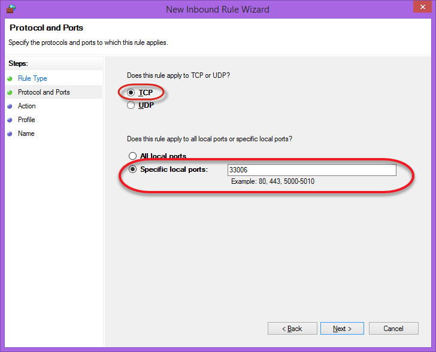
6. Choose Allow the connection action:

  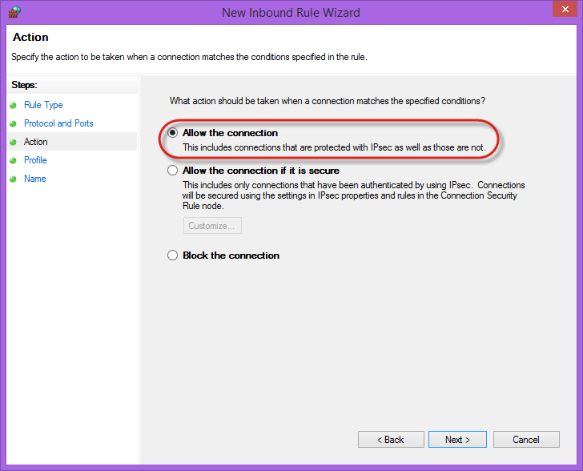
7. Choose all profiles:

  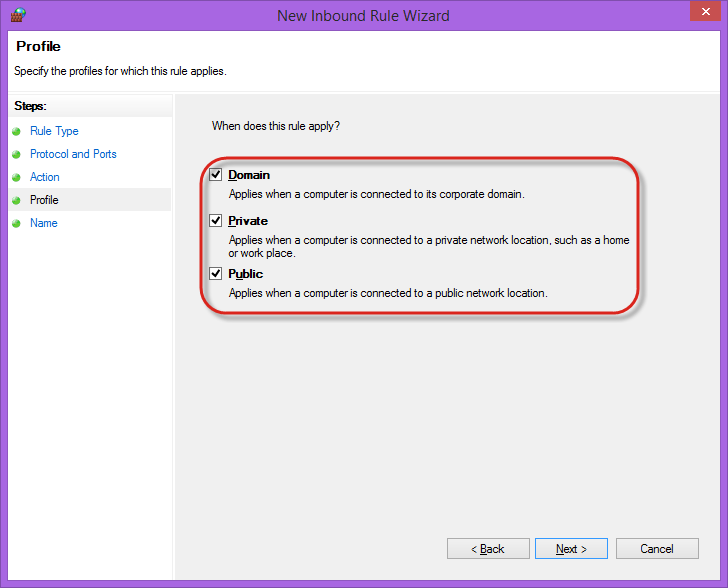
8. Specify the rule name and click "Finish.":

  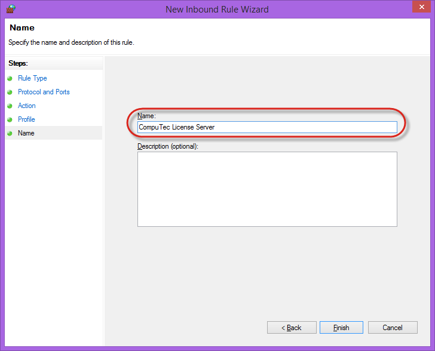

Addresses should auto-populate after a successful installation. If installed on a local server, update the Web Address and CT License Server to localhost, keeping the ports unchanged (like in the screenshot above).

General settings you need to define:

- **Computec Label Web Service Address**: Computec Label web service address (defines the connection between CompuTec Labels and SAP Business One) – default port value is 33006. **Make sure that the port is open**.
- **Server Address**:  The SAP Server Address (including the port for HANA).
- **License Server Address**: SAP License Server address (including port for HANA).
- **CT License Server Address**: CompuTec License Server address (including port for HANA).
- **Refresh**: refresh rate in seconds indicating how often the service scans for new printing requests.

## Printer Types

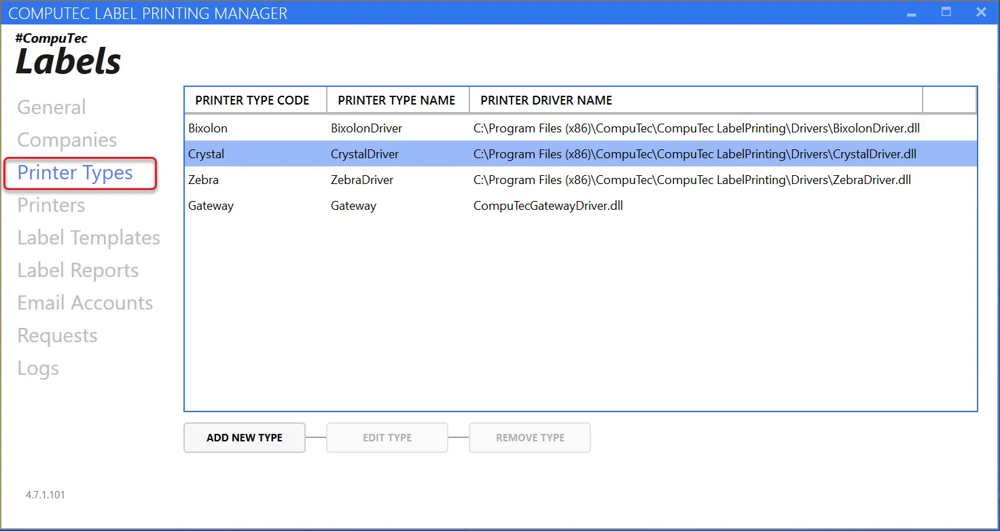

There are three printer types available now:

- **Label Printers**: Bixolon, Zebra
- **Standard Printers**: for SAP Crystal Reports.

To use any of these types, it is required to load its drivers (on the screenshot above, the drivers are already assigned: Printer Driver Name column is filled). To load the drivers, click a row of a specific printer and then click Edit Type. Click the icon next to the Driver Location field and choose the driver file corresponding to the Printer Type.

In one of the future releases, the drivers will be assigned automatically to every printer type.

Click a row of a specific printer type to edit its details or remove it from the list. Clicking Add New Printer Type leads to the following form:

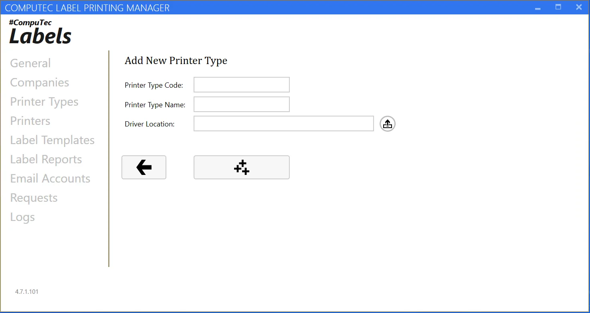

Define the Printer Type Code, Printer Type Name, and a path to the printer driver library (the default path: `[InstallationPath]\Drivers`). Clicking the '+' icon adds a new Printer Type to the list from the previous form.

## Printers

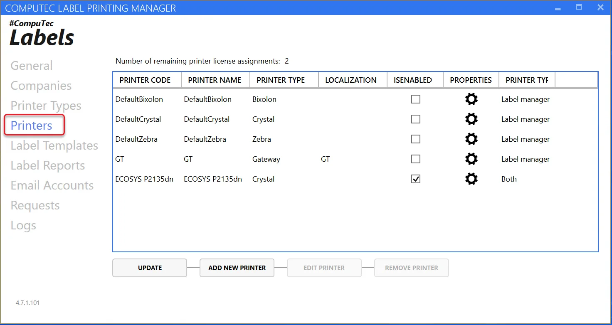

- Click a row to edit or remove an existing printer.
- Click Add New Printer to define the details of the new printer:

  - Printer Code, Printer Name – printer identification,
  - Printer Type can only be chosen from the predefined drop-down list,
  - Localization – information field not connected to the application logic, e.g., Warehouse Click the '+' icon to add the printer to the list from the previous form.

Please note that every field must be filled up to save the settings.

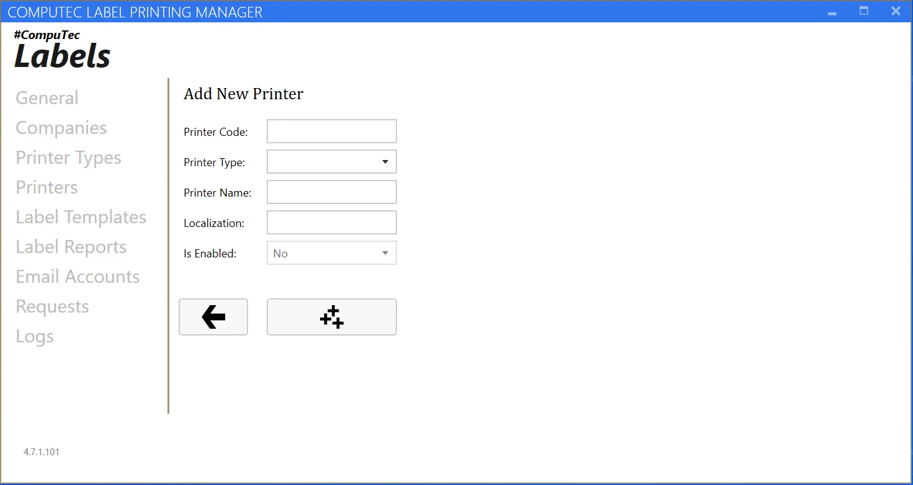

After successful operation, assign a physical printer name and (if there are any) properties to the printer. To do that, please click on a tool wheel icon:

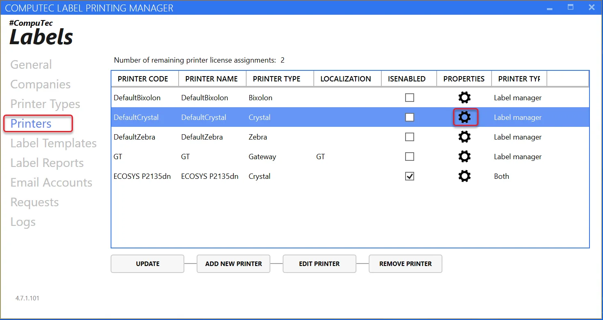

It leads to the following form:

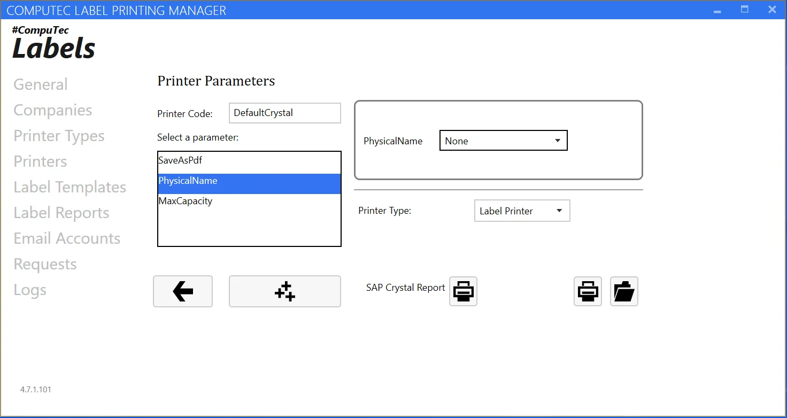

You can set properties accordingly by clicking on a property (the left box) and assessing its value (the right box).

Crystal printers have the following options:

- **SaveAsPdf**: when this parameter is set to True, every print will also be saved as a PDF file (the option can be active simultaneously with the printing option)
- **Physical Name**: all printers available on the server

  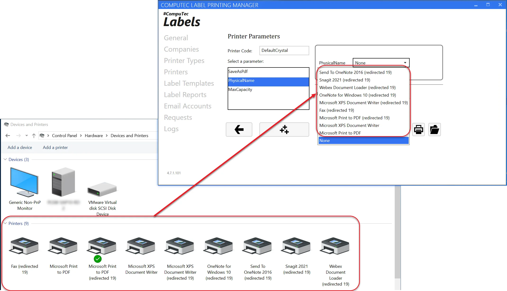

Zebra printers have the following options:

- **Physical Name**: all printers available on the server
- **CodePage**: code page declaration

Bixolon printers have the following options:

- **Physical Name**: all printers available on the server.

The '+' button saves printer properties. In this view, we are also able to launch a test print. You can do this by clicking the icon highlighted in the screenshot below:

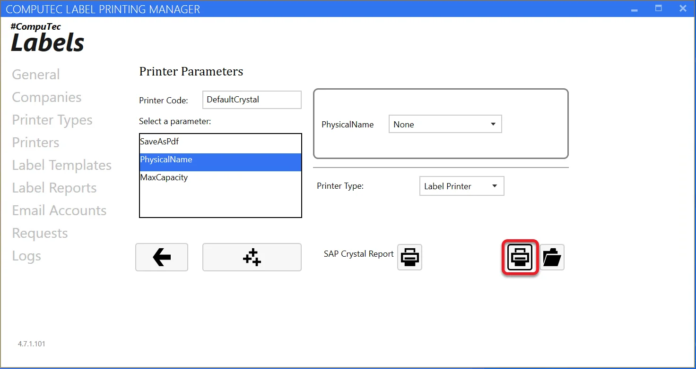

You can access the specified printer log folder by clicking the folder icon (next to the test print icon).

## Label Templates

Here, we can create Label Templates that determine which actions on which transactions printing will take place and what data will be printed. A set of settings, e.g., [mapping](./company-installation-and-configuration.md#mapping-parameters-view) or [event triggers](./company-installation-and-configuration.md#event-triggers-view), can be assigned to a Template, which is later assigned to a specific printer.

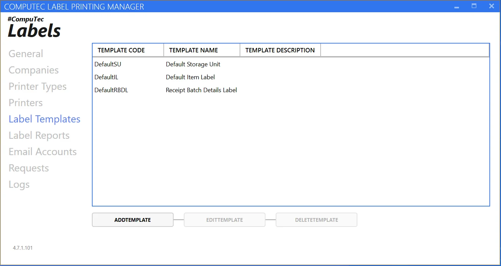

Click a row of a specific template to edit its details or remove it.

You can create templates that act as a simple connector between data configuration and report files in this form. To do this, click Add Template. The following form will be displayed:

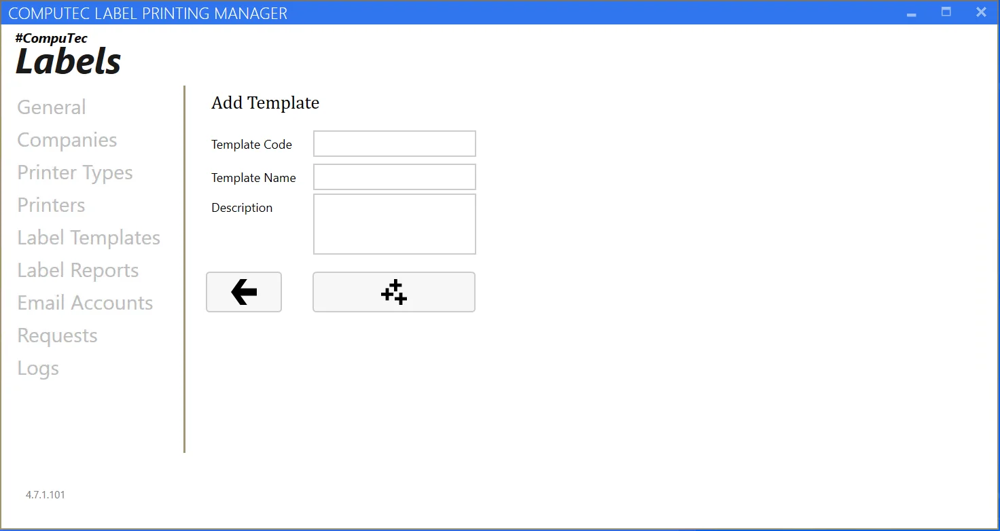

Define Template Code, Template Name, and optionally Description. Click the '+' icon to add it to the list from the previous form.

## Label Reports

Once the template is defined, it can be assigned to specific printers here. After installing the application, default entries will already be present (as indicated in the screenshot below).

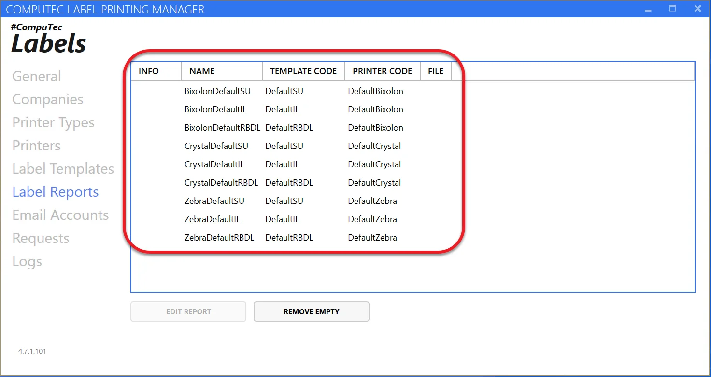

To add a new report, right-click on a table and click Open Report Manager. It leads to the following form:

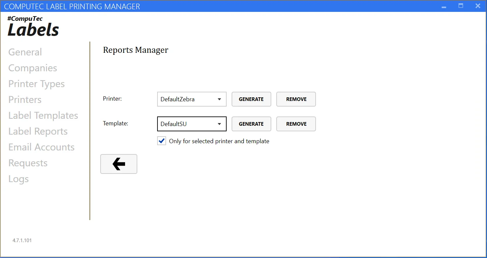

You can generate report files via permutations by a given printer or template. Choose a printer or template and press Generate. Doing so will provide new entries in the main report form with appropriate report input.

The first column, Info, indicates whether we have a report file assigned to it. Available statuses are OK or NOT FOUND. Select a row to assign a specific report file and press “Edit Report.” The application ships with default test reports. Standard localization: `[InstallationPath]/Reports` (default localization: `C:\Program Files (x86)\CompuTec\CompuTec LabelPrinting\Reports`). Place the report that you want to use in this directory.

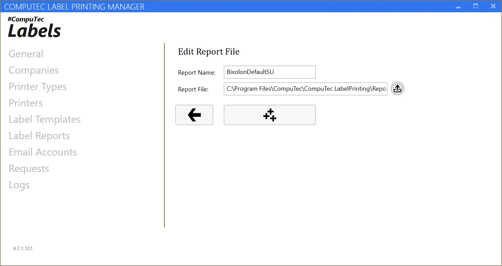

Choose the report file and name and click the + icon. Go back after the Data published message successfully.

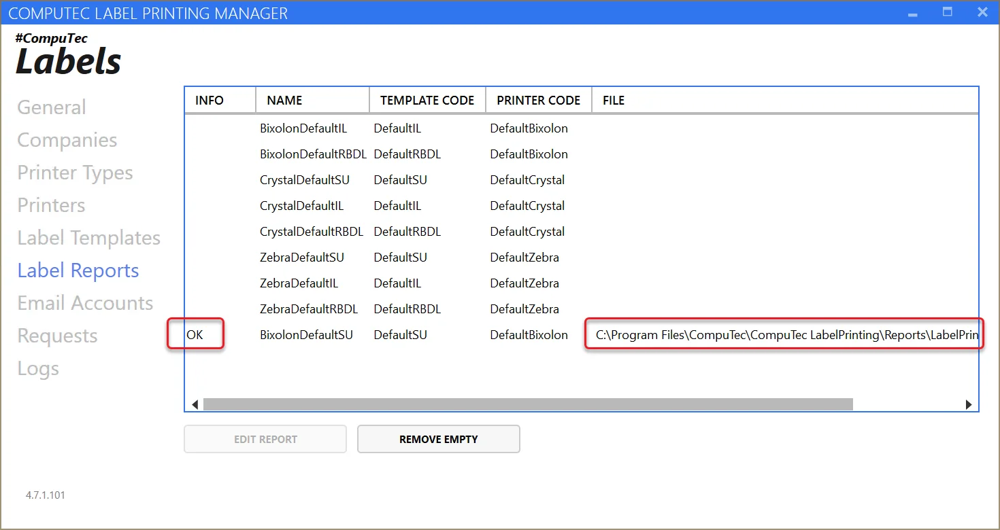

Now, the report file is assigned to a template and a corresponding printer.

## Companies

To configure companies:

1. Click the Company tab.
2. Click Refresh to load company data.
3. Click Update to save the entries.

  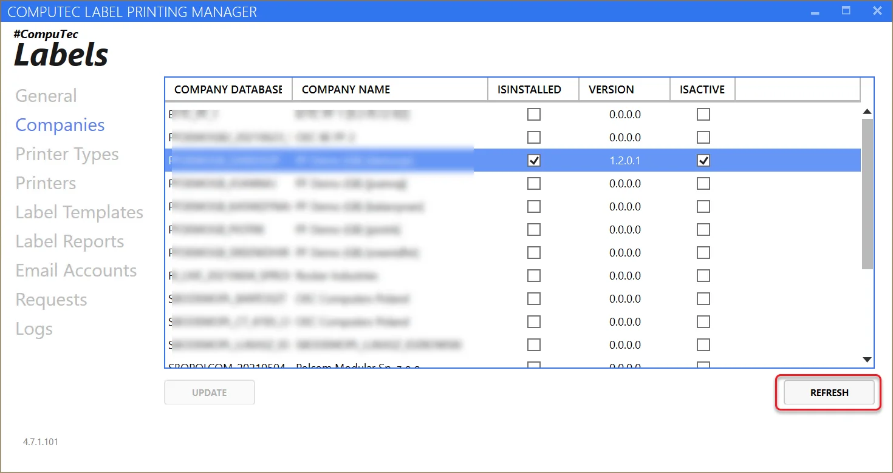

To process a company with our program:

1. Click on the desired company and press Activate
2. Click the Update button below the table.

Click [here](company-installation-and-configuration.md) to find out more about company installation and configuration.

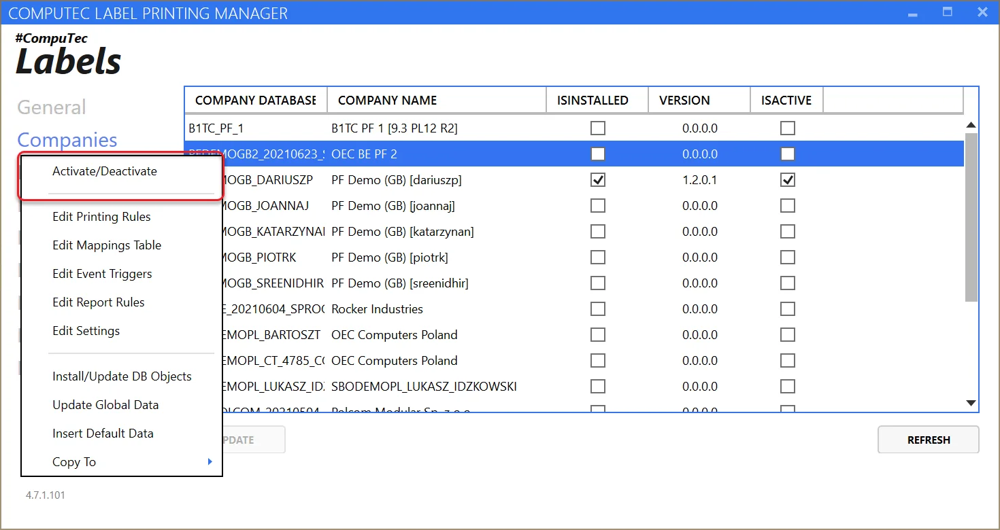

---
