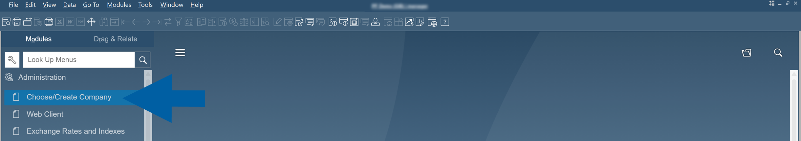
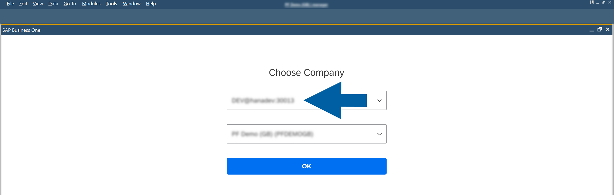
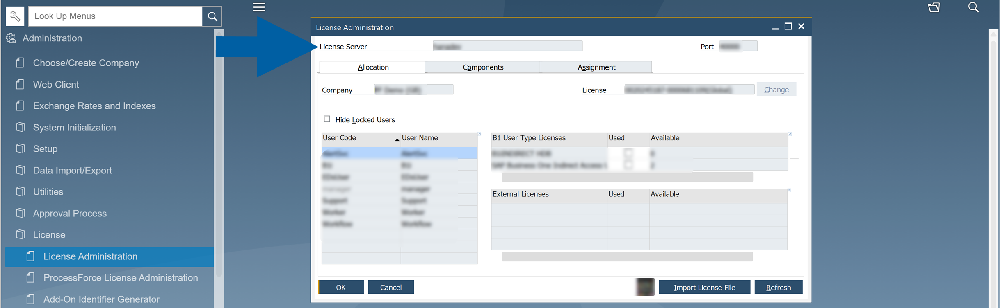

# Install CompuTec Labels Printing Manager

This guide explains how to install **CompuTec Labels Printing Manager** and configure its database connection.

During the installation, you connect **CompuTec Labels Printing Manager** to either a **Microsoft SQL Server** or **SAP HANA** database. After the installation is complete, the required CompuTec Labels components are added to the system.

## Before you start

Before installing CompuTec Labels Printing Manager:

- Make sure your environment meets all [CompuTec Labels requirements](/docs/labels/setup/requirements).
- Download the **CompuTec Labels Printing Manager installation file** from the [Download section](/docs/labels/releases/download).
- Make sure you have the database connection details and credentials required for your environment.

:::info[note]
You may need assistance from your system or database administrator to obtain the required database credentials.
:::

## Step 1: Install CompuTec Labels Printing Manager

1. Run the **CompuTec Labels Printing Manager installation file**.

    

2. Select the installation path.

    

3. Continue the installation until the database configuration screen appears.

    

## Step 2: Configure the database connection

To configure the database connection, follow these steps:

1. Select the database type:

    - Microsoft SQL Server
    - SAP HANA

    

2. In **Server Address**, enter the address of your database server. 

    For **SAP HANA**, include the port with the server address.

    :::info[Note]

    You can find the server name in your SAP Business One installation:

    - Go to **Administration** > **Choose/Create Company**.

        

    - After logging in, you will find the server address in the upper part of the screen.

        

    :::

3. Enter the **SAP License Server Address**.

     For **SAP HANA**, include the port with the server address.

    :::info[note]
    You can find the License Server address and port in SAP Business One under **Administration** > **License** > **License Administration**.

    

    If you cannot access **License Administration** or do not know which **License Server** to use, contact your SAP Business One administrator.
    :::

4. Enter the required database credentials.

    :::info[note]
    If you do not have the database connection details or credentials, contact your database or SAP Business One administrator.
    :::

5. Click **Connect**.

    

6. CompuTec Labels Printing Manager validates the database connection. You can continue the installation after the connection is successfully established.

    

## Step 3: Complete the installation

1. Continue through the remaining installation steps.

    

2. Complete the installation.

    

## Result

After the installation is complete, the following components are available:

- **CTLabel Service**: Windows service used by CompuTec Labels.
- **CTLabel**: database created for CompuTec Labels.
- **CompuTec Labels Printing Manager**: management application installed on the computer.

A shortcut to **CompuTec Labels Printing Manager** is also added to the desktop.
